# Agent OS: Architecture Diagrams and Refactoring Guidance

## Overview

This document provides comprehensive architecture diagrams, component relationships, and refactoring guidance for Agent OS. It visualizes both the current architecture and proposed future states.

**Related Documents:**
- [Project Roadmap](./roadmap.md)
- [Code Map](./codemap.md)
- [Workflows Analysis](./workflows.md)

---

## Current Architecture

### High-Level System Architecture

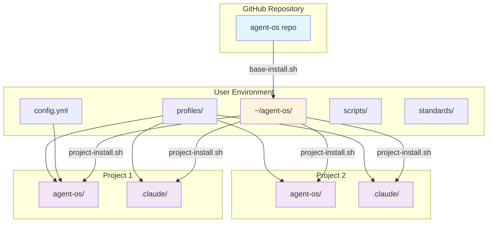

### Component Layer Architecture

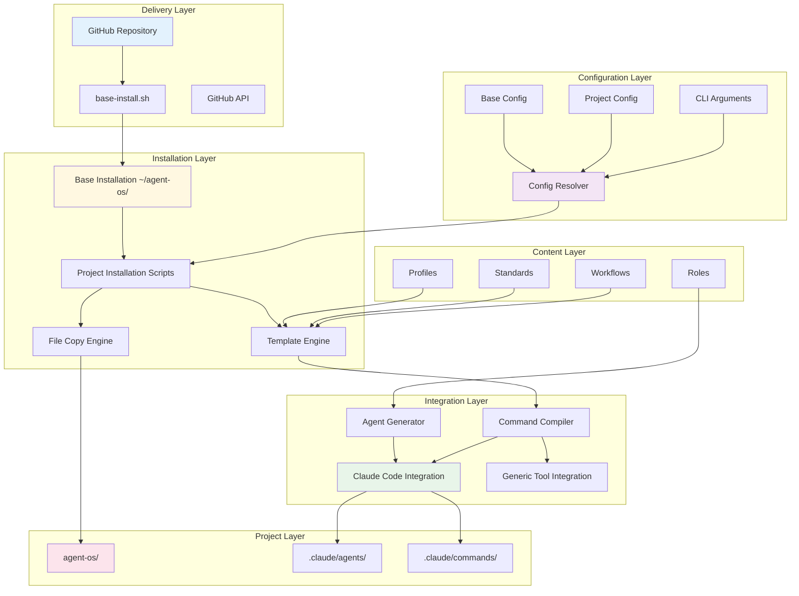

### Data Flow Architecture

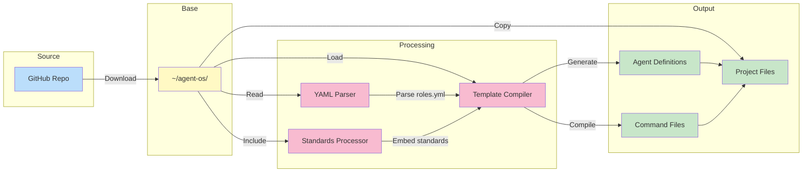

---

## Current Architecture Pain Points

### 1. Dual Installation Model

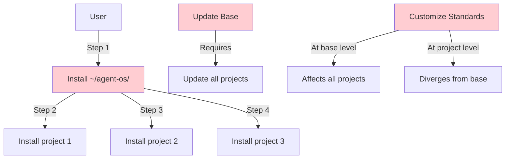

**Issues:**
- Two-step installation complexity
- Version sync challenges
- Customization conflicts
- Dependency on user-level directory

### 2. File Duplication Pattern

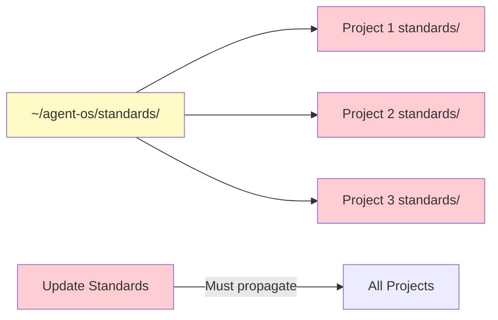

**Issues:**
- Storage overhead
- Sync complexity
- Version fragmentation
- Update propagation

### 3. Tight Coupling

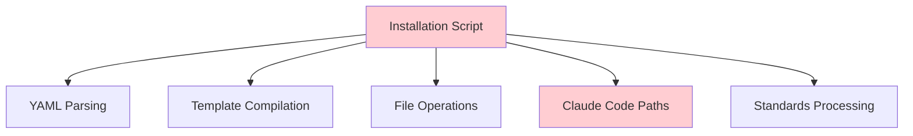

**Issues:**
- Monolithic scripts
- Tool-specific code embedded
- Difficult to test
- Hard to extend

---

## Proposed Architecture: Phase 1 (Project-Only)

### Simplified Installation Model

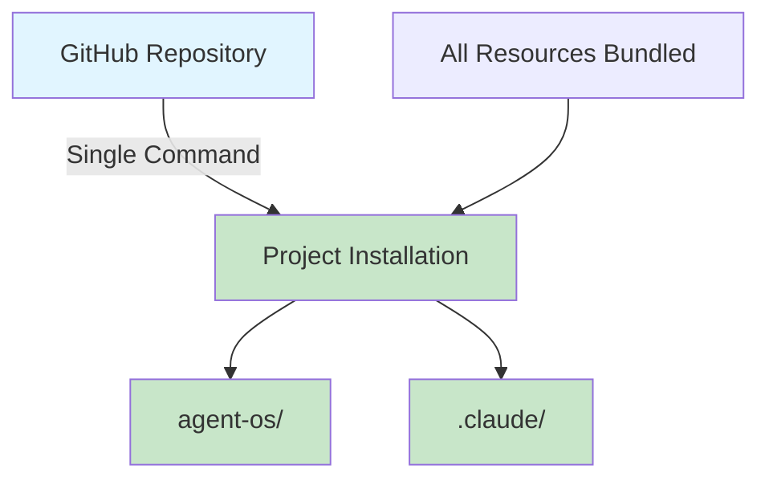

**Benefits:**
- Single installation step
- No user-level dependencies
- Self-contained projects
- Simplified updates

### Embedded Resources Model

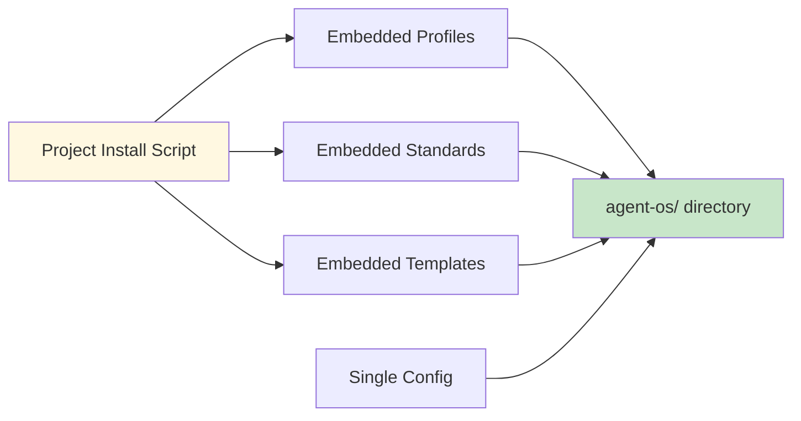

**Changes:**
- Bundle all resources in installer
- Remove `~/agent-os/` dependency
- Single configuration file
- Simplified path resolution

---

## Proposed Architecture: Phase 3 (API-Driven)

### Modern API Architecture

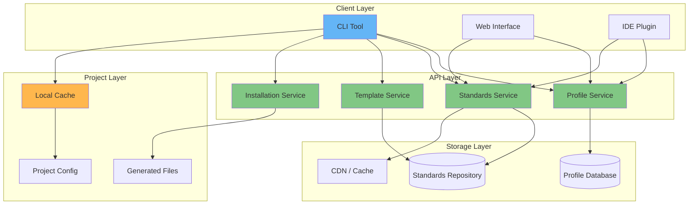

### API Service Architecture

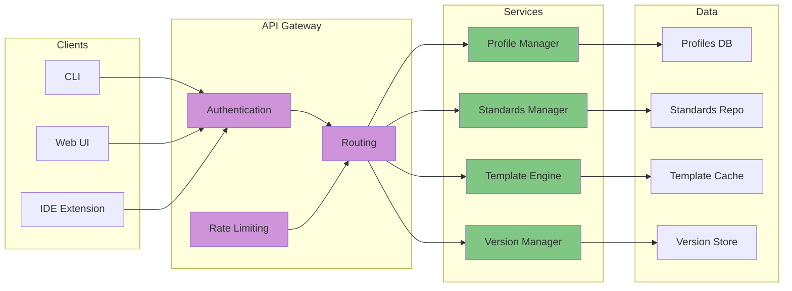

### Dynamic Resource Loading

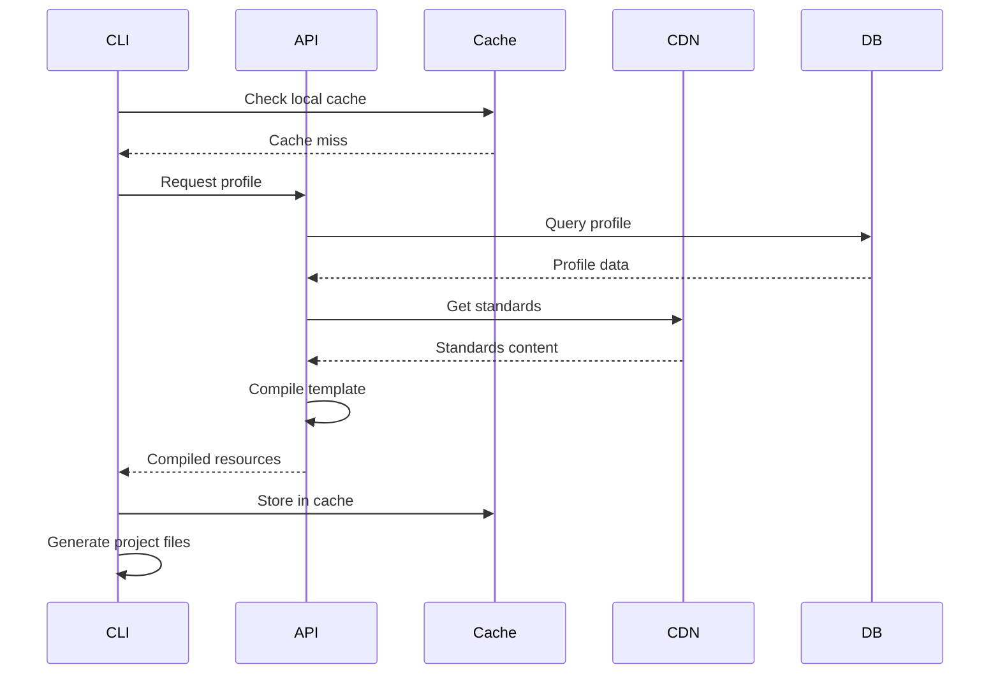

**Benefits:**
- No file copying
- Real-time updates
- Version management
- Centralized maintenance
- Reduced storage
- Faster installations

---

## Component Modularity Analysis

### Current Modularity

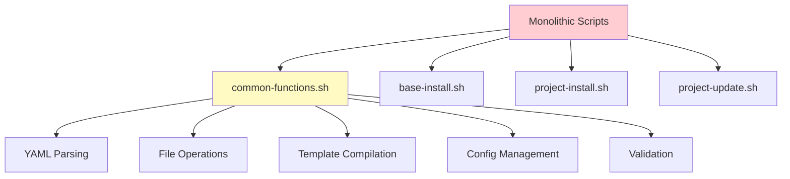

**Modularity Score: 4/10**
- Some separation in common-functions.sh
- Still tightly coupled
- Difficult to test individually
- Hard to reuse components

### Proposed Modularity (Phase 2)

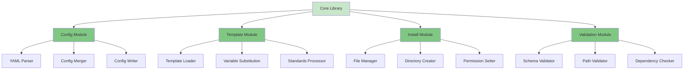

**Target Modularity Score: 8/10**
- Clear separation of concerns
- Independently testable
- Reusable components
- Pluggable architecture

---

## Integration Points

### Tool Integration Architecture

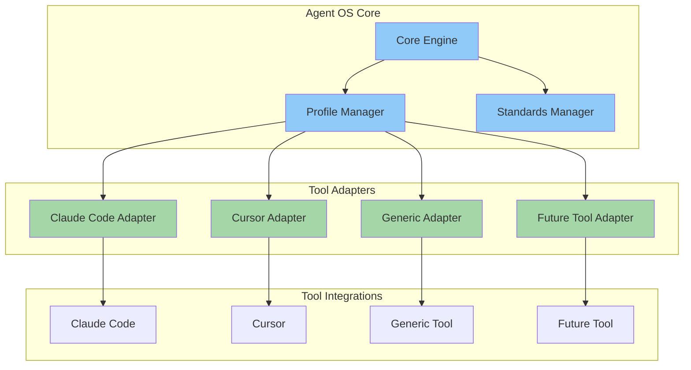

**Current State:**
- Claude Code integration hardcoded
- Generic mode limited
- Difficult to add new tools

**Target State:**
- Adapter pattern for tools
- Pluggable integrations
- Unified core interface
- Easy tool additions

### External Service Dependencies

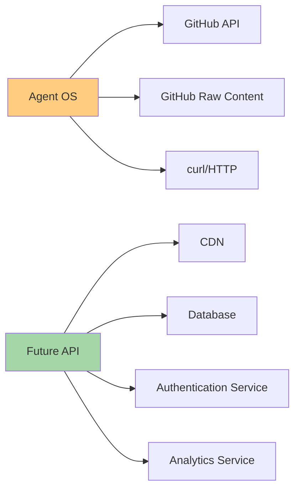

---

## Refactoring Strategy

### Phase 1: Project-Only Installation

**Goal:** Remove `~/agent-os/` dependency

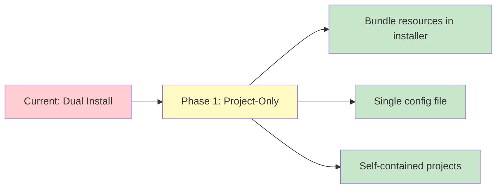

**Key Changes:**
- Embed profiles in installation script
- Remove base directory dependency
- Simplify configuration
- Update path resolution

### Phase 2: Improved Modularity

**Goal:** Better separation and testability

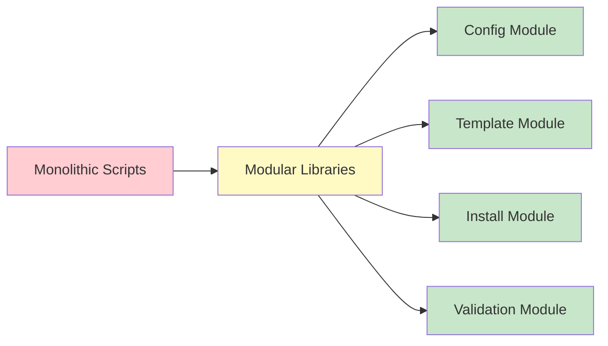

**Key Changes:**
- Extract functions to modules
- Add unit tests
- Standardize interfaces
- Enable reuse

### Phase 3: API Architecture

**Goal:** Modern, serverless architecture

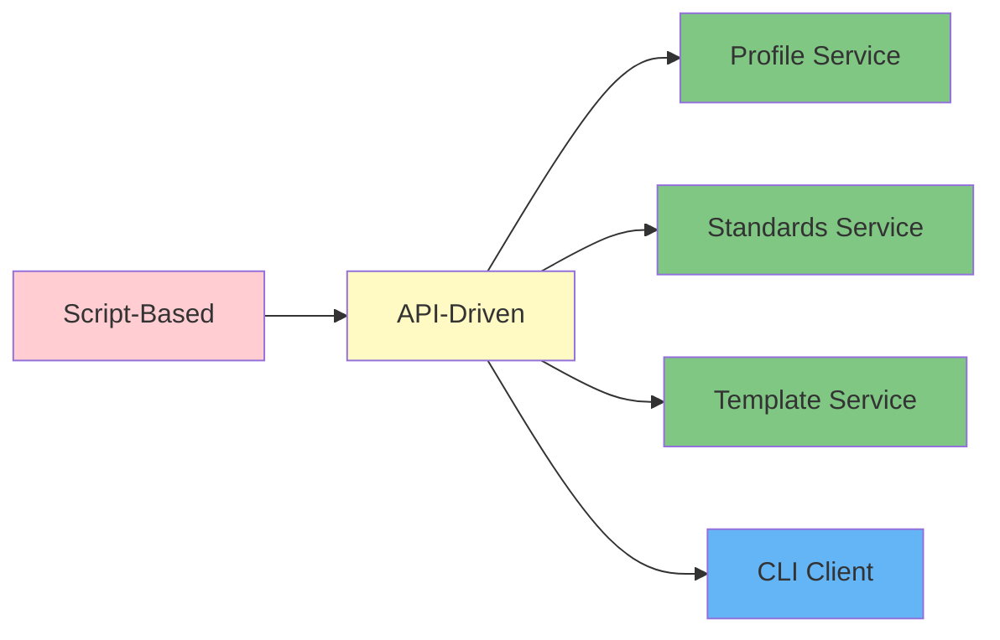

**Key Changes:**
- Build REST/GraphQL API
- Create CLI client
- Dynamic resource loading
- Cloud-based storage

---

## Scalability Analysis

### Current Scalability Limits

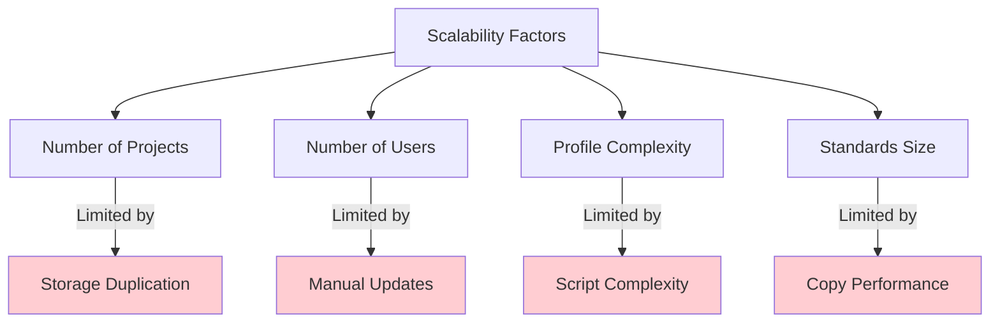

**Bottlenecks:**
- File copying overhead (O(n) per project)
- Storage grows linearly with projects
- Update propagation manual
- Script execution time

### Target Scalability

```mermaid
graph TD
    A[API Architecture] --> B[O(1) Installation]
    A --> C[Centralized Storage]
    A --> D[Cached Resources]
    A --> E[Automatic Updates]
    
    B --> F[Fast]
    C --> F
    D --> F
    E --> F
    
    style A fill:#c8e6c9
    style F fill:#81c784
```

**Improvements:**
- Constant-time operations
- Minimal storage per project
- CDN-cached resources
- Real-time updates

---

## Security Considerations

### Current Security Model

```mermaid
graph LR
    A[Download Scripts] -->|curl| B[GitHub]
    C[Execute Scripts] -->|bash| D[User Permissions]
    E[File Operations] -->|write| F[User Directories]
    
    style A fill:#fff9c4
    style C fill:#fff9c4
    style E fill:#fff9c4
```

**Security Posture:**
- Trust GitHub content
- Execute downloaded scripts
- User-level permissions
- No authentication
- No authorization

### Target Security Model

```mermaid
graph LR
    A[CLI Client] -->|HTTPS| B[API]
    B -->|Auth| C[Authentication Service]
    B -->|Verify| D[Signature Validation]
    E[Resources] -->|Signed| F[CDN]
    
    style B fill:#c8e6c9
    style C fill:#81c784
    style D fill:#81c784
    style F fill:#81c784
```

**Security Improvements:**
- API authentication
- Resource signing
- Version verification
- Access control
- Audit logging

---

## Migration Path

### Backward Compatibility Strategy

```mermaid
graph TD
    A[Current Users] --> B{Choose Mode}
    B -->|Legacy| C[Keep ~/agent-os/]
    B -->|New| D[Project-Only Mode]
    
    C --> E[Continue with scripts]
    D --> F[Use new installer]
    
    E --> G[Gradual Migration]
    G --> F
    
    style C fill:#fff9c4
    style D fill:#c8e6c9
    style F fill:#c8e6c9
```

**Migration Strategy:**
1. Support both modes simultaneously
2. Provide migration tool
3. Deprecate old mode gradually
4. Sunset old mode after transition period

### Version Management

```mermaid
graph LR
    A[v2.0.3 Current] --> B[v2.1.0 Project-Only]
    B --> C[v2.2.0 Modular]
    C --> D[v3.0.0 API]
    
    A -.->|Migration Tool| B
    B -.->|Gradual Upgrade| C
    C -.->|Dual Mode| D
    
    style A fill:#fff9c4
    style B fill:#c8e6c9
    style C fill:#c8e6c9
    style D fill:#81c784
```

---

## Related Documentation

- [Project Roadmap](./roadmap.md) - Overall strategy
- [Code Map](./codemap.md) - Component details
- [Workflows Analysis](./workflows.md) - Process flows
- [Configuration Guide](./config.md) - Config details
- [Refactoring Notes](./refactoring-notes.md) - Action items

---

**Last Updated:** 2025-10-13  
**Analysis Version:** 1.0  
**Source Repository:** https://github.com/buildermethods/agent-os
