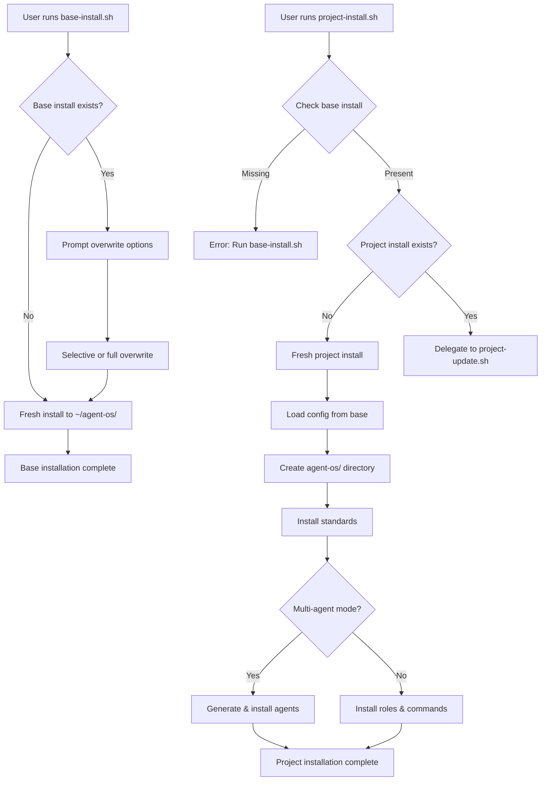
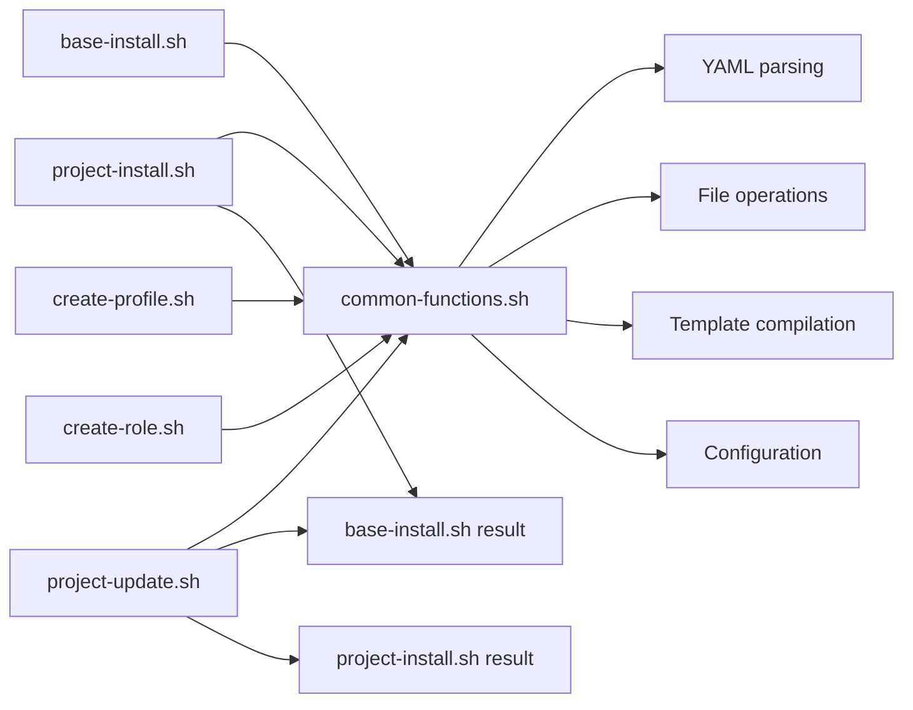
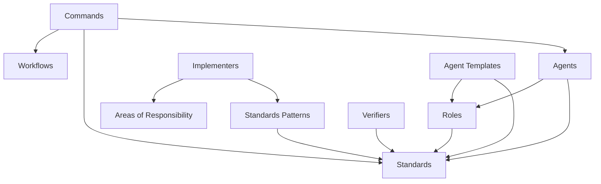
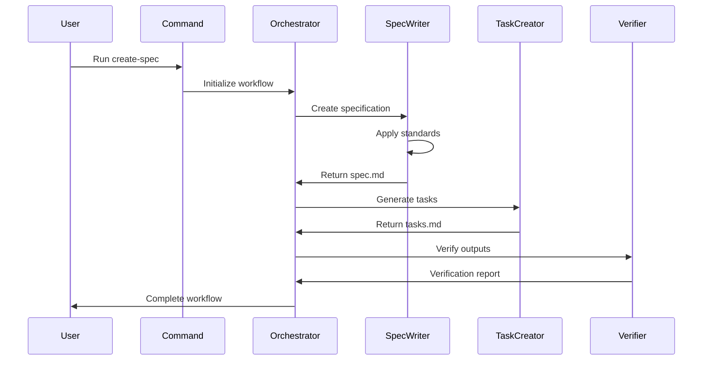
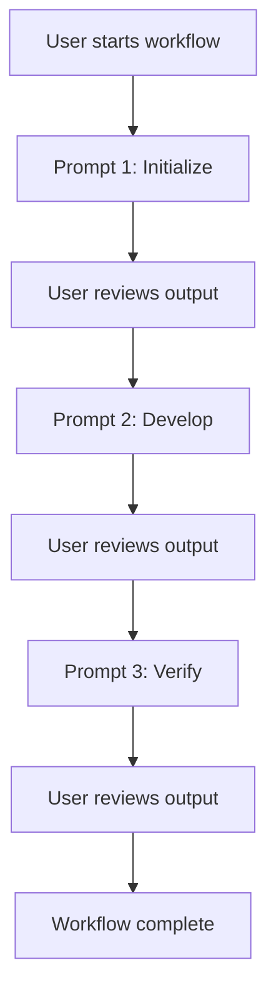

# Agent OS: Code Map and Component Analysis

## Overview

This document provides a comprehensive map of all components, scripts, files, and their relationships in the Agent OS codebase. It includes detailed breakdowns of functionality, dependencies, and visual diagrams.

**Related Documents:**
- [Project Roadmap](./roadmap.md)
- [Workflows Analysis](./workflows.md)
- [Architecture Diagrams](./architecture.md)

---

## Repository Structure

```
agent-os/
├── .github/
│   ├── workflows/          # GitHub Actions automation
│   │   ├── pr-decline.yml
│   │   └── stale.yml
│   └── ISSUE_TEMPLATE/
│       └── config.yml
├── profiles/               # Profile-based configuration
│   └── default/
│       ├── agents/         # Agent definitions (multi-agent mode)
│       │   ├── specification/
│       │   ├── templates/
│       │   └── *.md
│       ├── commands/       # User-facing commands
│       │   ├── create-spec/
│       │   ├── implement-spec/
│       │   ├── new-spec/
│       │   └── plan-product/
│       ├── roles/          # Role definitions (implementers, verifiers)
│       │   ├── implementers.yml
│       │   └── verifiers.yml
│       ├── standards/      # Coding standards and best practices
│       │   ├── backend/
│       │   ├── frontend/
│       │   ├── global/
│       │   └── testing/
│       └── workflows/      # Workflow documentation
│           ├── implementation/
│           ├── planning/
│           └── specification/
├── scripts/                # Installation and management scripts
│   ├── base-install.sh
│   ├── common-functions.sh
│   ├── create-profile.sh
│   ├── create-role.sh
│   ├── project-install.sh
│   └── project-update.sh
├── config.yml              # Global configuration
├── README.md
├── CHANGELOG.md
├── LICENSE
└── .gitignore
```

---

## Component Inventory

### 1. Installation Scripts

#### `scripts/base-install.sh`
**Purpose:** Downloads and installs Agent OS to user's home directory (`~/agent-os/`)

**Key Functions:**
- `get_latest_version()` - Fetches version from GitHub config.yml
- `download_file(relative_path, dest_path)` - Downloads individual files from GitHub
- `get_all_repo_files()` - Uses GitHub API to list all repository files
- `download_all_files(dest_base)` - Downloads complete repository (with exclusions)
- `should_exclude(file_path)` - Filters files during download
- `prompt_overwrite_choice()` - Handles existing installation updates
- `overwrite_all()`, `overwrite_profile()`, `overwrite_scripts()`, `overwrite_config()` - Selective update strategies
- `perform_fresh_installation()` - New installation flow
- `check_existing_installation()` - Detects and handles existing installs

**Dependencies:**
- curl (required)
- common-functions.sh (downloaded first)
- GitHub API (for file listing)
- jq or python3 (optional, for JSON parsing)

**Entry Point:** Called directly by users for base installation

**Key Paths:**
- Source: GitHub repository
- Target: `~/agent-os/`
- Temp: `/tmp/` for temporary files

**Exclusions:**
- `scripts/base-install.sh` (self)
- `old-versions/*`
- `.git*` and `.github/*`

---

#### `scripts/project-install.sh`
**Purpose:** Installs Agent OS into a specific project directory

**Key Functions:**
- `parse_arguments()` - Command-line argument parsing
- `load_configuration()` - Loads base and project configs
- `create_agent_os_folder()` - Creates project directory structure
- `install_standards()` - Copies standards files to project
- `install_roles()` - Copies role definitions (single-agent mode)
- `install_single_agent_commands()` - Installs/compiles single-agent commands
- `install_claude_code_files()` - Installs multi-agent commands and agents for Claude Code
- `perform_installation()` - Main installation orchestrator
- `handle_reinstallation()` - Manages re-installation flow

**Dependencies:**
- `common-functions.sh`
- Base installation at `~/agent-os/`
- Profile files
- YAML parsing utilities

**Entry Point:** Run from project root directory

**Command-Line Options:**
- `--profile PROFILE` - Specify profile
- `--multi-agent-mode [BOOL]` - Enable/disable multi-agent
- `--multi-agent-tool TOOL` - Specify tool (claude-code)
- `--single-agent-mode [BOOL]` - Enable/disable single-agent
- `--single-agent-tool TOOL` - Specify tool
- `--re-install` - Force reinstallation
- `--overwrite-*` - Selective overwrites
- `--dry-run` - Preview changes
- `--verbose` - Detailed output

**Key Paths:**
- Source: `~/agent-os/`
- Target: `<project>/agent-os/`, `<project>/.claude/`

**Generated Files:**
- `<project>/agent-os/config.yml` - Project configuration
- `<project>/agent-os/standards/**/*` - Coding standards
- `<project>/agent-os/roles/**/*` - Role definitions (single-agent)
- `<project>/agent-os/commands/**/*` - Commands (single-agent)
- `<project>/.claude/agents/agent-os/**/*` - Agent definitions (multi-agent)
- `<project>/.claude/commands/agent-os/**/*` - Commands (multi-agent)

---

#### `scripts/project-update.sh`
**Purpose:** Updates existing Agent OS installation in a project

**Key Functions:**
- `parse_arguments()` - Command-line parsing
- `validate_installations()` - Checks base and project installations
- `load_configurations()` - Loads configs from multiple sources
- `check_compatibility()` - Version compatibility validation
- `update_standards()`, `update_roles()`, `update_commands()`, `update_agents()` - Selective update functions
- `perform_update()` - Main update orchestrator
- `handle_reinstallation()` - Delegates to project-install.sh with --re-install

**Dependencies:**
- `common-functions.sh`
- Base installation
- Existing project installation

**Entry Point:** Called by user or delegated from project-install.sh

**Update Strategies:**
- Skip existing files by default
- `--overwrite-*` flags for selective overwrites
- `--overwrite-all` for complete refresh
- Tracks updated, new, and skipped files

---

#### `scripts/common-functions.sh`
**Purpose:** Shared utility functions for all scripts

**Key Function Categories:**

1. **Output Functions:**
   - `print_color()`, `print_section()`, `print_status()`, `print_success()`, `print_warning()`, `print_error()`, `print_verbose()`

2. **YAML Parsing:**
   - `normalize_yaml_line()`, `get_indent_level()`
   - `get_yaml_value(file, key, default)` - Extract simple values
   - `get_yaml_array(file, key)` - Extract array values
   - `parse_role_yaml(file, section, id, field)` - Extract role fields
   - `get_role_standards(file, section, id)` - Get standards for role

3. **File Operations:**
   - `ensure_dir(dir_path)` - Create directory if missing
   - `copy_file(source, dest)` - Copy with overwrite logic
   - `get_profile_file(profile, relative_path, base_dir)` - Resolve profile file paths
   - `get_profile_files(profile, base_dir, subdirectory)` - List profile files

4. **Configuration:**
   - `load_base_config()` - Load `~/agent-os/config.yml`
   - `load_project_config()` - Load project config
   - `write_project_config()` - Generate project config file
   - `validate_config()` - Validate configuration consistency
   - `parse_bool_flag()` - Parse boolean command-line flags

5. **Template Compilation:**
   - `compile_command(source, dest, base_dir, profile)` - Compile command templates
   - `compile_agent(source, dest, base_dir, profile, role_data)` - Compile agent templates
   - `process_standards(content, base_dir, profile, patterns)` - Include standards in templates

6. **Validation:**
   - `validate_base_installation()` - Check base installation exists
   - `is_agent_os_installed(project_dir)` - Check project installation
   - `check_not_base_installation()` - Prevent installing in base directory

**Template Variables:**
- `{{STANDARDS}}` - Replaced with standards content
- `{{ROLE_*}}` - Replaced with role-specific data
- `<<<FIELD>>>...<<<END>>>` - Delimited role data format

---

#### `scripts/create-profile.sh`
**Purpose:** Create new profiles (planned/stub implementation)

**Status:** Referenced but not analyzed in detail

---

#### `scripts/create-role.sh`
**Purpose:** Create new roles (planned/stub implementation)

**Status:** Referenced but not analyzed in detail

---

### 2. Profile Structure

#### Default Profile (`profiles/default/`)

##### **Agents** (`agents/`)
Multi-agent mode definitions for specialized AI agents.

**Specification Agents:**
- `spec-initializer.md` - Initializes new specifications
- `spec-researcher.md` - Research and gathering phase
- `spec-writer.md` - Writes formal specifications
- `tasks-list-creator.md` - Creates task breakdowns
- `spec-verifier.md` - Verifies spec completeness

**General Agents:**
- `product-planner.md` - Product planning and roadmap
- `implementation-verifier.md` - Verifies implementations

**Agent Templates:**
- `templates/implementer.md` - Template for implementer agents
- `templates/verifier.md` - Template for verifier agents

**Dynamic Agents (Generated):**
Generated at installation time from role definitions:
- Database Engineer
- API Engineer
- UI Designer
- Testing Engineer
- Backend Verifier
- Frontend Verifier

---

##### **Commands** (`commands/`)
User-facing commands organized by function.

**Structure:**
```
commands/
├── <command-name>/
│   ├── multi-agent/
│   │   └── <command-name>.md
│   └── single-agent/
│       └── <step-number>-<step-name>.md
```

**Available Commands:**

1. **`create-spec/`** - Create specification from initialized spec
   - Multi-agent: Single autonomous command
   - Single-agent: 3 prompts (create-spec, create-tasks-list, verify-spec)

2. **`implement-spec/`** - Implement a specification
   - Multi-agent: Single autonomous command with multiple agents
   - Single-agent: Single comprehensive prompt

3. **`new-spec/`** - Initialize and research new specification
   - Multi-agent: Single autonomous command
   - Single-agent: 2 prompts (new-spec, research-spec)

4. **`plan-product/`** - Product planning and setup
   - Multi-agent: Single autonomous command
   - Single-agent: 4 prompts (plan-product, create-mission, create-roadmap, create-tech-stack)

---

##### **Roles** (`roles/`)
Define specialized implementer and verifier roles.

**`implementers.yml`:**
Defines 4 implementer roles:

1. **database-engineer**
   - Models, migrations, schemas, queries
   - Standards: global/*, backend/*, testing/*
   - Verified by: backend-verifier

2. **api-engineer**
   - API endpoints, controllers, business logic
   - Standards: global/*, backend/*, testing/*
   - Verified by: backend-verifier

3. **ui-designer**
   - UI components, views, styling, responsive design
   - Standards: global/*, frontend/*, testing/*
   - Verified by: frontend-verifier

4. **testing-engineer**
   - Unit, integration, system tests
   - Standards: global/*, testing/*
   - Verified by: backend-verifier, frontend-verifier

**`verifiers.yml`:**
Defines 2 verifier roles:

1. **backend-verifier**
   - Verifies backend implementations
   - Standards: global/*, backend/*, testing/*

2. **frontend-verifier**
   - Verifies frontend implementations
   - Standards: global/*, frontend/*, testing/*

**Role Schema:**
- `id` - Unique identifier
- `description` - Role summary
- `your_role` - Role instructions for agent
- `tools` - Available tools (Write, Read, Bash, WebFetch, Playwright)
- `model` - AI model (inherit from config)
- `color` - UI color coding
- `areas_of_responsibility` - List of responsibilities
- `example_areas_outside_of_responsibility` - Scope boundaries
- `standards` - Standards patterns (glob-style)
- `verified_by` - Verifier agents (implementers only)

---

##### **Standards** (`standards/`)
Coding standards and best practices.

**Global Standards:**
- `commenting.md` - Code commenting guidelines
- `coding-style.md` - General coding style
- `conventions.md` - Naming and organizational conventions
- `error-handling.md` - Error handling patterns
- `tech-stack.md` - Technology stack reference
- `validation.md` - Input validation standards

**Backend Standards:**
- `api.md` - API design and implementation
- `migrations.md` - Database migration standards
- `models.md` - Data model standards
- `queries.md` - Database query standards

**Frontend Standards:**
- `accessibility.md` - Accessibility guidelines
- `components.md` - Component design standards
- `css.md` - CSS/styling standards
- `responsive.md` - Responsive design guidelines

**Testing Standards:**
- `test-writing.md` - Test writing guidelines

---

##### **Workflows** (`workflows/`)
Workflow documentation and guidance.

**Planning Workflows:**
- `create-product-mission.md`
- `create-product-roadmap.md`
- `create-product-tech-stack.md`
- `gather-product-info.md`

**Specification Workflows:**
- `initialize-spec.md`
- `research-spec.md`
- `write-spec.md`
- `create-tasks-list.md`
- `verify-spec.md`

**Implementation Workflows:**
- `implementer-responsibilities.md`
- `verifier-responsibilities.md`
- `implement-task.md`
- `update-tasks-list.md`
- `document-implementation.md`
- `analyze-patterns.md`
- `verification/verify-tasks.md`
- `verification/verify-documentation.md`
- `verification/run-all-tests.md`
- `verification/create-verification-report.md`
- `verification/update-roadmap.md`

---

### 3. Configuration Files

#### `config.yml` (Base Configuration)
**Location:** `~/agent-os/config.yml`

**Fields:**
- `version` - Agent OS version (2.0.3)
- `base_install` - Base installation flag (true)
- `multi_agent_mode` - Enable multi-agent orchestration (true)
- `multi_agent_tool` - Tool for multi-agent mode (claude-code)
- `single_agent_mode` - Enable single-agent prompts (false)
- `single_agent_tool` - Tool for single-agent mode (generic)
- `profile` - Default profile (default)

**Project Configuration:**
Same schema, stored in `<project>/agent-os/config.yml`

---

### 4. GitHub Actions Workflows

#### `.github/workflows/pr-decline.yml`
**Purpose:** Automated PR decline with canned responses

**Triggers:**
- `pull_request_target` with labels
- `workflow_dispatch` (manual)

**Labels:**
- "Close PR: Out of scope"
- "Close PR: Low info"
- "Close PR: Duplicate"
- "Close PR: Spam"

**Actions:**
- Posts comment with reason
- Closes PR

**Permissions:**
- `pull-requests: write`
- `contents: read`

---

#### `.github/workflows/stale.yml`
**Purpose:** Closes stale issues automatically

**Schedule:** Daily at 09:00 UTC

**Configuration:**
- Stale after: 30 days of inactivity
- Close after: 7 additional days
- Exempt: Issues labeled "bug"

**Actions:**
- Marks stale
- Posts warning comment
- Closes after grace period

---

## Component Relationships

### Installation Flow Diagram



### Script Dependencies



### Profile Component Dependencies



### Multi-Agent Workflow



### Single-Agent Workflow



---

## File Naming Conventions

### Profiles
- Pattern: `profiles/<profile-name>/`
- Default: `profiles/default/`
- Custom: User-defined names

### Agents
- Pattern: `<role-id>.md` or `<function-name>.md`
- Location: `profiles/<profile>/agents/`
- Templates: `profiles/<profile>/agents/templates/`
- Specification: `profiles/<profile>/agents/specification/`

### Commands
- Pattern: `<command-name>/<mode>/<command-name>.md`
- Modes: `multi-agent/` or `single-agent/`
- Single-agent steps: `<number>-<step-name>.md`

### Standards
- Pattern: `<category>/<standard-name>.md`
- Categories: `global/`, `backend/`, `frontend/`, `testing/`

### Workflows
- Pattern: `<phase>/<workflow-name>.md`
- Phases: `planning/`, `specification/`, `implementation/`

---

## External Dependencies

### Required Tools
- **curl** - File downloading
- **bash** - Script execution (v4.0+)
- **git** - Repository cloning (for development)

### Optional Tools
- **jq** - JSON parsing (fallback: python3, awk)
- **python3** - JSON parsing fallback
- **tree** - Directory visualization

### Tool Integration
- **Claude Code** - Multi-agent orchestration
- **Cursor** - AI coding assistant
- **Generic** - Single-agent mode compatible with any tool

### APIs
- **GitHub API** - Repository file listing
- **GitHub Raw Content** - File downloads

---

## Entry Points

### User Entry Points
1. **Base Installation:** `bash <(curl -s https://raw.githubusercontent.com/buildermethods/agent-os/main/scripts/base-install.sh)`
2. **Project Installation:** `~/agent-os/scripts/project-install.sh`
3. **Project Update:** `~/agent-os/scripts/project-update.sh`

### System Entry Points
1. **Common Functions:** Sourced by all scripts
2. **Template Compilation:** Called during installation
3. **YAML Parsing:** Called for configuration and role processing

---

## Module/Component Breakdown

### Core Modules
1. **Installation Engine** - Scripts for setup and updates
2. **Profile System** - Modular configuration and standards
3. **Template Engine** - Dynamic agent/command generation
4. **Configuration Manager** - Multi-layer config resolution
5. **Standards Library** - Best practices and guidelines

### Support Modules
1. **YAML Parser** - Configuration file processing
2. **File Utilities** - Copy, create, manage files
3. **Output Formatter** - Colored console output
4. **Validation Engine** - Config and installation validation

### Integration Modules
1. **Claude Code Integration** - Agent and command installation
2. **Generic Tool Support** - Single-agent mode compatibility

---

## Deprecated/Legacy Elements

### Currently None Identified
The codebase appears to be actively maintained with no obviously deprecated features. However, potential candidates for deprecation in modernization:

1. **Dual Installation Model** - Target for removal in Phase 1
2. **Bash-based Template Compilation** - Target for replacement in Phase 3
3. **File Copying Pattern** - Target for API-based delivery in Phase 3

---

## Related Documentation

- [Project Roadmap](./roadmap.md) - Modernization strategy
- [Workflows Analysis](./workflows.md) - Workflow deep dive
- [Architecture Diagrams](./architecture.md) - System architecture
- [Configuration Guide](./config.md) - Configuration details
- [Commands Reference](./commands.md) - CLI commands
- [Refactoring Notes](./refactoring-notes.md) - Action items
- [Test Coverage](./test-coverage.md) - Testing analysis

---

**Last Updated:** 2025-10-13  
**Analysis Version:** 1.0  
**Source Repository:** https://github.com/buildermethods/agent-os
