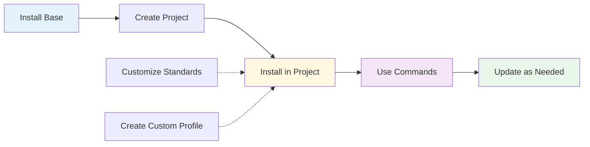

# Agent OS: CLI Commands and User Interface Reference

## Overview

This document provides a comprehensive reference for all user-facing commands in Agent OS, including installation commands, project commands, and internal utilities.

**Related Documents:**
- [Project Roadmap](./roadmap.md)
- [Workflows Analysis](./workflows.md)
- [Configuration Guide](./config.md)

---

## Installation Commands

### Base Installation

#### Install Agent OS (First Time)

**Command:**
```bash
bash <(curl -s https://raw.githubusercontent.com/buildermethods/agent-os/main/scripts/base-install.sh)
```

**Description:**  
Downloads and installs Agent OS to `~/agent-os/`. This is required before installing Agent OS in any project.

**Options:** None (interactive prompts for existing installations)

**Interactive Prompts:**

If base installation already exists:
```
=== ⚠️  Existing Installation Detected ===

You already have a base installation of Agent OS
  Your installed version: 2.0.3
  Latest available version: 2.0.3

What would you like to do?

1) Overwrite everything
2) Overwrite only the default profile, including your standards
3) Overwrite only the scripts
4) Overwrite only the base config.yml
5) Cancel installation
```

**Output:**
- Creates `~/agent-os/`
- Downloads all repository files (excluding `.git`, `.github`, etc.)
- Makes scripts executable
- Displays next steps

**Prerequisites:**
- curl installed
- Internet connection
- Write access to home directory

**Example:**
```bash
$ bash <(curl -s https://raw.githubusercontent.com/buildermethods/agent-os/main/scripts/base-install.sh)

=== Agent OS Base Installation ===

Initializing...
Installing Agent OS files...
✓ Installed 77 files to ~/agent-os

✓ Agent OS has been successfully installed!

Next steps:

1) Customize your profile's standards in ~/agent-os/profiles/default/standards

2) Navigate to a project directory
   cd path/to/project-directory

3) Install Agent OS in your project by running:
   ~/agent-os/scripts/project-install.sh

Visit the docs for guides on how to use Agent OS: https://buildermethods.com/agent-os
```

---

### Project Installation

#### Install Agent OS in Project

**Command:**
```bash
~/agent-os/scripts/project-install.sh [OPTIONS]
```

**Description:**  
Installs Agent OS into the current project directory, creating `agent-os/` and optionally `.claude/` directories.

**Options:**

| Option | Argument | Default | Description |
|--------|----------|---------|-------------|
| `--profile` | PROFILE | default | Use specified profile |
| `--multi-agent-mode` | [BOOL] | true | Enable/disable multi-agent mode |
| `--multi-agent-tool` | TOOL | claude-code | Specify multi-agent tool |
| `--single-agent-mode` | [BOOL] | false | Enable/disable single-agent mode |
| `--single-agent-tool` | TOOL | generic | Specify single-agent tool |
| `--re-install` | - | false | Delete and reinstall Agent OS |
| `--overwrite-all` | - | false | Overwrite all existing files |
| `--overwrite-standards` | - | false | Overwrite existing standards |
| `--overwrite-commands` | - | false | Overwrite existing commands |
| `--overwrite-agents` | - | false | Overwrite existing agents |
| `--dry-run` | - | false | Show what would be done |
| `--verbose` | - | false | Show detailed output |
| `-h, --help` | - | - | Show help message |

**Examples:**

```bash
# Basic installation with defaults
~/agent-os/scripts/project-install.sh

# Use custom profile
~/agent-os/scripts/project-install.sh --profile rails

# Enable both single and multi-agent modes
~/agent-os/scripts/project-install.sh --multi-agent-mode --single-agent-mode

# Dry run to preview changes
~/agent-os/scripts/project-install.sh --dry-run

# Reinstall from scratch
~/agent-os/scripts/project-install.sh --re-install

# Verbose output for debugging
~/agent-os/scripts/project-install.sh --verbose
```

**Output:**
```bash
=== Agent OS Project Installation ===

Configuration:
  Profile: default
  Multi-agent mode: true
  Multi-agent tool: claude-code
  Single-agent mode: false

Installing agent-os folder
✓ Created agent-os folder
✓ Created agent-os project configuration

Installing standards
✓ Installed 15 standards in agent-os/standards

Installing Claude Code tools
✓ Installed 4 Claude Code commands
✓ Installed 11 Claude Code agents

✓ Agent OS has been successfully installed in your project!

Visit the docs for guides on how to use Agent OS: https://buildermethods.com/agent-os
```

**Prerequisites:**
- Base installation at `~/agent-os/`
- Run from project root directory
- Write permissions in project directory

---

### Project Update

#### Update Agent OS in Project

**Command:**
```bash
~/agent-os/scripts/project-update.sh [OPTIONS]
```

**Description:**  
Updates existing Agent OS installation in the current project, optionally overwriting files.

**Options:** (Same as `project-install.sh`)

**Examples:**

```bash
# Update with default behavior (skip existing files)
~/agent-os/scripts/project-update.sh

# Overwrite all agents
~/agent-os/scripts/project-update.sh --overwrite-agents

# Overwrite everything
~/agent-os/scripts/project-update.sh --overwrite-all

# Preview update
~/agent-os/scripts/project-update.sh --dry-run

# Change to multi-agent mode
~/agent-os/scripts/project-update.sh --multi-agent-mode true
```

**Output:**
```bash
=== Agent OS Project Update ===

Configuration:
  Profile: default
  Multi-agent mode: true
  Multi-agent tool: claude-code

Updating agent-os folder
✓ Updated 3 files
✓ Added 2 new files
✓ Skipped 25 existing files

Summary:
  Updated: 3 files
  New: 2 files
  Skipped: 25 files

✓ Agent OS has been successfully updated in your project!
```

**Prerequisites:**
- Base installation at `~/agent-os/`
- Existing project installation
- Run from project root directory

---

## Agent OS Commands (In-Project)

These commands are available after installing Agent OS in a project. They appear differently depending on the mode.

### Multi-Agent Mode Commands

Located in `.claude/commands/agent-os/` (for Claude Code).

#### 1. new-spec

**Purpose:** Initialize and research a new feature specification.

**File:** `.claude/commands/agent-os/new-spec.md`

**Usage:**
```
Run the new-spec command in Claude Code
```

**What it does:**
1. Creates spec directory and initial structure
2. Gathers requirements through Q&A
3. Documents research findings
4. Prepares spec for formal writing

**Autonomous Agents Used:**
- spec-initializer
- spec-researcher

---

#### 2. create-spec

**Purpose:** Write a formal specification from an initialized spec.

**File:** `.claude/commands/agent-os/create-spec.md`

**Usage:**
```
Run the create-spec command in Claude Code
```

**What it does:**
1. Writes formal specification with all sections
2. Applies relevant standards
3. Creates task breakdown
4. Verifies completeness

**Autonomous Agents Used:**
- spec-writer
- tasks-list-creator
- spec-verifier

---

#### 3. implement-spec

**Purpose:** Implement a specification by executing all tasks.

**File:** `.claude/commands/agent-os/implement-spec.md`

**Usage:**
```
Run the implement-spec command in Claude Code
```

**What it does:**
1. Reviews specification and tasks
2. Assigns tasks to specialized implementer agents
3. Each agent implements their assigned tasks
4. Verifier agents check implementations
5. Testing engineer writes tests
6. Creates verification report

**Autonomous Agents Used:**
- database-engineer
- api-engineer
- ui-designer
- testing-engineer
- backend-verifier
- frontend-verifier

---

#### 4. plan-product

**Purpose:** Create product planning artifacts.

**File:** `.claude/commands/agent-os/plan-product.md`

**Usage:**
```
Run the plan-product command in Claude Code
```

**What it does:**
1. Gathers product information through Q&A
2. Creates product mission statement
3. Creates feature roadmap
4. Documents tech stack

**Autonomous Agents Used:**
- product-planner

---

### Single-Agent Mode Commands

Located in `agent-os/commands/` (flat structure if single-agent only, or with mode folders if both modes enabled).

#### 1. new-spec

**Files:**
- `1-new-spec.md` - Initialize specification
- `2-research-spec.md` - Research and document requirements

**Usage:**
```
1. Share the contents of 1-new-spec.md with your AI agent
2. Review the output
3. Share the contents of 2-research-spec.md with your AI agent
4. Review the output
```

**What it does:**
- Step-by-step prompts for spec initialization and research
- User reviews output after each step
- Manual progression through workflow

---

#### 2. create-spec

**Files:**
- `1-create-spec.md` - Write formal specification
- `2-create-tasks-list.md` - Create task breakdown
- `3-verify-spec.md` - Verify completeness

**Usage:**
```
1. Share the contents of 1-create-spec.md with your AI agent
2. Review the specification
3. Share the contents of 2-create-tasks-list.md with your AI agent
4. Review the tasks
5. Share the contents of 3-verify-spec.md with your AI agent
6. Review verification report
```

---

#### 3. implement-spec

**File:** `implement-spec.md`

**Usage:**
```
Share the contents of implement-spec.md with your AI agent
```

**What it does:**
- Comprehensive prompt for implementing entire specification
- Single prompt with all context and standards

---

#### 4. plan-product

**Files:**
- `1-plan-product.md` - Gather product information
- `2-create-mission.md` - Create mission statement
- `3-create-roadmap.md` - Create feature roadmap
- `4-create-tech-stack.md` - Document tech stack

**Usage:**
```
Progress through each file in order, reviewing output after each step
```

---

## Script Utilities

### create-profile.sh

**Command:**
```bash
~/agent-os/scripts/create-profile.sh [OPTIONS]
```

**Status:** Planned/stub implementation

**Purpose:** Create custom profiles for different project types.

---

### create-role.sh

**Command:**
```bash
~/agent-os/scripts/create-role.sh [OPTIONS]
```

**Status:** Planned/stub implementation

**Purpose:** Create custom implementer or verifier roles.

---

## Command-Line Argument Parsing

### Boolean Flags

Agent OS supports flexible boolean flag syntax:

```bash
# All equivalent - enable feature
--multi-agent-mode
--multi-agent-mode true
--multi-agent-mode=true

# All equivalent - disable feature
--multi-agent-mode false
--multi-agent-mode=false
```

### String Arguments

```bash
# With space
--profile rails

# With equals
--profile=rails
```

---

## Interactive Prompts

### Base Installation Update Prompt

```
What would you like to do?

1) Overwrite everything
2) Overwrite only the default profile, including your standards
3) Overwrite only the scripts
4) Overwrite only the base config.yml
5) Cancel installation

Enter your choice (1-5):
```

### Reinstallation Confirmation

```
This will DELETE your current agent-os/ folder and reinstall from scratch.

This will also DELETE:
  - .claude/agents/agent-os/
  - .claude/commands/agent-os/

Are you sure you want to proceed? (y/n):
```

### Dry Run Confirmation

```
The following files would be created:
  - agent-os/config.yml
  - agent-os/standards/global/coding-style.md
  [... more files ...]

Proceed with actual installation? (y/n):
```

---

## Exit Codes

| Code | Meaning | Common Causes |
|------|---------|---------------|
| 0 | Success | Command completed successfully |
| 1 | General error | Various errors, configuration issues |
| 2 | File not found | Missing files or directories |

---

## Command Output Formatting

### Color Codes

Agent OS uses colored output for clarity:

- **Blue** - Status messages, section headers
- **Green** - Success messages
- **Yellow** - Warnings
- **Red** - Errors

### Output Patterns

**Status:**
```
Installing agent-os folder
```

**Success:**
```
✓ Installed 15 standards in agent-os/standards
```

**Warning:**
```
⚠️  Existing Installation Detected
```

**Error:**
```
✗ Base installation not found
```

**Section:**
```
=== Agent OS Project Installation ===
```

---

## Usage Patterns

### Typical Workflow



**Steps:**
1. Install base with curl command
2. Optionally customize standards in `~/agent-os/`
3. Navigate to project directory
4. Run `project-install.sh`
5. Use Agent OS commands for development
6. Run `project-update.sh` for updates

---

### Common Scenarios

#### Scenario 1: New Project, Default Setup

```bash
# Install base (one time)
bash <(curl -s https://raw.githubusercontent.com/buildermethods/agent-os/main/scripts/base-install.sh)

# Install in project
cd ~/projects/my-app
~/agent-os/scripts/project-install.sh
```

---

#### Scenario 2: New Project, Custom Profile

```bash
# Create custom profile (manual or with tool)
cp -r ~/agent-os/profiles/default ~/agent-os/profiles/rails

# Customize rails profile
# Edit files in ~/agent-os/profiles/rails/

# Install with custom profile
cd ~/projects/my-rails-app
~/agent-os/scripts/project-install.sh --profile rails
```

---

#### Scenario 3: Existing Project, Enable Single-Agent Mode

```bash
cd ~/projects/existing-app
~/agent-os/scripts/project-update.sh --single-agent-mode true
```

---

#### Scenario 4: Update After Base Changes

```bash
# Update base installation
bash <(curl -s https://raw.githubusercontent.com/buildermethods/agent-os/main/scripts/base-install.sh)

# Update all projects
cd ~/projects/project1
~/agent-os/scripts/project-update.sh --overwrite-agents

cd ~/projects/project2
~/agent-os/scripts/project-update.sh --overwrite-agents
```

---

#### Scenario 5: Troubleshooting - Clean Reinstall

```bash
cd ~/projects/problem-project
~/agent-os/scripts/project-install.sh --re-install
```

---

## Command Availability Matrix

| Command | Multi-Agent | Single-Agent | Location |
|---------|-------------|--------------|----------|
| new-spec | ✅ Autonomous | ✅ 2 prompts | .claude/commands/ or agent-os/commands/ |
| create-spec | ✅ Autonomous | ✅ 3 prompts | .claude/commands/ or agent-os/commands/ |
| implement-spec | ✅ Autonomous | ✅ 1 prompt | .claude/commands/ or agent-os/commands/ |
| plan-product | ✅ Autonomous | ✅ 4 prompts | .claude/commands/ or agent-os/commands/ |

---

## Related Documentation

- [Project Roadmap](./roadmap.md) - Modernization strategy
- [Code Map](./codemap.md) - Component details
- [Workflows Analysis](./workflows.md) - Workflow details
- [Configuration Guide](./config.md) - Configuration options
- [Refactoring Notes](./refactoring-notes.md) - Future improvements

---

**Last Updated:** 2025-10-13  
**Analysis Version:** 1.0  
**Source Repository:** https://github.com/buildermethods/agent-os
