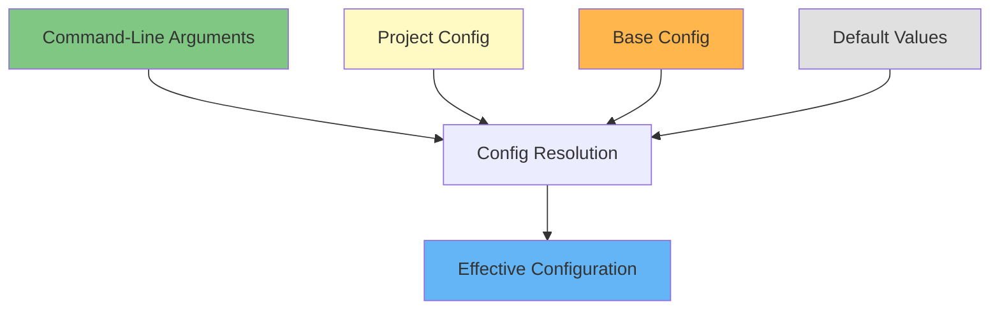
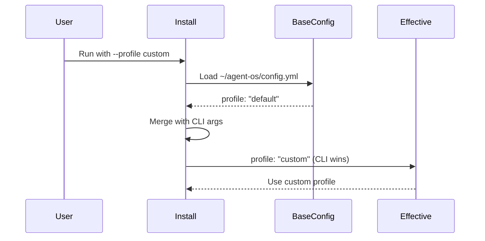
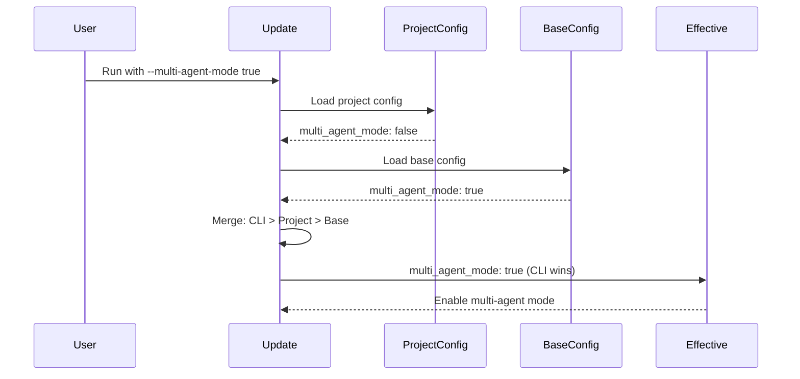
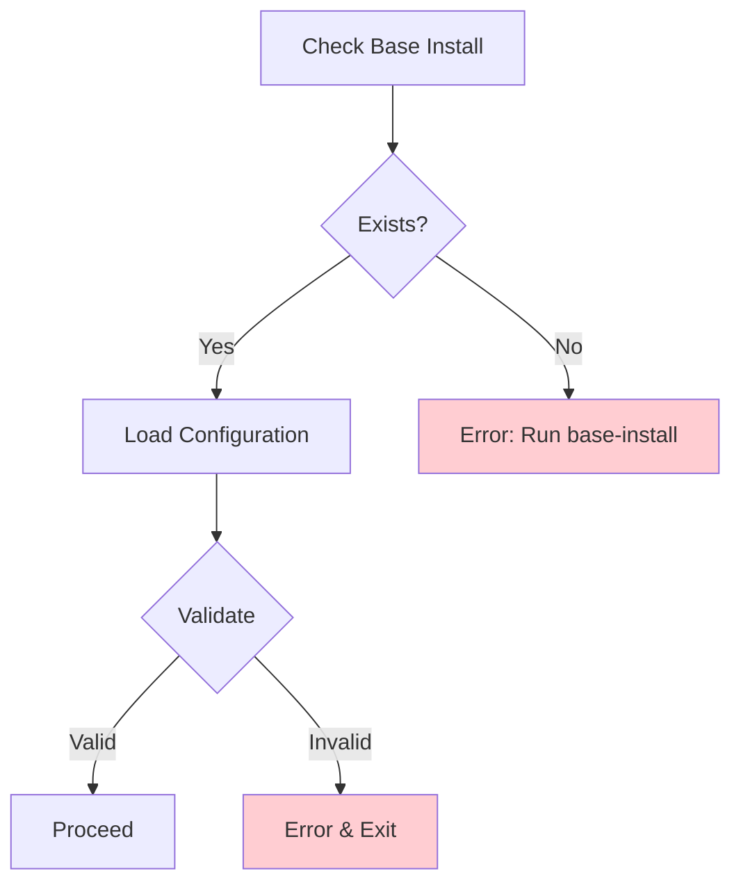

# Agent OS: Configuration and Environment Mapping

## Overview

This document comprehensively maps all configuration files, environment variables, and settings in Agent OS. It documents how configuration flows through the system and how values are resolved.

**Related Documents:**
- [Project Roadmap](./roadmap.md)
- [Code Map](./codemap.md)
- [Workflows Analysis](./workflows.md)
- [Architecture Diagrams](./architecture.md)

---

## Configuration Files

### 1. Base Configuration (`~/agent-os/config.yml`)

**Location:** `~/agent-os/config.yml`  
**Created by:** `base-install.sh`  
**Purpose:** Global default settings for Agent OS installation

**Schema:**

```yaml
# Version tracking
version: "2.0.3"

# Base installation flag
base_install: true

# Multi-agent mode configuration
multi_agent_mode: true
multi_agent_tool: "claude-code"

# Single-agent mode configuration
single_agent_mode: false
single_agent_tool: "generic"

# Default profile
profile: "default"
```

**Field Definitions:**

| Field | Type | Default | Description |
|-------|------|---------|-------------|
| `version` | string | "2.0.3" | Agent OS version number |
| `base_install` | boolean | true | Indicates base installation presence |
| `multi_agent_mode` | boolean | true | Enable multi-agent orchestration |
| `multi_agent_tool` | string | "claude-code" | Tool for multi-agent mode |
| `single_agent_mode` | boolean | false | Enable single-agent prompts |
| `single_agent_tool` | string | "generic" | Tool for single-agent mode |
| `profile` | string | "default" | Active profile name |

**Valid Values:**

- `multi_agent_tool`: `"claude-code"` (other tools planned)
- `single_agent_tool`: `"generic"`, `"cursor"`, etc.
- `profile`: Any profile name in `~/agent-os/profiles/`

**Constraints:**
- At least one agent mode must be enabled
- Both modes can be enabled simultaneously
- Profile must exist in profiles directory

---

### 2. Project Configuration (`<project>/agent-os/config.yml`)

**Location:** `<project>/agent-os/config.yml`  
**Created by:** `project-install.sh`  
**Purpose:** Project-specific Agent OS configuration

**Schema:** (Same as base configuration)

```yaml
version: "2.0.3"
base_install: false
multi_agent_mode: true
multi_agent_tool: "claude-code"
single_agent_mode: false
single_agent_tool: "generic"
profile: "default"
```

**Key Differences from Base:**
- `base_install: false` (indicates project install)
- Can override all base settings
- Takes precedence over base config in updates

---

### 3. Role Definitions (`profiles/<profile>/roles/`)

#### Implementers Configuration (`implementers.yml`)

**Location:** `profiles/default/roles/implementers.yml`  
**Purpose:** Define specialized implementer agent roles

**Schema:**

```yaml
implementers:
  - id: <role-id>
    description: <brief-description>
    your_role: <agent-instructions>
    tools: <tool-list>
    model: <model-spec>
    color: <ui-color>
    areas_of_responsibility:
      - <responsibility-1>
      - <responsibility-2>
    example_areas_outside_of_responsibility:
      - <exclusion-1>
      - <exclusion-2>
    standards:
      - <standards-pattern>
    verified_by:
      - <verifier-id>
```

**Field Definitions:**

| Field | Type | Required | Description |
|-------|------|----------|-------------|
| `id` | string | Yes | Unique role identifier (kebab-case) |
| `description` | string | Yes | Brief role summary |
| `your_role` | string | Yes | Instructions for agent assuming this role |
| `tools` | string | Yes | Comma-separated tool list |
| `model` | string | Yes | AI model ("inherit" or specific model) |
| `color` | string | Yes | UI color identifier |
| `areas_of_responsibility` | array | Yes | List of responsibilities |
| `example_areas_outside_of_responsibility` | array | No | Scope boundary examples |
| `standards` | array | Yes | Standards patterns (glob-style) |
| `verified_by` | array | Yes | Verifier role IDs |

**Available Tools:**
- `Write` - File writing capability
- `Read` - File reading capability
- `Bash` - Shell command execution
- `WebFetch` - Web content retrieval
- `Playwright` - Browser automation

**Standards Patterns:**
- `global/*` - All global standards
- `backend/*` - All backend standards
- `frontend/*` - All frontend standards
- `testing/*` - All testing standards
- `global/specific.md` - Specific standard file

**Example:**

```yaml
implementers:
  - id: database-engineer
    description: Handles migrations, models, schemas, database queries
    your_role: You are a database engineer. Your role is to implement database migrations, models, schemas, and database queries.
    tools: Write, Read, Bash, WebFetch
    model: inherit
    color: orange
    areas_of_responsibility:
      - Create database migrations
      - Create database models
      - Create database queries
    example_areas_outside_of_responsibility:
      - Create API endpoints
      - Create UI components
    standards:
      - global/*
      - backend/*
      - testing/*
    verified_by:
      - backend-verifier
```

---

#### Verifiers Configuration (`verifiers.yml`)

**Location:** `profiles/default/roles/verifiers.yml`  
**Purpose:** Define verification agent roles

**Schema:** (Same structure as implementers, without `verified_by`)

```yaml
verifiers:
  - id: <role-id>
    description: <brief-description>
    your_role: <agent-instructions>
    tools: <tool-list>
    model: <model-spec>
    color: <ui-color>
    areas_of_responsibility:
      - <responsibility-1>
    example_areas_outside_of_responsibility:
      - <exclusion-1>
    standards:
      - <standards-pattern>
```

**Example:**

```yaml
verifiers:
  - id: backend-verifier
    description: Verifies backend implementations
    your_role: You are a backend verifier. Your role is to verify backend code implementations.
    tools: Read, Bash
    model: inherit
    color: yellow
    areas_of_responsibility:
      - Verify backend code quality
      - Check standards compliance
      - Validate test coverage
    standards:
      - global/*
      - backend/*
      - testing/*
```

---

## Configuration Resolution

### Configuration Layer Hierarchy



**Resolution Order (highest to lowest priority):**

1. **Command-Line Arguments** - Explicit user input
2. **Project Configuration** - Project-specific settings (updates only)
3. **Base Configuration** - Global defaults
4. **Hardcoded Defaults** - Fallback values in code

### Configuration Flow (Installation)



### Configuration Flow (Update)



---

## Environment Variables

### System Environment Variables

**Used by Scripts:**

| Variable | Source | Usage | Description |
|----------|--------|-------|-------------|
| `HOME` | System | All scripts | User home directory path |
| `PWD` | System | Installation scripts | Current working directory |
| `BASH_SOURCE` | Bash | Script resolution | Script file location |
| `TMPDIR` | System | base-install.sh | Temporary file directory |

**Used in GitHub Actions:**

| Variable | Source | Workflow | Usage |
|----------|--------|----------|-------|
| `GITHUB_TOKEN` | GitHub | pr-decline.yml, stale.yml | Authentication |
| `GITHUB_REPOSITORY` | GitHub | pr-decline.yml | Repository identifier |
| `GITHUB_EVENT_NAME` | GitHub | pr-decline.yml | Trigger event type |
| `GITHUB_WORKSPACE` | GitHub | Actions | Workspace directory |

### Custom Environment Variables

**Defined in Workflows:**

```yaml
# pr-decline.yml
env:
  REPO: ${{ github.repository }}
  IDEAS_URL: https://github.com/buildermethods/agent-os/discussions/categories/ideas
  CONTRIBUTING_URL: https://github.com/buildermethods/agent-os/blob/main/.github/CONTRIBUTING.md
```

---

## Path Configuration

### Hardcoded Paths

**Base Installation:**
```bash
BASE_DIR="$HOME/agent-os"
```

**Project Installation:**
```bash
PROJECT_DIR="$(pwd)"
AGENT_OS_DIR="$PROJECT_DIR/agent-os"
CLAUDE_DIR="$PROJECT_DIR/.claude"
```

**Script Locations:**
```bash
SCRIPT_DIR="$( cd "$( dirname "${BASH_SOURCE[0]}" )" && pwd )"
```

### Dynamic Path Resolution

**Profile Files:**
```bash
# Function: get_profile_file
# Resolves: ~/agent-os/profiles/<profile>/<relative_path>
get_profile_file(profile, relative_path, base_dir) {
    echo "${base_dir}/profiles/${profile}/${relative_path}"
}
```

**Standards Files:**
```bash
# Resolved from standards patterns in roles
# Example: "global/*" -> ~/agent-os/profiles/default/standards/global/*.md
```

---

## Template Variables

### Agent Template Variables

**Used in `agents/templates/implementer.md` and `verifier.md`:**

| Variable | Source | Description |
|----------|--------|-------------|
| `{{ROLE_id}}` | Role YAML | Role identifier |
| `{{ROLE_description}}` | Role YAML | Role description |
| `{{ROLE_your_role}}` | Role YAML | Role instructions |
| `{{ROLE_tools}}` | Role YAML | Available tools |
| `{{ROLE_model}}` | Role YAML | AI model specification |
| `{{ROLE_color}}` | Role YAML | UI color |
| `{{ROLE_areas_of_responsibility}}` | Role YAML | Responsibility list |
| `{{ROLE_example_areas_outside_of_responsibility}}` | Role YAML | Exclusion examples |
| `{{ROLE_implementer_standards}}` | Processed | Embedded standards content |
| `{{ROLE_verifier_standards}}` | Processed | Embedded standards content |

### Command Template Variables

**Used in command files:**

| Variable | Source | Description |
|----------|--------|-------------|
| `{{STANDARDS}}` | Standards files | All relevant standards content |
| `{{WORKFLOWS}}` | Workflow files | Workflow documentation |

### Variable Substitution Format

**Delimiter-Based Format (for multi-line values):**

```
<<<FIELD>>>
Multi-line content
Can span multiple lines
<<<END>>>
```

**Simple Format (for single-line values):**

```
{{VARIABLE}}
```

---

## Configuration Validation

### Validation Rules

**In `common-functions.sh` (`validate_config()`):**

```bash
validate_config() {
    local multi_agent_mode=$1
    local single_agent_mode=$2
    local profile=$3
    
    # Rule 1: At least one mode must be enabled
    if [[ "$multi_agent_mode" != "true" ]] && [[ "$single_agent_mode" != "true" ]]; then
        print_error "At least one agent mode must be enabled"
        exit 1
    fi
    
    # Rule 2: Profile must exist
    if [[ ! -d "$BASE_DIR/profiles/$profile" ]]; then
        print_error "Profile not found: $profile"
        exit 1
    fi
}
```

### Validation Points



---

## Configuration Examples

### Example 1: Multi-Agent Only (Default)

**Base Config:**
```yaml
version: "2.0.3"
base_install: true
multi_agent_mode: true
multi_agent_tool: "claude-code"
single_agent_mode: false
single_agent_tool: "generic"
profile: "default"
```

**Result:**
- Installs to `.claude/agents/` and `.claude/commands/`
- Generates dynamic agents from roles
- No single-agent commands installed

---

### Example 2: Both Modes Enabled

**Base Config:**
```yaml
multi_agent_mode: true
multi_agent_tool: "claude-code"
single_agent_mode: true
single_agent_tool: "generic"
profile: "default"
```

**Result:**
- Multi-agent: `.claude/agents/`, `.claude/commands/`
- Single-agent: `agent-os/commands/` with step-by-step prompts
- Both folder structures preserved

---

### Example 3: Single-Agent Only

**Base Config:**
```yaml
multi_agent_mode: false
single_agent_tool: "generic"
single_agent_mode: true
profile: "default"
```

**Result:**
- Only `agent-os/` directory created
- Commands installed without mode subfolders
- Roles installed to `agent-os/roles/`

---

### Example 4: Custom Profile

**Command:**
```bash
~/agent-os/scripts/project-install.sh --profile rails
```

**Configuration Resolution:**
```yaml
# From command line
profile: "rails"

# Uses: ~/agent-os/profiles/rails/
```

---

### Example 5: Override on Update

**Command:**
```bash
~/agent-os/scripts/project-update.sh --multi-agent-mode true --overwrite-agents
```

**Configuration Resolution:**
```yaml
# Project config has: multi_agent_mode: false
# Command line has: --multi-agent-mode true
# Result: multi_agent_mode: true (CLI wins)
```

---

## Default Values Reference

### Base Configuration Defaults

```yaml
version: "2.0.3"
base_install: true
multi_agent_mode: true
multi_agent_tool: "claude-code"
single_agent_mode: false
single_agent_tool: "generic"
profile: "default"
```

### Script Variable Defaults

**In `project-install.sh` and `project-update.sh`:**

```bash
DRY_RUN="false"
VERBOSE="false"
PROFILE=""  # Empty = use config default
MULTI_AGENT_MODE=""  # Empty = use config default
MULTI_AGENT_TOOL=""  # Empty = use config default
SINGLE_AGENT_MODE=""  # Empty = use config default
SINGLE_AGENT_TOOL=""  # Empty = use config default
RE_INSTALL="false"
OVERWRITE_ALL="false"
OVERWRITE_STANDARDS="false"
OVERWRITE_COMMANDS="false"
OVERWRITE_AGENTS="false"
```

---

## Configuration Migration

### From v1.x to v2.x

**Changes:**
- Added `multi_agent_mode` and `single_agent_mode`
- Added `multi_agent_tool` and `single_agent_tool`
- Removed `mode` field (replaced by separate mode flags)

**Migration:**
```yaml
# v1.x
mode: "multi-agent"

# v2.x
multi_agent_mode: true
multi_agent_tool: "claude-code"
single_agent_mode: false
```

---

## Troubleshooting Configuration Issues

### Common Issues

**Issue 1: "At least one agent mode must be enabled"**
- **Cause:** Both modes disabled
- **Solution:** Enable at least one mode
- **Fix:** Set `multi_agent_mode: true` or `single_agent_mode: true`

**Issue 2: "Profile not found"**
- **Cause:** Invalid profile name
- **Solution:** Use existing profile or create new one
- **Check:** `ls ~/agent-os/profiles/`

**Issue 3: "Base installation not found"**
- **Cause:** `~/agent-os/` doesn't exist
- **Solution:** Run `base-install.sh` first
- **Verify:** `ls ~/agent-os/`

**Issue 4: Version mismatch warnings**
- **Cause:** Base and project versions differ
- **Solution:** Update base or project installation
- **Commands:** `base-install.sh` (for base) or `project-update.sh` (for project)

---

## Related Documentation

- [Project Roadmap](./roadmap.md) - Modernization strategy
- [Code Map](./codemap.md) - Component details
- [Workflows Analysis](./workflows.md) - Process flows
- [Architecture Diagrams](./architecture.md) - System architecture
- [Commands Reference](./commands.md) - CLI commands
- [Refactoring Notes](./refactoring-notes.md) - Action items

---

**Last Updated:** 2025-10-13  
**Analysis Version:** 1.0  
**Source Repository:** https://github.com/buildermethods/agent-os
