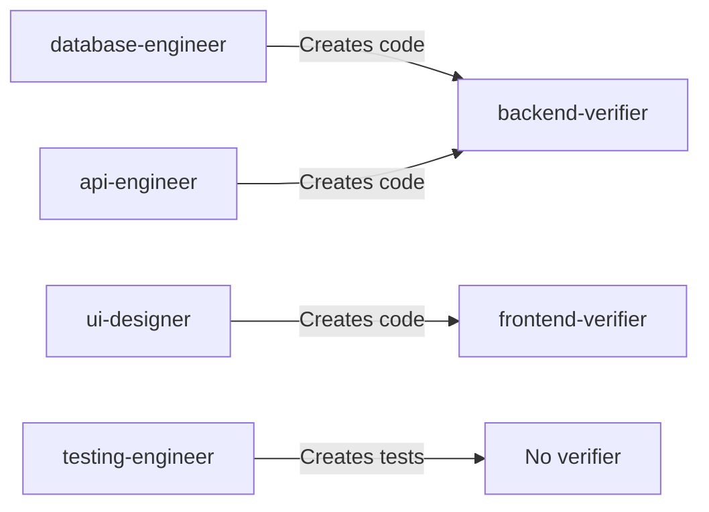

# Agent OS: Roles Structure and API Mapping Analysis

## Executive Summary

This document provides comprehensive analysis of the Agent OS roles system, including YAML structure, role definitions, API mappings, and multi-agent compilation patterns. Roles define specialized agent behaviors with specific responsibilities, tools, and standards.

**Key Findings:**
- 2 role files (`implementers.yml`, `verifiers.yml`) containing 6 total role definitions
- Structured YAML format with 10+ fields per role
- Roles compile into agent definitions during multi-agent installation
- Role-to-agent mapping enables dynamic agent generation from templates

---

## Role Inventory

### Role Files

| File | Role Type | Count | Purpose |
|------|-----------|-------|---------|
| `implementers.yml` | Implementers | 4 | Define specialized implementation agents |
| `verifiers.yml` | Verifiers | 2 | Define verification/QA agents |
| **Total** | | **6** | Complete role library |

### Role Definitions

#### Implementers (4 roles)

| ID | Description | Color | Model | Verifier |
|----|-------------|-------|-------|----------|
| `database-engineer` | Migrations, models, schemas, queries | Orange | inherit | backend-verifier |
| `api-engineer` | API endpoints, controllers, business logic | Blue | inherit | backend-verifier |
| `ui-designer` | UI components, views, layouts, styling | Purple | inherit | frontend-verifier |
| `testing-engineer` | Test files, test suites, test coverage | Green | inherit | (none) |

#### Verifiers (2 roles)

| ID | Description | Color | Model | Verifies |
|----|-------------|-------|-------|----------|
| `backend-verifier` | Verifies database and API implementations | Pink | sonnet | Database + API |
| `frontend-verifier` | Verifies UI, styling, responsive design | Cyan | sonnet | UI + Frontend |

---

## File Structure

### Directory Location

```
profiles/default/roles/
├── implementers.yml
└── verifiers.yml
```

**Pattern:** `profiles/{profile}/roles/{role-category}.yml`

### File Naming Conventions

**Rules:**
- Lowercase only
- Hyphen-separated if multi-word
- Descriptive of role category
- `.yml` or `.yaml` extension
- Category-based grouping (implementers, verifiers, etc.)

**Valid Examples:**
```
implementers.yml
verifiers.yml
reviewers.yml
architects.yml
```

---

## YAML Structure

### Top-Level Structure

```yaml
{category}:           # Category name (e.g., "implementers", "verifiers")
  - id: {role-id}     # Unique identifier for the role
    description: ...   # Brief description
    your_role: ...     # First-person role description
    tools: ...         # Available tools/capabilities
    model: ...         # LLM model to use
    color: ...         # Visual identifier
    areas_of_responsibility: ...
    example_areas_outside_of_responsibility: ...
    standards: ...     # Standards to follow
    verified_by: ...   # (Implementers only) Verifier role ID
```

### Field Definitions

#### Required Fields

| Field | Type | Description | Example |
|-------|------|-------------|---------|
| `id` | string | Unique role identifier (kebab-case) | `database-engineer` |
| `description` | string | Brief role description | `Handles migrations, models, schemas` |
| `your_role` | string | First-person role statement | `You are a database engineer...` |
| `tools` | string or array | Available tools (comma-separated or array) | `Write, Read, Bash, WebFetch` |
| `model` | string | LLM model (`inherit`, `sonnet`, `opus`, `haiku`) | `inherit` or `sonnet` |
| `color` | string | Visual identifier color | `orange`, `blue`, `purple` |
| `areas_of_responsibility` | array | List of responsibilities | See below |
| `standards` | array | Standards glob patterns | `["global/*", "backend/*"]` |

#### Optional Fields

| Field | Type | Description | Example |
|-------|------|-------------|---------|
| `example_areas_outside_of_responsibility` | array | Anti-responsibilities | What NOT to do |
| `verified_by` | array | Verifier role IDs | `["backend-verifier"]` |

### Field Details

#### `id` Field
- **Format:** kebab-case (lowercase, hyphen-separated)
- **Uniqueness:** Must be unique within the role file
- **Usage:** Used to reference role in templates and agent compilation
- **Examples:** `database-engineer`, `api-engineer`, `backend-verifier`

#### `description` Field
- **Format:** Plain text, brief (1-2 sentences)
- **Purpose:** Human-readable summary of role
- **Usage:** Displayed in UI, documentation, and agent lists

#### `your_role` Field
- **Format:** First-person narrative statement
- **Purpose:** Injected into agent prompt as identity
- **Pattern:** "You are a {role}. Your role is to {responsibilities}."
- **Example:** `You are a database engineer. Your role is to implement database migrations, models, schemas, and database queries.`

#### `tools` Field
- **Format:** String (comma-separated) or Array
- **Options:**
  - `Write` - File write operations
  - `Read` - File read operations
  - `Bash` - Shell command execution
  - `WebFetch` - Web/API requests
  - `Playwright` - Browser automation
- **Example (String):** `Write, Read, Bash, WebFetch`
- **Example (Array):** `["Write", "Read", "Bash", "WebFetch"]`

#### `model` Field
- **Options:**
  - `inherit` - Use project default model
  - `sonnet` - Claude Sonnet model
  - `opus` - Claude Opus model
  - `haiku` - Claude Haiku model
- **Typical Usage:**
  - Implementers: `inherit` (defer to project config)
  - Verifiers: `sonnet` (explicit model choice)

#### `color` Field
- **Purpose:** Visual identifier in UI/logs
- **Format:** CSS color name
- **Examples:** `orange`, `blue`, `purple`, `pink`, `cyan`, `green`

#### `areas_of_responsibility` Field
- **Format:** YAML array of strings
- **Purpose:** Define what the role SHOULD do
- **Usage:** Included in agent prompt to scope responsibilities
- **Example:**
```yaml
areas_of_responsibility:
  - Create database migrations
  - Create database models
  - Create database queries
  - Create database seed data
```

#### `example_areas_outside_of_responsibility` Field
- **Format:** YAML array of strings
- **Purpose:** Define what the role SHOULD NOT do (boundaries)
- **Usage:** Helps agent avoid scope creep
- **Example:**
```yaml
example_areas_outside_of_responsibility:
  - Create API endpoints
  - Create UI components
  - Write backend business logic
```

#### `standards` Field
- **Format:** YAML array of glob patterns
- **Purpose:** Define which standards apply to this role
- **Expansion:** Patterns expanded during agent compilation
- **Example:**
```yaml
standards:
  - global/*      # All global standards
  - backend/*     # All backend standards
  - testing/*     # All testing standards
```

#### `verified_by` Field
- **Format:** YAML array of role IDs
- **Purpose:** Link implementer to verifier(s)
- **Usage:** Determines which verifier reviews this implementer's work
- **Example:**
```yaml
verified_by:
  - backend-verifier
```

---

## API Endpoint Mappings

### List Roles

**Endpoint:** `GET /profiles/{profile}/roles`

**File System Action:**
- List all `*.yml` files in `profiles/{profile}/roles/`
- Parse YAML structure
- Return metadata for all roles

**Response Example:**
```json
{
  "profile": "default",
  "files": ["implementers.yml", "verifiers.yml"],
  "roles": [
    {
      "id": "database-engineer",
      "category": "implementers",
      "description": "Handles migrations, models, schemas, database queries",
      "model": "inherit",
      "color": "orange",
      "file": "implementers.yml"
    },
    {
      "id": "backend-verifier",
      "category": "verifiers",
      "description": "Verifies database and API implementations",
      "model": "sonnet",
      "color": "pink",
      "file": "verifiers.yml"
    }
  ]
}
```

### Get Role Details

**Endpoint:** `GET /profiles/{profile}/roles/{roleId}`

**File System Action:**
- Search all `*.yml` files in `profiles/{profile}/roles/`
- Parse YAML to find role with matching `id`
- Return complete role definition

**Response Example:**
```json
{
  "id": "database-engineer",
  "category": "implementers",
  "file": "implementers.yml",
  "description": "Handles migrations, models, schemas, database queries",
  "your_role": "You are a database engineer...",
  "tools": ["Write", "Read", "Bash", "WebFetch"],
  "model": "inherit",
  "color": "orange",
  "areas_of_responsibility": [
    "Create database migrations",
    "Create database models"
  ],
  "example_areas_outside_of_responsibility": [
    "Create API endpoints",
    "Create UI components"
  ],
  "standards": ["global/*", "backend/*", "testing/*"],
  "verified_by": ["backend-verifier"]
}
```

### Create/Update Role

**Endpoint:** `POST /profiles/{profile}/roles`

**Request Body:**
```json
{
  "file": "implementers.yml",
  "category": "implementers",
  "roles": [
    {
      "id": "database-engineer",
      "description": "...",
      "your_role": "...",
      "tools": ["Write", "Read", "Bash"],
      "model": "inherit",
      "color": "orange",
      "areas_of_responsibility": [],
      "standards": ["global/*", "backend/*"],
      "verified_by": ["backend-verifier"]
    }
  ]
}
```

**File System Action:**
- Write to: `profiles/{profile}/roles/{file}`
- Validate YAML structure
- Overwrite existing file

### Delete Role

**Endpoint:** `DELETE /profiles/{profile}/roles/{roleId}`

**File System Action:**
- Find role in appropriate YAML file
- Remove role entry from YAML
- Rewrite file without the role
- Or delete entire file if it was the only role

---

## Role-to-Agent Compilation

### Multi-Agent Mode Compilation

During project installation with `multi_agent_mode: true`, roles are compiled into agent definitions.

**Process:**
1. **Read Role Definition:** Parse role from YAML file
2. **Load Agent Template:** Load `profiles/{profile}/agents/templates/{category}.md`
3. **Variable Substitution:** Replace placeholders with role data
4. **Standards Expansion:** Expand `{{standards/*}}` patterns
5. **Write Agent File:** Create agent definition file

### Template Variables

**Agent Template (`templates/implementer.md`):**
```markdown
# {{role_name}}

{{your_role}}

## Tools
{{tools}}

## Areas of Responsibility
{{areas_of_responsibility}}

## Areas Outside of Responsibility
{{example_areas_outside_of_responsibility}}

## Standards to Follow
{{standards}}

## Verified By
{{verified_by}}
```

**After Compilation (Example for `database-engineer`):**
```markdown
# Database Engineer

You are a database engineer. Your role is to implement database migrations, models, schemas, and database queries.

## Tools
Write, Read, Bash, WebFetch

## Areas of Responsibility
- Create database migrations
- Create database models
- Create database queries

## Areas Outside of Responsibility
- Create API endpoints
- Create UI components

## Standards to Follow
[Expanded content of all matched standards]

## Verified By
backend-verifier
```

### File Output Location

**Multi-Agent Mode:**
- Output: `<project>/.claude/agents/agent-os/{role-id}.md`
- Example: `<project>/.claude/agents/agent-os/database-engineer.md`

**Single-Agent Mode:**
- Roles not compiled into separate files
- Roles referenced in command steps as context

---

## Role Assignment Pattern

### Implementer-Verifier Pairing

| Implementer | Verifier | Standards Overlap |
|-------------|----------|-------------------|
| database-engineer | backend-verifier | global, backend, testing |
| api-engineer | backend-verifier | global, backend, testing |
| ui-designer | frontend-verifier | global, frontend, testing |
| testing-engineer | (none) | global, backend, frontend, testing |

**Pattern:** Related implementers share a verifier with overlapping standards.

### Verification Flow



---

## Standards Assignment

### Standards Matrix

| Role | Global | Backend | Frontend | Testing | Total |
|------|--------|---------|----------|---------|-------|
| database-engineer | ✅ (6) | ✅ (4) | ❌ | ✅ (1) | 11 |
| api-engineer | ✅ (6) | ✅ (4) | ❌ | ✅ (1) | 11 |
| ui-designer | ✅ (6) | ❌ | ✅ (4) | ✅ (1) | 11 |
| testing-engineer | ✅ (6) | ✅ (4) | ✅ (4) | ✅ (1) | 15 |
| backend-verifier | ✅ (6) | ✅ (4) | ❌ | ✅ (1) | 11 |
| frontend-verifier | ✅ (6) | ❌ | ✅ (4) | ✅ (1) | 11 |

**Note:** All roles include `global/*` standards (universal guidelines).

---

## Profile Inheritance

### Role Override Behavior

**Rule:** Child roles override parent roles by `id`.

**Example:**
```
profiles/
├── base/
│   └── roles/
│       └── implementers.yml    # Contains database-engineer
└── custom/
    └── roles/
        └── implementers.yml    # Contains database-engineer (different config)
```

**Resolution:**
- Uses `custom/roles/implementers.yml::database-engineer` (child overrides parent)
- Other roles from parent are still available if not overridden

---

## Validation and Quality Control

### YAML Validation

| Check | Description | Enforcement |
|-------|-------------|-------------|
| Valid YAML syntax | File must be parseable YAML | ✅ Required |
| Required fields present | All required fields exist | ✅ Required |
| Unique IDs | No duplicate role IDs within profile | ✅ Required |
| Valid model values | Model is one of allowed values | ⚠️ Recommended |
| Valid standards patterns | Standards patterns are valid globs | ⚠️ Recommended |
| Valid verifier references | Verifier IDs exist in verifiers.yml | ⚠️ Recommended |

### Content Quality Checks

- [ ] Role description is clear and concise
- [ ] Areas of responsibility are specific
- [ ] Areas outside of responsibility are helpful
- [ ] Standards assignment is appropriate
- [ ] Verifier assignment makes sense
- [ ] `your_role` statement is grammatically correct

---

## Error Handling

### Missing/Invalid Files

| Scenario | HTTP Status | Response | Behavior |
|----------|-------------|----------|----------|
| Role file doesn't exist | 404 | `{"error": "Role file not found"}` | Return error |
| Invalid YAML syntax | 400 | `{"error": "Invalid YAML"}` | Return parse error |
| Role ID not found | 404 | `{"error": "Role not found"}` | Return error |
| Profile doesn't exist | 404 | `{"error": "Profile not found"}` | Return error |

### Compilation Errors

| Scenario | HTTP Status | Response | Behavior |
|----------|-------------|----------|----------|
| Missing template file | 500 | `{"error": "Template not found"}` | Abort compilation |
| Standards expansion error | 500 | `{"error": "Standards expansion failed"}` | Abort compilation |
| Missing required field | 400 | `{"error": "Missing field: {field}"}` | Abort compilation |

---

## Performance Considerations

### Caching Strategy

**Role Definitions:**
- Cache parsed YAML in memory
- Invalidate on file system changes
- Cache role-to-agent compilation results

**Cache Key Example:**
```
Key: role:{profile}:{role-id}
Value: Parsed role object
TTL: Until file modified
```

### Optimization

**For API Requests:**
- Parse YAML once per file, cache results
- Index roles by ID for fast lookup
- Pre-compile agents during installation

---

## Testing Recommendations

### Unit Tests
- [ ] YAML parsing (valid structure)
- [ ] YAML parsing (invalid structure)
- [ ] Role ID uniqueness validation
- [ ] Required field validation
- [ ] Standards pattern validation
- [ ] Verifier reference validation
- [ ] Template variable substitution

### Integration Tests
- [ ] API `/profiles/{profile}/roles` listing
- [ ] API `/profiles/{profile}/roles/{roleId}` retrieval
- [ ] Role creation via POST
- [ ] Role deletion via DELETE
- [ ] Agent compilation from role
- [ ] Standards expansion in compiled agent
- [ ] Profile inheritance override

### Edge Case Tests
- [ ] Empty role file
- [ ] Role with minimal fields
- [ ] Role with all optional fields
- [ ] Very long role description
- [ ] Invalid standards pattern
- [ ] Non-existent verifier reference
- [ ] Circular verifier dependencies

---

## Related Documentation

- [API Specification](../api-spec_Version2.md) - API endpoints for roles
- [Claude Code Integration Policy](../CLAUDE_CODE_INTEGRATION_POLICY_Version2.md) - Integration patterns
- [Profiles Analysis](./profiles-analysis.md) - Profile structure and inheritance
- [Agents Analysis](./agents-analysis.md) - Agent compilation process
- [Standards Analysis](./standards-analysis.md) - Standards assignment details

---

## Recommendations

### Immediate Actions
1. Add YAML schema validation
2. Implement role ID uniqueness check
3. Validate verifier references
4. Document role authoring guide

### Short-Term Improvements
1. Add role metadata (version, author, tags)
2. Implement role versioning
3. Create role testing framework
4. Add role validation CLI tool
5. Support role composition (role extends another role)

### Long-Term Vision
1. Role marketplace/registry
2. Dynamic role loading via API
3. AI-assisted role generation
4. Role analytics (usage tracking)
5. Interactive role builder UI
6. Role dependencies and orchestration
7. Role performance metrics

---

**Last Updated:** 2025-10-14  
**Analysis Version:** 2.0  
**Agent OS Version Analyzed:** 2.0.3  
**Source Repository:** https://github.com/buildermethods/agent-os
