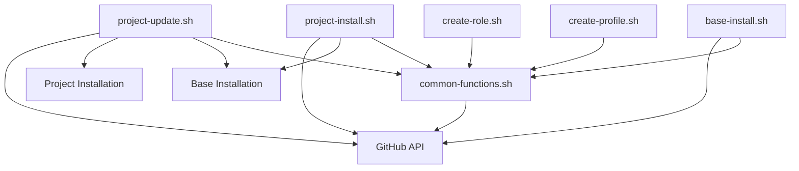
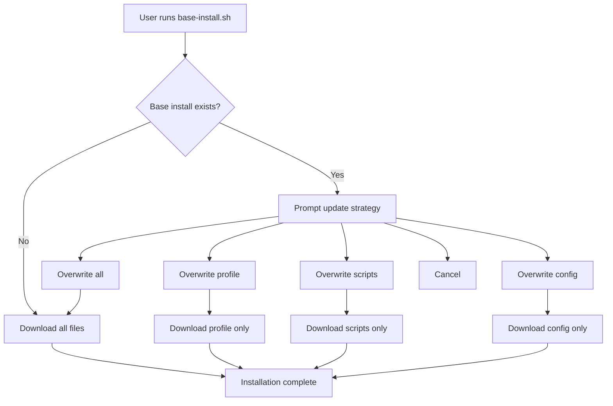
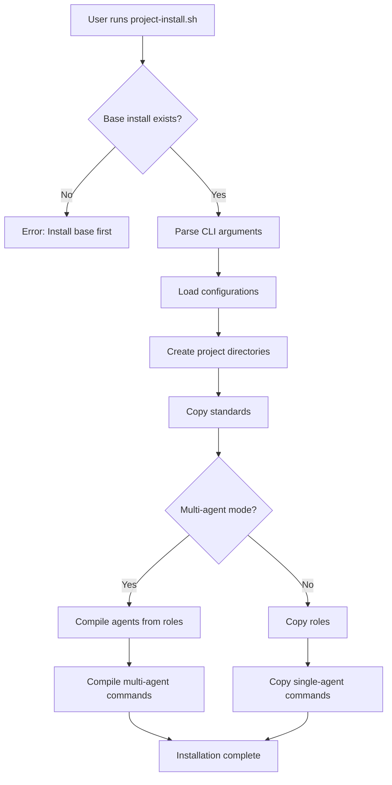
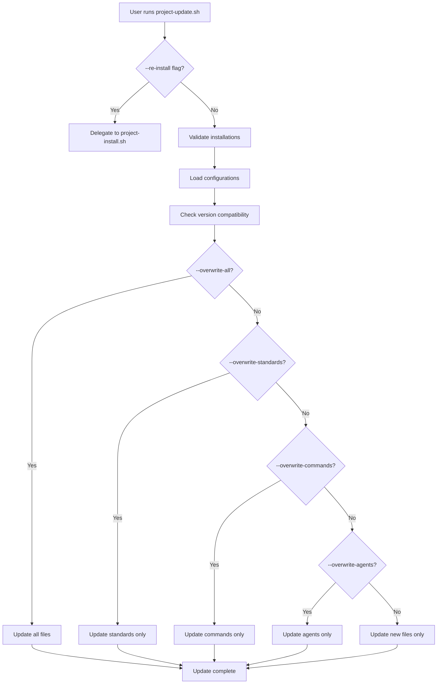

# Agent OS: Scripts Inventory and Analysis

## Executive Summary

This document provides comprehensive analysis of the Agent OS shell scripts, including purposes, entry points, key functions, dependencies, and workflow patterns. Scripts are the installation and management engine of Agent OS.

**Key Findings:**
- 6 shell scripts totaling 4,371 lines of bash code
- Shared utility library (`common-functions.sh`) with 1,139 lines
- Three main workflows: base install, project install, project update
- Template compilation and file operations abstracted in common functions

---

## Script Inventory

### Script Files

| Script | Lines | Purpose | Entry Point |
|--------|-------|---------|-------------|
| `base-install.sh` | 579 | Install Agent OS to `~/agent-os/` | User executes directly |
| `project-install.sh` | 639 | Install Agent OS into project | User executes directly |
| `project-update.sh` | 994 | Update existing project installation | User executes directly |
| `common-functions.sh` | 1,139 | Shared utility functions | Sourced by other scripts |
| `create-profile.sh` | 327 | Create new profile | User executes directly |
| `create-role.sh` | 693 | Create new role | User executes directly |
| **Total** | **4,371** | Complete scripting system | |

---

## Script Details

### base-install.sh

**Purpose:** Downloads and installs Agent OS from GitHub to user's home directory.

**Entry Point:**
```bash
bash <(curl -s https://raw.githubusercontent.com/buildermethods/agent-os/main/scripts/base-install.sh)
```

**Key Functions:**
- `get_latest_version()` - Fetches version from GitHub config.yml
- `download_file(relative_path, dest_path)` - Downloads individual files
- `get_all_repo_files()` - Uses GitHub API to list repository files
- `download_all_files(dest_base)` - Downloads complete repository with exclusions
- `should_exclude(file_path)` - Filters files during download
- `prompt_overwrite_choice()` - Handles existing installation updates
- `overwrite_all()`, `overwrite_profile()`, `overwrite_scripts()`, `overwrite_config()` - Selective update strategies
- `perform_fresh_installation()` - New installation flow
- `check_existing_installation()` - Detects and handles existing installs

**Dependencies:**
- curl (required)
- GitHub API (for file listing)
- jq or python3 (optional, for JSON parsing)

**Target Paths:**
- Install to: `~/agent-os/`
- Temp files: `/tmp/`

**File Exclusions:**
- `scripts/base-install.sh` (self)
- `old-versions/*`
- `.git*` and `.github/*`

**Update Strategies:**
1. Overwrite everything
2. Overwrite default profile only
3. Overwrite scripts only
4. Overwrite config.yml only
5. Cancel

---

### project-install.sh

**Purpose:** Installs Agent OS into a specific project directory.

**Entry Point:**
```bash
~/agent-os/scripts/project-install.sh [OPTIONS]
```

**Command-Line Options:**
- `--multi-agent-mode [true/false]`
- `--single-agent-mode [true/false]`
- `--multi-agent-tool [tool-name]`
- `--single-agent-tool [tool-name]`
- `--profile [profile-name]`
- `--overwrite-all [true/false]`
- `--re-install [true/false]`

**Key Functions:**
- `parse_arguments()` - Command-line argument parsing
- `validate_installations()` - Checks base installation exists
- `detect_tool_from_project()` - Auto-detects Claude Code, Cursor, etc.
- `load_configurations()` - Loads base and project configs
- `initialize_project_structure()` - Creates directory structure
- `install_standards()` - Copies standards files
- `install_roles()` - Copies role definitions (single-agent mode)
- `install_agents()` - Compiles agents from roles (multi-agent mode)
- `install_commands()` - Installs/compiles commands
- `main()` - Main installation orchestrator

**Target Paths:**
- `<project>/agent-os/` - Project-specific Agent OS files
- `<project>/.claude/agents/agent-os/` - Multi-agent agents (Claude Code)
- `<project>/.claude/commands/agent-os/` - Multi-agent commands (Claude Code)

**Installed Files:**
- `<project>/agent-os/config.yml` - Project configuration
- `<project>/agent-os/standards/**/*` - Standards files
- `<project>/agent-os/workflows/**/*` - Workflow files
- `<project>/agent-os/roles/**/*` - Role definitions (single-agent)
- `<project>/agent-os/commands/**/*` - Commands (single-agent)
- `<project>/.claude/agents/agent-os/**/*` - Agent definitions (multi-agent)
- `<project>/.claude/commands/agent-os/**/*` - Commands (multi-agent)

**Dependencies:**
- `common-functions.sh`
- Base installation at `~/agent-os/`

---

### project-update.sh

**Purpose:** Updates existing Agent OS installation in a project.

**Entry Point:**
```bash
~/agent-os/scripts/project-update.sh [OPTIONS]
```

**Command-Line Options:**
- `--overwrite [true/false]` - Overwrite all files
- `--overwrite-standards [true/false]`
- `--overwrite-commands [true/false]`
- `--overwrite-agents [true/false]`
- `--overwrite-all [true/false]`
- `--dry-run [true/false]`
- `--re-install [true/false]` - Delegates to project-install.sh

**Key Functions:**
- `parse_arguments()` - Command-line parsing
- `validate_installations()` - Checks base and project installations
- `load_configurations()` - Loads configs from multiple sources
- `check_compatibility()` - Version compatibility validation
- `update_standards()` - Selective standards update
- `update_roles()` - Selective roles update
- `update_commands()` - Selective commands update
- `update_agents()` - Selective agents update
- `perform_update()` - Main update orchestrator
- `handle_reinstallation()` - Delegates to project-install.sh with --re-install

**Update Strategies:**
- Skip existing files by default
- `--overwrite-*` flags for selective overwrites
- `--overwrite-all` for complete refresh
- `--dry-run` to preview changes without applying

**Tracks:**
- Updated files
- New files
- Skipped files

---

### common-functions.sh

**Purpose:** Shared utility functions for all scripts.

**Sourced By:** All other scripts

**Function Categories:**

#### 1. Output Functions
- `print_color(color, message)` - Colored console output
- `print_section(title)` - Section headers
- `print_status(message)` - Status messages
- `print_success(message)` - Success messages
- `print_warning(message)` - Warning messages
- `print_error(message)` - Error messages
- `print_verbose(message)` - Verbose debug messages

#### 2. YAML Parsing
- `normalize_yaml_line(line)` - Normalize YAML formatting
- `get_indent_level(line)` - Calculate indentation level
- `get_yaml_value(file, key, default)` - Extract simple values
- `get_yaml_array(file, key)` - Extract array values
- `parse_role_yaml(file, section, id, field)` - Extract role fields
- `get_role_standards(file, section, id)` - Get standards for role

#### 3. File Operations
- `ensure_dir(dir_path)` - Create directory if missing
- `copy_file(source, dest)` - Copy with overwrite logic
- `get_profile_file(profile, relative_path, base_dir)` - Resolve profile file paths
- `get_profile_files(profile, base_dir, subdirectory)` - List profile files

#### 4. Configuration
- `load_base_config()` - Load `~/agent-os/config.yml`
- `load_project_config()` - Load project config
- `write_project_config()` - Generate project config file
- `validate_config()` - Validate configuration consistency
- `parse_bool_flag(value)` - Parse boolean command-line flags

#### 5. Template Compilation
- `compile_command(source, dest, base_dir, profile)` - Compile command templates
- `compile_agent(source, dest, base_dir, profile, role_data)` - Compile agent templates
- `process_standards(content, base_dir, profile, patterns)` - Include standards in templates

#### 6. Validation
- `validate_base_install()` - Check base installation
- `validate_project_install()` - Check project installation
- `check_required_commands()` - Verify required CLI tools

---

### create-profile.sh

**Purpose:** Creates a new profile with directory structure.

**Entry Point:**
```bash
~/agent-os/scripts/create-profile.sh [OPTIONS]
```

**Command-Line Options:**
- `--name [profile-name]` - Profile name (required)
- `--from [parent-profile]` - Parent profile to copy from
- `--base-dir [path]` - Base directory (default: `~/agent-os`)

**Key Functions:**
- `parse_arguments()` - Command-line parsing
- `validate_profile_name()` - Validate profile name format
- `create_profile_structure()` - Create directory tree
- `copy_from_parent()` - Copy files from parent profile
- `initialize_profile_config()` - Create profile config file

**Creates:**
- `profiles/{name}/agents/`
- `profiles/{name}/commands/`
- `profiles/{name}/roles/`
- `profiles/{name}/standards/`
- `profiles/{name}/workflows/`
- `profiles/{name}/config.yml` (optional)

---

### create-role.sh

**Purpose:** Creates a new role entry in roles YAML file.

**Entry Point:**
```bash
~/agent-os/scripts/create-role.sh [OPTIONS]
```

**Command-Line Options:**
- `--id [role-id]` - Role identifier (required)
- `--type [implementer/verifier]` - Role type (required)
- `--profile [profile-name]` - Profile name
- `--description [text]` - Role description
- `--color [color]` - Visual identifier
- `--model [model-name]` - LLM model

**Key Functions:**
- `parse_arguments()` - Command-line parsing
- `validate_role_id()` - Validate role ID format
- `check_role_exists()` - Check for duplicate role ID
- `prompt_role_details()` - Interactive prompts for role fields
- `generate_role_yaml()` - Generate YAML structure
- `append_to_role_file()` - Add role to YAML file

**Modifies:**
- `profiles/{profile}/roles/implementers.yml`
- `profiles/{profile}/roles/verifiers.yml`

---

## Script Dependencies

### Dependency Graph



### External Dependencies

| Dependency | Required | Used By | Purpose |
|------------|----------|---------|---------|
| bash | ✅ Yes | All scripts | Shell interpreter |
| curl | ✅ Yes | base-install.sh, project-install.sh | File downloads |
| GitHub API | ✅ Yes | base-install.sh | Repository file listing |
| jq | ⚠️ Optional | base-install.sh | JSON parsing (fallback: python3) |
| python3 | ⚠️ Optional | base-install.sh | JSON parsing (fallback for jq) |

---

## Installation Workflows

### Base Installation Flow



### Project Installation Flow



### Project Update Flow



---

## Template Compilation Process

### Command Compilation

**Function:** `compile_command(source, dest, base_dir, profile)`

**Process:**
1. Read source command file (`.md`)
2. Find all `{{standards/*}}` markers
3. Expand standards patterns using `process_standards()`
4. Find all `{{workflows/*}}` markers
5. Expand workflow references
6. Write compiled content to destination

**Example:**
```bash
Source: profiles/default/commands/create-spec/single-agent/1-create-spec.md
Dest: <project>/agent-os/commands/create-spec/single-agent/1-create-spec.md
```

### Agent Compilation

**Function:** `compile_agent(source, dest, base_dir, profile, role_data)`

**Process:**
1. Read agent template (`.md`)
2. Replace `{{id}}`, `{{description}}`, `{{your_role}}`, etc.
3. Convert `areas_of_responsibility` array to markdown list
4. Expand `{{standards/*}}` patterns
5. Expand `{{workflows/*}}` patterns
6. Write compiled agent to destination

**Example:**
```bash
Template: profiles/default/agents/templates/implementer.md
Role: database-engineer from implementers.yml
Dest: <project>/.claude/agents/agent-os/database-engineer.md
```

### Standards Processing

**Function:** `process_standards(content, base_dir, profile, patterns)`

**Process:**
1. Find standards patterns in content (e.g., `{{standards/global/*}}`)
2. For each pattern:
   a. Resolve glob to file list
   b. Sort files lexicographically
   c. Read each file
   d. Prepend header: `## [Standard: {filename}]`
   e. Concatenate all content
3. Replace pattern with concatenated content
4. Detect circular includes (recursion limit: 10)

---

## Error Handling

### Common Error Scenarios

| Scenario | Script | Behavior |
|----------|--------|----------|
| Base install missing | project-install.sh | Exit with error message |
| Project install missing | project-update.sh | Exit with error message |
| Invalid profile | All | Exit with error message |
| Missing config file | All | Use defaults or prompt |
| File download failure | base-install.sh | Retry or exit with error |
| YAML parse error | project-install.sh | Exit with error message |
| Write permission denied | All | Exit with error message |

### Exit Codes

| Code | Meaning |
|------|---------|
| 0 | Success |
| 1 | General error |
| 2 | Missing dependency |
| 3 | Invalid arguments |
| 4 | Installation validation failed |

---

## Configuration Hierarchy

### Configuration Sources (Priority Order)

1. Command-line arguments (highest priority)
2. Project config: `<project>/agent-os/config.yml`
3. Base config: `~/agent-os/config.yml`
4. Script defaults (lowest priority)

### Configuration Merging

**Example:**
```yaml
# Base config
multi_agent_mode: true
profile: default

# Project config (overrides base)
profile: custom

# Effective config
multi_agent_mode: true  # from base
profile: custom          # from project
```

---

## Performance Considerations

### Optimization Strategies

**File Operations:**
- Batch file downloads (GitHub API)
- Skip copying unchanged files
- Use symbolic links where possible (not currently implemented)

**YAML Parsing:**
- Cache parsed YAML in memory
- Parse files once per script execution
- Use efficient line-by-line parsing (no external tools required)

**Template Compilation:**
- Pre-expand standards during installation (not runtime)
- Cache compiled templates per project
- Avoid redundant expansions

---

## Testing Recommendations

### Unit Tests (Using BATS or similar)
- [ ] YAML parsing functions
- [ ] File path resolution
- [ ] Template variable substitution
- [ ] Standards expansion
- [ ] Configuration merging
- [ ] Boolean flag parsing

### Integration Tests
- [ ] Base installation (fresh)
- [ ] Base installation (update)
- [ ] Project installation (multi-agent)
- [ ] Project installation (single-agent)
- [ ] Project update (various flags)
- [ ] Profile creation
- [ ] Role creation

### End-to-End Tests
- [ ] Complete workflow: base → project → update
- [ ] Multi-project installations
- [ ] Cross-platform (Linux, macOS)
- [ ] Different shells (bash, zsh)

---

## Known Limitations

### Current Constraints

1. **Bash Dependency:** Requires bash shell (not POSIX sh)
2. **GitHub API:** Dependent on GitHub API availability
3. **No Rollback:** No automatic rollback on failed installation
4. **Manual Validation:** No automated validation after installation
5. **No Versioning:** Limited support for version migrations
6. **No Concurrency:** Scripts not safe for concurrent execution

---

## Related Documentation

- [Profiles Analysis](./profiles-analysis.md) - Profile structure
- [Commands Analysis](./commands-analysis.md) - Command compilation
- [Standards Analysis](./standards-analysis.md) - Standards expansion
- [Workflows Analysis](./workflows-analysis.md) - Workflow processing
- [Roles Analysis](./roles-analysis.md) - Role parsing and compilation
- [Agents Analysis](./agents-analysis.md) - Agent generation
- [Architecture](../architecture.md) - Overall system architecture
- [Workflows](../workflows.md) - Detailed workflow analysis

---

## Recommendations

### Immediate Actions
1. Add comprehensive error handling
2. Implement rollback mechanism
3. Add installation validation
4. Create test suite using BATS

### Short-Term Improvements
1. Add progress indicators
2. Implement parallel file downloads
3. Add dry-run mode for all scripts
4. Improve YAML parsing robustness
5. Add version migration scripts

### Long-Term Vision
1. Rewrite in modern language (Go, Rust, Python)
2. API-driven installation (eliminate scripts)
3. Plugin architecture for extensibility
4. Automated testing and validation
5. Interactive installation wizard
6. Cloud-based installation (no local files)

---

**Last Updated:** 2025-10-14  
**Analysis Version:** 2.0  
**Agent OS Version Analyzed:** 2.0.3  
**Source Repository:** https://github.com/buildermethods/agent-os
