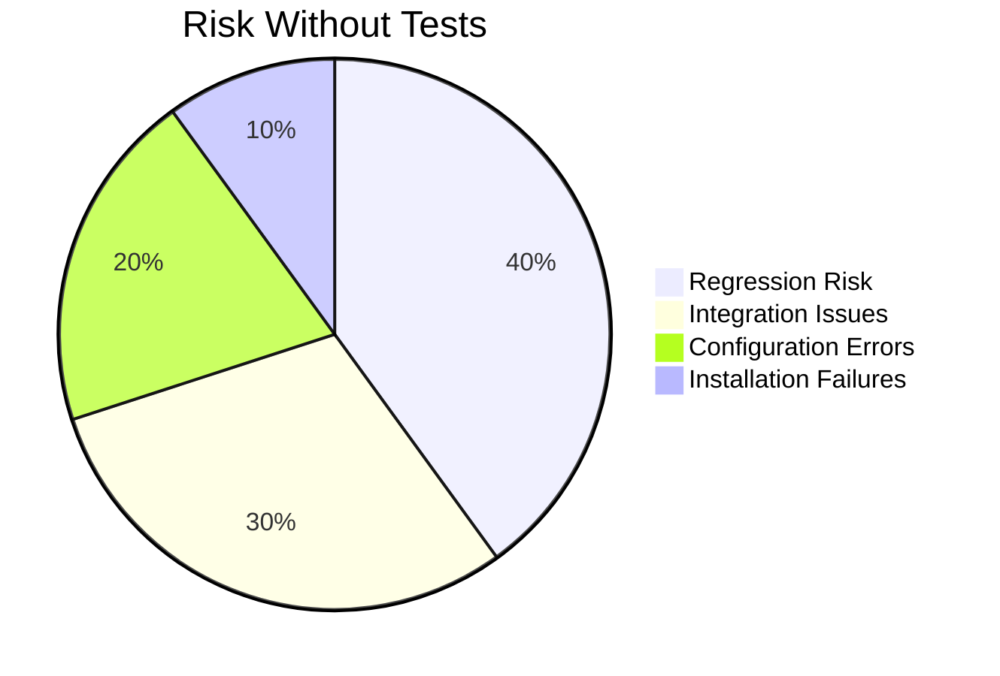

# Agent OS: Test Coverage Analysis

## Overview

This document analyzes the current test coverage in Agent OS and provides recommendations for implementing comprehensive testing. Currently, Agent OS has **no automated tests**, presenting a significant opportunity for quality improvement.

**Related Documents:**
- [Refactoring Notes](./refactoring-notes.md)
- [Code Map](./codemap.md)
- [Workflows Analysis](./workflows.md)

---

## Current State

### Test Coverage: 0%

**Existing Tests:** None  
**Test Framework:** None  
**CI/CD:** None  
**Testing Approach:** Manual only

### Risk Assessment



**High-Risk Areas:**
1. **Installation Scripts** - Complex logic, multiple paths
2. **Template Compilation** - String manipulation, variable substitution
3. **Configuration Resolution** - Multi-layer merging
4. **YAML Parsing** - Custom parser, edge cases
5. **File Operations** - Path resolution, permissions

---

## Test Infrastructure Recommendations

### Recommended Testing Stack

**Unit Testing:**
- **Framework:** [Bats (Bash Automated Testing System)](https://github.com/bats-core/bats-core)
- **Purpose:** Test individual functions in isolation
- **Coverage Target:** 80%

**Integration Testing:**
- **Framework:** Bats with helper functions
- **Purpose:** Test script workflows end-to-end
- **Coverage Target:** Critical paths

**Linting:**
- **Tool:** [ShellCheck](https://www.shellcheck.net/)
- **Purpose:** Static analysis, best practices
- **Integration:** Pre-commit hooks, CI

**CI/CD:**
- **Platform:** GitHub Actions
- **Triggers:** PR, push to main
- **Tests:** Lint, unit, integration
- **Environments:** Ubuntu, macOS

---

## Test Plan

### Phase 1: Foundation (Weeks 1-2)

#### Setup Test Infrastructure

```bash
# Install bats
git submodule add https://github.com/bats-core/bats-core.git test/bats
git submodule add https://github.com/bats-core/bats-support.git test/test_helper/bats-support
git submodule add https://github.com/bats-core/bats-assert.git test/test_helper/bats-assert
```

**Directory Structure:**
```
agent-os/
├── test/
│   ├── bats/                 # Bats framework
│   ├── test_helper/          # Test helpers
│   ├── fixtures/             # Test data
│   ├── unit/                 # Unit tests
│   │   ├── common-functions.bats
│   │   ├── yaml-parsing.bats
│   │   └── template-engine.bats
│   ├── integration/          # Integration tests
│   │   ├── base-install.bats
│   │   ├── project-install.bats
│   │   └── project-update.bats
│   └── e2e/                  # End-to-end tests
│       └── full-workflow.bats
```

**Action Items:**
- [ ] Add bats as submodule
- [ ] Create test directory structure
- [ ] Add test fixtures (sample configs, profiles)
- [ ] Write test runner script
- [ ] Document test conventions

---

### Phase 2: Unit Tests (Weeks 3-5)

#### Test: common-functions.sh

**File:** `test/unit/common-functions.bats`

**Test Coverage:**

```bats
#!/usr/bin/env bats

load '../test_helper/bats-support/load'
load '../test_helper/bats-assert/load'

# Source the functions to test
source "scripts/common-functions.sh"

@test "normalize_name: converts uppercase to lowercase" {
  result=$(normalize_name "MyProfile")
  assert_equal "$result" "myprofile"
}

@test "normalize_name: replaces spaces with hyphens" {
  result=$(normalize_name "My Profile Name")
  assert_equal "$result" "my-profile-name"
}

@test "get_yaml_value: extracts simple value" {
  echo "version: 2.0.3" > /tmp/test-config.yml
  result=$(get_yaml_value "/tmp/test-config.yml" "version" "")
  assert_equal "$result" "2.0.3"
  rm /tmp/test-config.yml
}

@test "get_yaml_value: returns default when key not found" {
  echo "version: 2.0.3" > /tmp/test-config.yml
  result=$(get_yaml_value "/tmp/test-config.yml" "missing_key" "default")
  assert_equal "$result" "default"
  rm /tmp/test-config.yml
}

@test "get_yaml_value: handles quotes" {
  echo 'name: "Agent OS"' > /tmp/test-config.yml
  result=$(get_yaml_value "/tmp/test-config.yml" "name" "")
  assert_equal "$result" "Agent OS"
  rm /tmp/test-config.yml
}

@test "get_yaml_array: extracts array values" {
  cat > /tmp/test-array.yml << EOF
tools:
  - Write
  - Read
  - Bash
EOF
  result=$(get_yaml_array "/tmp/test-array.yml" "tools")
  assert_equal "$(echo "$result" | wc -l)" "3"
  assert_equal "$(echo "$result" | head -1)" "Write"
  rm /tmp/test-array.yml
}

@test "validate_config: rejects when all modes disabled" {
  run validate_config "false" "false" "default"
  assert_failure
  assert_output --partial "At least one agent mode must be enabled"
}

@test "validate_config: accepts when multi-agent enabled" {
  run validate_config "true" "false" "default"
  assert_success
}

@test "parse_bool_flag: parses true" {
  result=$(parse_bool_flag "" "true")
  assert_equal "$(echo "$result" | cut -d' ' -f1)" "true"
}

@test "parse_bool_flag: parses false" {
  result=$(parse_bool_flag "" "false")
  assert_equal "$(echo "$result" | cut -d' ' -f1)" "false"
}

@test "parse_bool_flag: handles flag without value" {
  result=$(parse_bool_flag "" "")
  assert_equal "$(echo "$result" | cut -d' ' -f1)" "true"
}
```

**Coverage:** 20+ tests for common functions

---

#### Test: Configuration Resolution

**File:** `test/unit/config-resolution.bats`

**Test Cases:**
- [ ] Load base config
- [ ] Load project config
- [ ] Merge configs (CLI > Project > Base)
- [ ] Handle missing config files
- [ ] Validate config constraints
- [ ] Resolve effective values

---

#### Test: Template Compilation

**File:** `test/unit/template-engine.bats`

**Test Cases:**
- [ ] Variable substitution
- [ ] Standards inclusion
- [ ] Multi-line value handling
- [ ] Role data processing
- [ ] Template validation
- [ ] Error handling for invalid templates

---

#### Test: YAML Parsing

**File:** `test/unit/yaml-parsing.bats`

**Test Cases:**
- [ ] Parse simple values
- [ ] Parse arrays
- [ ] Parse nested structures
- [ ] Handle quotes
- [ ] Handle indentation
- [ ] Handle edge cases (empty values, special characters)
- [ ] Handle malformed YAML

---

#### Test: Path Resolution

**File:** `test/unit/path-resolution.bats`

**Test Cases:**
- [ ] Resolve base directory
- [ ] Resolve project directory
- [ ] Resolve profile paths
- [ ] Resolve relative paths
- [ ] Handle symlinks
- [ ] Handle spaces in paths

---

### Phase 3: Integration Tests (Weeks 6-7)

#### Test: Base Installation

**File:** `test/integration/base-install.bats`

**Test Cases:**
- [ ] Fresh installation
- [ ] Installation to existing directory
- [ ] Overwrite all
- [ ] Overwrite profile only
- [ ] Overwrite scripts only
- [ ] Overwrite config only
- [ ] Download failures
- [ ] Permission errors
- [ ] Verification of installed files

**Example:**

```bats
@test "base-install: fresh installation creates ~/agent-os" {
  # Clean up
  rm -rf ~/agent-os-test
  
  # Run installation to test directory
  BASE_DIR=~/agent-os-test ./scripts/base-install.sh --test-mode
  
  # Verify directory exists
  assert [ -d ~/agent-os-test ]
  assert [ -f ~/agent-os-test/config.yml ]
  assert [ -d ~/agent-os-test/profiles ]
  assert [ -d ~/agent-os-test/scripts ]
  
  # Clean up
  rm -rf ~/agent-os-test
}
```

---

#### Test: Project Installation

**File:** `test/integration/project-install.bats`

**Test Cases:**
- [ ] Install in empty project
- [ ] Install with multi-agent mode
- [ ] Install with single-agent mode
- [ ] Install with both modes
- [ ] Install with custom profile
- [ ] Re-install
- [ ] Dry run mode
- [ ] Verification of generated files
- [ ] Agent generation from roles
- [ ] Command compilation

---

#### Test: Project Update

**File:** `test/integration/project-update.bats`

**Test Cases:**
- [ ] Update with no overwrites (default)
- [ ] Update with overwrite-all
- [ ] Update with selective overwrites
- [ ] Mode switching
- [ ] Profile switching
- [ ] Version compatibility checks

---

### Phase 4: End-to-End Tests (Week 8)

#### Test: Complete Workflow

**File:** `test/e2e/full-workflow.bats`

**Scenarios:**
1. Install base → Install project → Use commands
2. Install base → Install project → Update base → Update project
3. Install with profile → Switch profile → Verify changes
4. Multi-project installation → Update all projects

---

## CI/CD Integration

### GitHub Actions Workflow

**File:** `.github/workflows/test.yml`

```yaml
name: Tests

on:
  push:
    branches: [ main, develop ]
  pull_request:
    branches: [ main, develop ]

jobs:
  lint:
    runs-on: ubuntu-latest
    steps:
      - uses: actions/checkout@v3
      
      - name: Install ShellCheck
        run: sudo apt-get install -y shellcheck
      
      - name: Run ShellCheck
        run: |
          find scripts -name "*.sh" -print0 | xargs -0 shellcheck

  test:
    runs-on: ${{ matrix.os }}
    strategy:
      matrix:
        os: [ubuntu-latest, macos-latest]
    
    steps:
      - uses: actions/checkout@v3
        with:
          submodules: true
      
      - name: Run unit tests
        run: test/bats/bin/bats test/unit
      
      - name: Run integration tests
        run: test/bats/bin/bats test/integration
      
      - name: Run e2e tests
        run: test/bats/bin/bats test/e2e
      
      - name: Generate coverage report
        run: ./scripts/coverage.sh
      
      - name: Upload coverage
        uses: codecov/codecov-action@v3
        with:
          files: ./coverage/coverage.txt

  test-install:
    runs-on: ubuntu-latest
    steps:
      - uses: actions/checkout@v3
      
      - name: Test base installation
        run: |
          bash scripts/base-install.sh --test-mode
          [ -d ~/agent-os ]
          [ -f ~/agent-os/config.yml ]
      
      - name: Test project installation
        run: |
          mkdir -p /tmp/test-project
          cd /tmp/test-project
          ~/agent-os/scripts/project-install.sh
          [ -d agent-os ]
          [ -d .claude ]
```

---

## Test Coverage Targets

### By Component

| Component | Target Coverage | Priority |
|-----------|-----------------|----------|
| common-functions.sh | 90% | 🔴 Critical |
| YAML parsing | 85% | 🔴 Critical |
| Configuration | 85% | 🔴 Critical |
| Template engine | 80% | 🟡 High |
| Path resolution | 80% | 🟡 High |
| File operations | 75% | 🟡 High |
| Installation flows | 70% | 🟢 Medium |
| Update flows | 70% | 🟢 Medium |

### By Test Type

| Test Type | Count Target | Coverage Target |
|-----------|--------------|-----------------|
| Unit | 100+ | 80% |
| Integration | 30+ | Critical paths |
| End-to-end | 10+ | Main workflows |
| Total | 140+ | 75% overall |

---

## Testing Best Practices

### 1. Test Isolation

Each test should:
- Set up its own fixtures
- Clean up after itself
- Not depend on other tests
- Use temporary directories

**Example:**
```bats
setup() {
  TEST_DIR=$(mktemp -d)
  export TEST_DIR
}

teardown() {
  rm -rf "$TEST_DIR"
}

@test "isolated test" {
  cd "$TEST_DIR"
  # Test code here
}
```

---

### 2. Test Data Management

**Fixtures Directory:**
```
test/fixtures/
├── configs/
│   ├── valid-config.yml
│   ├── invalid-config.yml
│   └── minimal-config.yml
├── profiles/
│   └── test-profile/
├── roles/
│   ├── test-implementers.yml
│   └── test-verifiers.yml
└── templates/
    └── test-agent.md
```

---

### 3. Mocking External Dependencies

**Mock GitHub API:**
```bash
# Mock curl for testing
curl() {
  if [[ "$1" == *"api.github.com"* ]]; then
    cat test/fixtures/api-response.json
  else
    command curl "$@"
  fi
}
export -f curl
```

---

### 4. Assertion Helpers

```bash
# Custom assertions
assert_file_exists() {
  assert [ -f "$1" ]
}

assert_directory_exists() {
  assert [ -d "$1" ]
}

assert_file_contains() {
  assert grep -q "$2" "$1"
}

assert_yaml_value() {
  local file=$1
  local key=$2
  local expected=$3
  local actual=$(get_yaml_value "$file" "$key" "")
  assert_equal "$actual" "$expected"
}
```

---

## Testing Checklist

### Pre-Commit Checklist
- [ ] Run ShellCheck on modified scripts
- [ ] Run unit tests for modified functions
- [ ] Run integration tests for modified flows
- [ ] Update tests for new functionality
- [ ] Ensure tests pass on local machine

### PR Checklist
- [ ] All CI tests passing
- [ ] Code coverage maintained or improved
- [ ] Integration tests added for new features
- [ ] Documentation updated
- [ ] Manual testing performed

### Release Checklist
- [ ] Full test suite passing
- [ ] End-to-end tests on clean systems
- [ ] Test on multiple OS (Linux, macOS)
- [ ] Test with real projects
- [ ] Performance benchmarks
- [ ] Security scan

---

## Continuous Improvement

### Metrics to Track

1. **Test Count** - Monitor growth over time
2. **Coverage Percentage** - Target 75%+
3. **Test Execution Time** - Keep under 5 minutes
4. **Flaky Test Rate** - Target <1%
5. **Bug Escape Rate** - Bugs found in production

### Regular Reviews

- **Weekly:** Review test failures and flaky tests
- **Monthly:** Review coverage reports
- **Quarterly:** Assess test quality and gaps
- **Annually:** Refactor test suite for maintainability

---

## Testing Tools Reference

### Bats (Bash Automated Testing System)

**Installation:**
```bash
git clone https://github.com/bats-core/bats-core.git
cd bats-core
sudo ./install.sh /usr/local
```

**Basic Usage:**
```bash
# Run all tests
bats test/unit/*.bats

# Run specific test file
bats test/unit/common-functions.bats

# Run with verbose output
bats -v test/unit/*.bats
```

---

### ShellCheck

**Installation:**
```bash
# macOS
brew install shellcheck

# Ubuntu
sudo apt-get install shellcheck
```

**Usage:**
```bash
# Check single file
shellcheck scripts/base-install.sh

# Check all scripts
find scripts -name "*.sh" -exec shellcheck {} +

# Output JSON for tooling
shellcheck -f json scripts/base-install.sh
```

---

## Related Documentation

- [Refactoring Notes](./refactoring-notes.md) - Implementation plan
- [Code Map](./codemap.md) - Component details
- [Workflows Analysis](./workflows.md) - Process flows
- [Architecture Diagrams](./architecture.md) - System architecture

---

## Appendix: Sample Test Output

### Successful Test Run

```
✓ normalize_name: converts uppercase to lowercase
✓ normalize_name: replaces spaces with hyphens
✓ get_yaml_value: extracts simple value
✓ get_yaml_value: returns default when key not found
✓ validate_config: rejects when all modes disabled
✓ validate_config: accepts when multi-agent enabled

6 tests, 0 failures
```

### Failed Test Run

```
✓ normalize_name: converts uppercase to lowercase
✗ get_yaml_value: extracts simple value
  (in test file test/unit/common-functions.bats, line 15)
    `assert_equal "$result" "2.0.3"' failed
  expected: 2.0.3
  actual:   2.0.2

2 tests, 1 failure
```

---

**Last Updated:** 2025-10-13  
**Analysis Version:** 1.0  
**Source Repository:** https://github.com/buildermethods/agent-os
