# Agent OS: Workflows and CI/CD Analysis

## Overview

This document provides detailed analysis of all workflows in Agent OS, including GitHub Actions CI/CD pipelines, runtime script workflows, and user-facing command workflows.

**Related Documents:**
- [Project Roadmap](./roadmap.md)
- [Code Map](./codemap.md)
- [Architecture Diagrams](./architecture.md)

---

## GitHub Actions Workflows

### 1. PR Decline Workflow (`.github/workflows/pr-decline.yml`)

#### Purpose
Automates the process of declining pull requests with standardized messaging based on predefined categories.

#### Triggers
- **Event:** `pull_request_target` with `labeled` action
- **Workflow Dispatch:** Manual trigger with inputs

#### Workflow Dispatch Inputs
- `pr_number` (required) - PR number to act on
- `reason` (required, choice) - Decline reason
  - Out of scope
  - Low info
  - Duplicate
  - Spam

#### Label Mappings
```yaml
"Close PR: Out of scope" → "Out of scope"
"Close PR: Low info" → "Low info"
"Close PR: Duplicate" → "Duplicate"
"Close PR: Spam" → "Spam"
```

#### Jobs

##### `decline` Job
**Runs on:** `ubuntu-latest`

**Permissions:**
- `pull-requests: write`
- `contents: read`

**Steps:**

1. **Determine PR number and reason**
   - Uses: `actions/github-script@v7`
   - Logic:
     - If triggered by label: Extract PR number and map label to reason
     - If workflow dispatch: Use input values
     - Skip if not a decline label

2. **Stop if not a decline event**
   - Condition: `skip == 'true' || pr == '' || reason == ''`
   - Action: Echo message and exit

3. **Build canned message**
   - Uses: `actions/github-script@v7`
   - Generates appropriate message based on reason
   - Environment variables:
     - `IDEAS_URL`: https://github.com/buildermethods/agent-os/discussions/categories/ideas
     - `CONTRIBUTING_URL`: https://github.com/buildermethods/agent-os/blob/main/.github/CONTRIBUTING.md

4. **Comment and close PR**
   - Uses: GitHub CLI (`gh`)
   - Posts comment with reason
   - Closes the PR

#### Canned Messages

**Out of scope:**
```
Thanks for the PR! After review, this change isn't on the current roadmap for Agent OS.
We keep core focused to manage long-term maintenance and compatibility.

If you'd like to continue the conversation, please start a proposal in **Ideas**: <URL>
If you publish a fork/plugin/example, feel free to share it in **Show & Tell** so others can try it.

Closing to keep the backlog focused.
```

**Low info:**
```
Thanks for the PR! We're missing required details for review.

Please update the PR with:
• Summary
• Checklist
• Documented steps to test

Guidelines: <URL>

Once updated, you can open a new PR or ask a maintainer to reopen.
```

**Duplicate:**
```
Thanks for the PR! This appears to duplicate existing work or discussion.
We'll consolidate on the canonical thread/PR to reduce churn.

Closing this one to keep things tidy.
```

**Spam:**
```
Closing this PR. It doesn't meet our contribution policy.
```

#### Workflow Diagram

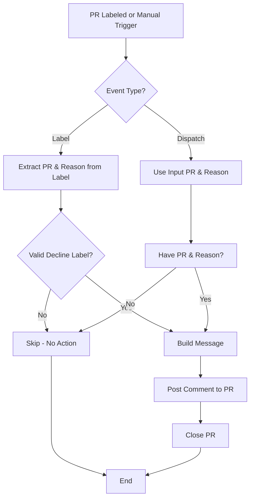

---

### 2. Stale Issues Workflow (`.github/workflows/stale.yml`)

#### Purpose
Automatically marks and closes issues that have been inactive for a specified period.

#### Triggers
- **Schedule:** Cron `0 9 * * *` (Daily at 09:00 UTC)

#### Jobs

##### `stale` Job
**Runs on:** `ubuntu-latest`

**Permissions:**
- `issues: write`

**Steps:**

1. **Mark and close stale issues**
   - Uses: `actions/stale@v9`
   - Configuration:
     - `days-before-stale: 30`
     - `days-before-close: 7`
     - `exempt-issue-labels: bug`

**Stale Message:**
```
This issue has been marked stale due to inactivity. If this is still a problem,
please add new details (logs, steps to reproduce) and we'll revisit.
```

**Close Message:**
```
Closing due to inactivity. If you can provide a fresh, reproducible case on the latest version,
please open a new bug report with full details. Thanks!
```

#### Timeline

```mermaid
gantt
    title Issue Lifecycle
    dateFormat X
    axisFormat %d
    
    section Active
    Issue Open           :0, 30d
    
    section Stale
    Stale Period        :30d, 7d
    
    section Closed
    Issue Closed        :37d, 1d
```

#### Exemptions
- Issues labeled `bug` are never marked stale
- Activity on an issue resets the stale timer

---

## Script Workflows

### 1. Base Installation Workflow

#### Entry Point
```bash
bash <(curl -s https://raw.githubusercontent.com/buildermethods/agent-os/main/scripts/base-install.sh)
```

#### Process Flow

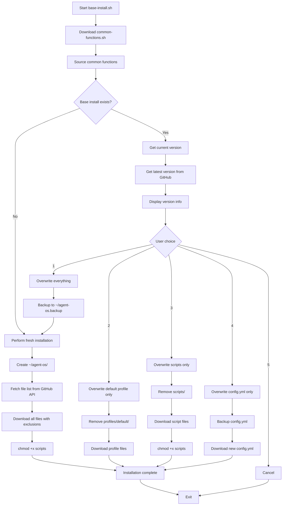

#### File Exclusions
- `scripts/base-install.sh` (self-exclusion)
- `old-versions/*`
- `.git*`
- `.github/*`

#### Key Operations
1. **Bootstrap** - Download common-functions.sh first
2. **API Query** - Use GitHub API to list all repository files
3. **Batch Download** - Download all files (with exclusions)
4. **Permission Setting** - Make scripts executable
5. **Selective Updates** - Four update strategies for existing installations

---

### 2. Project Installation Workflow

#### Entry Point
```bash
~/agent-os/scripts/project-install.sh [OPTIONS]
```

#### Pre-Conditions
- Base installation must exist at `~/agent-os/`
- Command must be run from project root directory
- Project directory must not be `~/agent-os/` itself

#### Process Flow

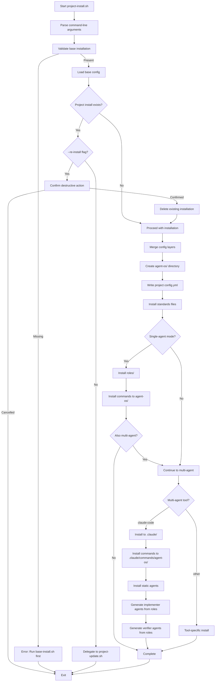

#### Configuration Layer Merging
```
Command-line args > Base config (~/agent-os/config.yml)
```

#### Installation Targets

**Always Created:**
- `<project>/agent-os/config.yml`
- `<project>/agent-os/standards/`

**Single-Agent Mode:**
- `<project>/agent-os/roles/`
- `<project>/agent-os/commands/`

**Multi-Agent Mode (Claude Code):**
- `<project>/.claude/commands/agent-os/`
- `<project>/.claude/agents/agent-os/`

#### Dynamic Agent Generation

**Implementers (from `roles/implementers.yml`):**
1. Read role definition (id, description, responsibilities, standards)
2. Load agent template (`agents/templates/implementer.md`)
3. Substitute template variables with role data
4. Process standards patterns (e.g., `global/*` → include all global standards)
5. Write compiled agent to `.claude/agents/agent-os/<role-id>.md`

**Verifiers (from `roles/verifiers.yml`):**
Same process using `agents/templates/verifier.md`

---

### 3. Project Update Workflow

#### Entry Point
```bash
~/agent-os/scripts/project-update.sh [OPTIONS]
```

#### Pre-Conditions
- Base installation exists
- Project installation exists
- Run from project root

#### Process Flow

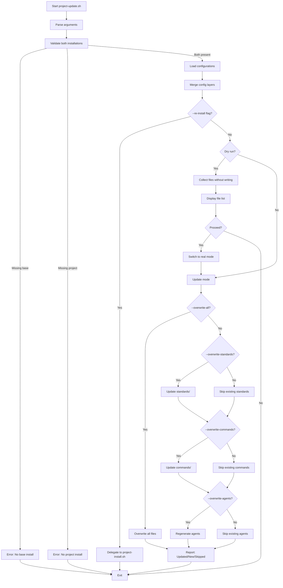

#### Configuration Layer Merging
```
Command-line args > Project config > Base config
```

#### Update Strategies

**Default (No Flags):**
- Skip all existing files
- Add new files only
- Update project config

**--overwrite-all:**
- Overwrite everything
- Regenerate all agents

**Selective Overwrites:**
- `--overwrite-standards` - Update standards only
- `--overwrite-commands` - Update commands only
- `--overwrite-agents` - Regenerate agents only

#### File Tracking
- `UPDATED_FILES[]` - Files that were overwritten
- `NEW_FILES[]` - Files created for first time
- `SKIPPED_FILES[]` - Existing files not updated

---

## User-Facing Command Workflows

### Command Structure

Commands support two modes:
1. **Multi-Agent** - Single command, autonomous execution with multiple agents
2. **Single-Agent** - Step-by-step prompts for manual execution

### Command: `new-spec`

#### Purpose
Initialize and research a new feature specification.

#### Multi-Agent Workflow

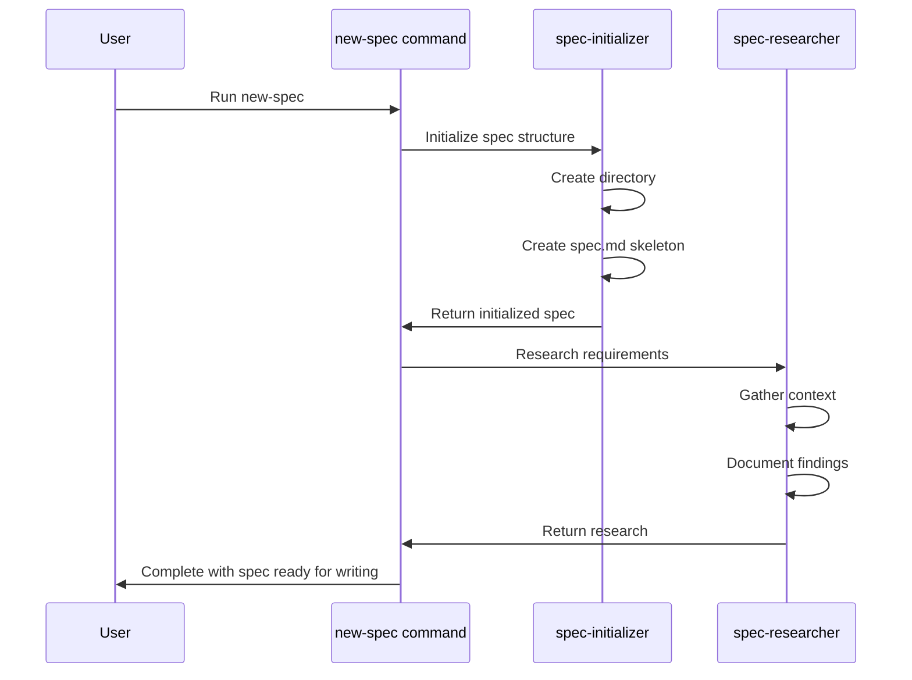

#### Single-Agent Workflow
1. **Prompt 1: Initialize Spec** (`1-new-spec.md`)
   - User describes feature
   - Agent creates directory and spec skeleton

2. **Prompt 2: Research** (`2-research-spec.md`)
   - User confirms initialization
   - Agent researches and documents requirements

---

### Command: `create-spec`

#### Purpose
Write a formal specification from an initialized spec.

#### Multi-Agent Workflow

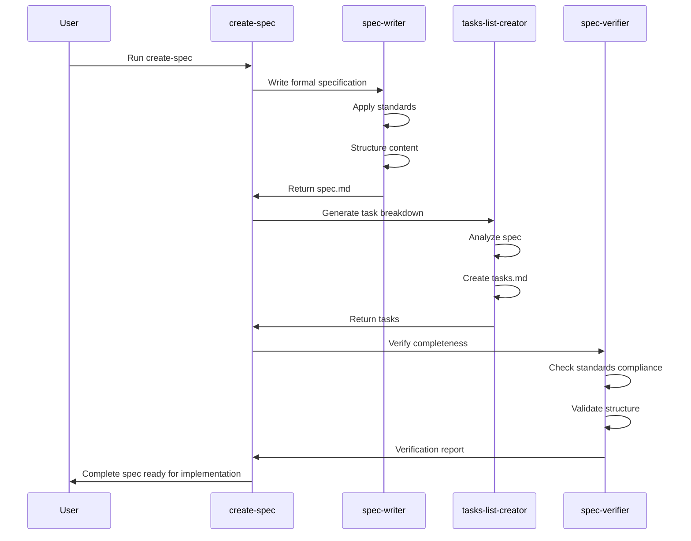

#### Single-Agent Workflow
1. **Prompt 1: Write Spec** (`1-create-spec.md`)
   - Agent writes formal specification
   - Applies all relevant standards

2. **Prompt 2: Create Tasks** (`2-create-tasks-list.md`)
   - Agent breaks down spec into implementable tasks
   - Organizes by area and priority

3. **Prompt 3: Verify** (`3-verify-spec.md`)
   - Agent verifies spec completeness
   - Checks standards compliance
   - Validates task breakdown

---

### Command: `implement-spec`

#### Purpose
Implement a specification by executing all tasks.

#### Multi-Agent Workflow

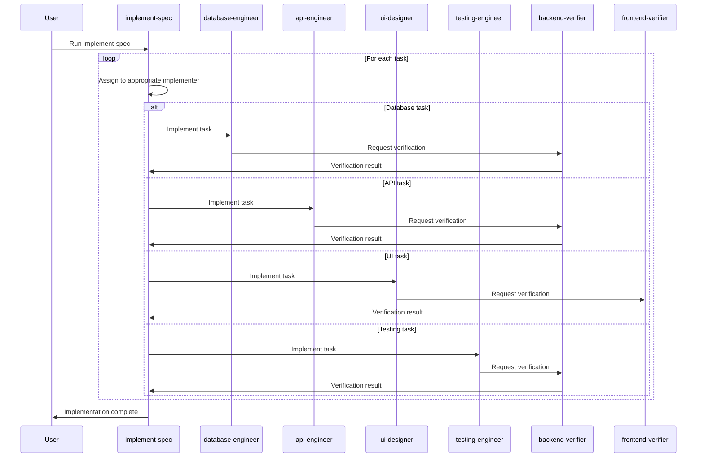

#### Single-Agent Workflow
1. **Prompt: Implement Spec** (`implement-spec.md`)
   - Comprehensive prompt for implementation
   - Agent works through all tasks
   - User provides feedback and iterations

---

### Command: `plan-product`

#### Purpose
Create product planning artifacts (mission, roadmap, tech stack).

#### Multi-Agent Workflow

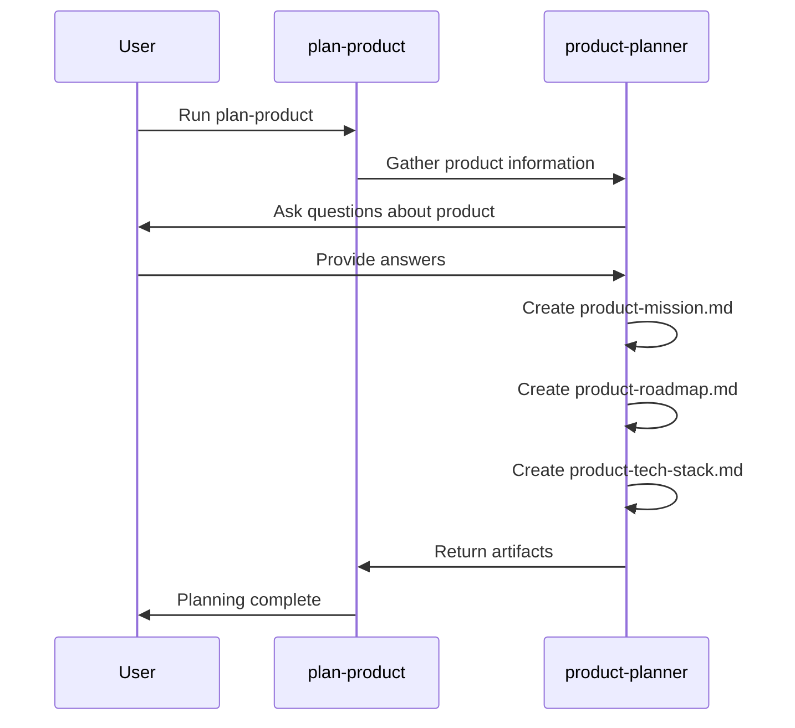

#### Single-Agent Workflow
1. **Prompt 1: Gather Info** (`1-plan-product.md`)
   - Agent asks questions about product
   - Documents responses

2. **Prompt 2: Create Mission** (`2-create-mission.md`)
   - Agent writes product mission statement

3. **Prompt 3: Create Roadmap** (`3-create-roadmap.md`)
   - Agent creates feature roadmap

4. **Prompt 4: Create Tech Stack** (`4-create-tech-stack.md`)
   - Agent documents technology choices

---

## Workflow Best Practices

### Specification Phase
1. **Initialize** - Create structure and skeleton
2. **Research** - Gather requirements and context
3. **Write** - Formal specification with standards
4. **Task Breakdown** - Implementation-ready tasks
5. **Verify** - Completeness and compliance check

### Implementation Phase
1. **Assign Tasks** - Route to specialized agents
2. **Implement** - Write code following standards
3. **Verify** - Area-specific verification
4. **Test** - Comprehensive test coverage
5. **Document** - Update documentation and roadmap

### Integration Points

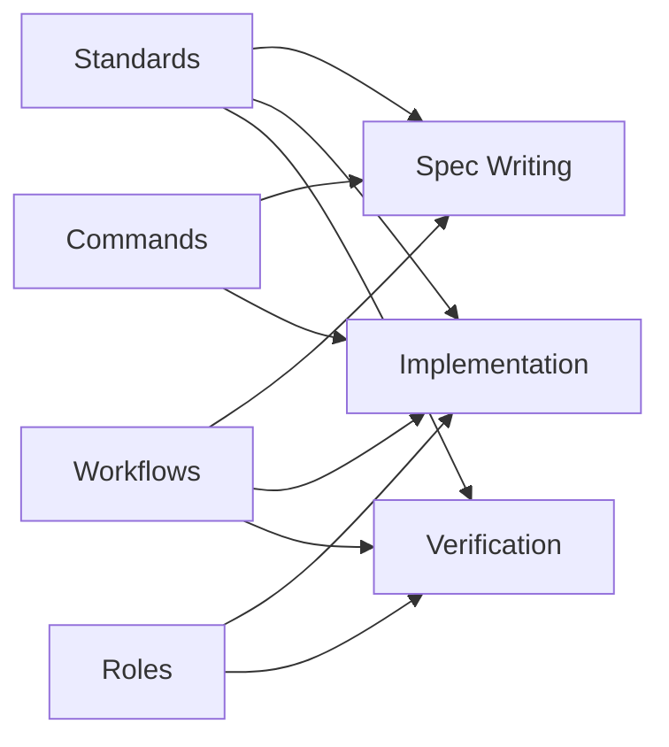

---

## Hardcoded Paths and System Assumptions

### Path Assumptions

**Base Installation:**
- Path: `~/agent-os/` (hardcoded)
- Environment: User home directory
- Permissions: User-writable

**Project Installation:**
- Path: `$(pwd)/agent-os/` (current directory)
- Path: `$(pwd)/.claude/` (Claude Code integration)
- Assumption: Run from project root

**Script Locations:**
- Scripts: `~/agent-os/scripts/`
- Profiles: `~/agent-os/profiles/`
- Config: `~/agent-os/config.yml`

### System Assumptions

**Operating System:**
- POSIX-compliant (Linux, macOS)
- Bash shell (version 4.0+)
- Standard Unix utilities (awk, sed, grep)

**Network:**
- HTTPS access to GitHub
- GitHub API availability
- Raw content download capability

**Tools:**
- curl installed and in PATH
- Optional: jq, python3 (for JSON parsing)

### Environment Variables Used

**In Scripts:**
- `HOME` - User home directory
- `PWD` - Current working directory
- `BASH_SOURCE` - Script location resolution

**In GitHub Actions:**
- `GITHUB_TOKEN` - Authentication
- `REPO` - Repository identifier
- `IDEAS_URL` - Discussion URL
- `CONTRIBUTING_URL` - Contributing guidelines URL

---

## Workflow Dependencies

### Installation Dependencies

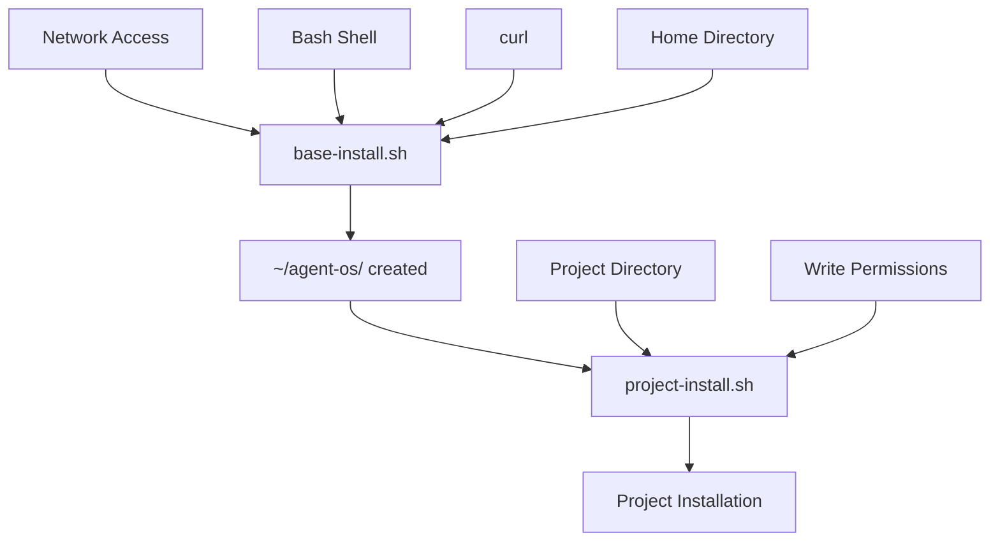

### Runtime Dependencies

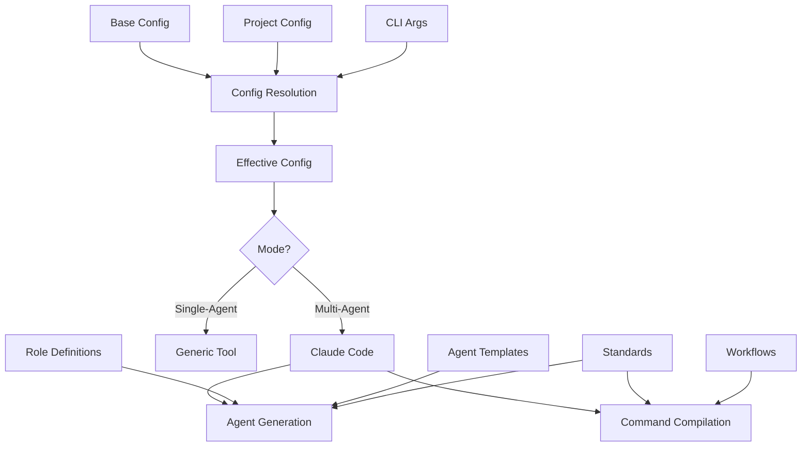

---

## Error Scenarios and Recovery

### Installation Errors

**Missing Base Installation:**
- Error: "Base installation not found"
- Recovery: Run `base-install.sh`
- Prevention: Check before project-install

**Network Failures:**
- Error: "Failed to download files"
- Recovery: Retry with network access
- Prevention: Validate connectivity first

**Permission Denied:**
- Error: "Cannot write to directory"
- Recovery: Check permissions, run from correct location
- Prevention: Validate write access before operations

**Corrupted Installation:**
- Error: "Missing required files"
- Recovery: Use `--re-install` or `--overwrite-all`
- Prevention: Atomic operations where possible

### Configuration Errors

**Invalid YAML:**
- Error: "Cannot parse config"
- Recovery: Fix syntax or restore backup
- Prevention: Validate before writing

**Mode Conflicts:**
- Error: "Both single and multi-agent enabled"
- Recovery: Choose one mode
- Prevention: Validation in common-functions.sh

**Missing Profile:**
- Error: "Profile not found"
- Recovery: Use 'default' profile or create custom
- Prevention: Validate profile exists before use

---

## Related Documentation

- [Project Roadmap](./roadmap.md) - Modernization strategy
- [Code Map](./codemap.md) - Component details
- [Architecture Diagrams](./architecture.md) - System architecture
- [Configuration Guide](./config.md) - Configuration details
- [Commands Reference](./commands.md) - CLI commands
- [Refactoring Notes](./refactoring-notes.md) - Action items

---

**Last Updated:** 2025-10-13  
**Analysis Version:** 1.0  
**Source Repository:** https://github.com/buildermethods/agent-os
