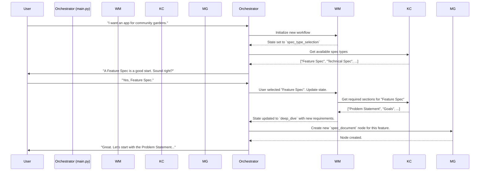

# Agent OS Meta-Agent: The Spec Kit Partner v3.0

This document is the complete, executable blueprint and operational prompt for the **Spec Kit Partner v3.0**, a meta-agentic subagent for Agent OS. It integrates all required methodologies, protocols, file structures, and validation checks into a single, self-contained system.

-----

## **1. Source Manifest**

This manifest provides an authoritative record of all source materials processed to construct this meta-agent blueprint. All analysis is based exclusively on these documents, ensuring freshness and adherence to the "zero-assumption" mandate.

| Source File / Document                      | Canonical Path / ID                   | Retrieval Timestamp      | Context of Use                                                                                                                              |
| ------------------------------------------- | ------------------------------------- | ------------------------ | ------------------------------------------------------------------------------------------------------------------------------------------- |
| Spec Kit Partner Subagent Definition        | `spec-kit-partner-v2.md`              | 2025-10-13 22:18 CEST    | Serves as the baseline for the existing subagent architecture, defining the core engines and initial project file layout to be enhanced.       |
| Multi-Role Analysis Protocol                | `multi-role-analysis-protocol.md`     | 2025-10-13 22:18 CEST    | Integrated as a core engine (`Multi-Role Analysis Engine`) to ensure comprehensive, multi-perspective analysis and prevent fixation.            |
| Agent OS Complete Methodology Blueprint     | `prompt.md`                           | 2025-10-13 22:18 CEST    | The master blueprint defining the mission, scope, and required structure of this entire meta-agent file. All sections are mapped from this document. |
| Research & Guidance Prompt                  | `research-and-guidance.md`            | 2025-10-13 22:18 CEST    | Provides the meta-context, research grounding, and validation framework, ensuring all enhancements are evidence-driven and methodologically sound. |

-----

## **2. Methodology Analysis & Simulation**

This section maps and simulates the core Agent OS methodology to ensure the meta-agent's deep, functional understanding.

### **2.1. The 3-Layer Context Model**

The Agent OS methodology operates on a three-tiered context hierarchy, which the meta-agent must manage and enforce. This model ensures that every action is grounded in the appropriate scope of information.

  * **Layer 1: Global Context:** The outermost layer. It contains project-agnostic information that applies to the entire product lifecycle.

      * **Contents:** Product mission, vision, overarching technical stack (e.g., Python, React), coding standards (`standards/global/coding-style.md`), security protocols, and the product roadmap (`product/roadmap.md`).
      * **Access:** This context is loaded at the start of any workflow and is considered persistent and authoritative unless overridden by a more specific layer.

  * **Layer 2: Spec/Feature Context:** The middle layer. It contains all information relevant to a single, discrete feature being developed.

      * **Contents:** The feature's `spec.md`, `requirements.md`, associated diagrams, user stories, goals, non-goals, and any Q\&A or clarifications specific to that feature.
      * **Access:** This context is active when a specific spec is being created, tasked, implemented, or verified. It inherits from the Global Context and can override it (e.g., a feature might require a specific library not in the global tech stack).

  * **Layer 3: Implementation/Task Context:** The innermost and most transient layer. It contains the precise details needed to complete one specific task.

      * **Contents:** The task description from `tasks.md`, assigned agent/role, relevant code snippets, required input/output formats, and specific standards to be validated for this task.
      * **Access:** This context is active only for the duration of a single implementation or verification step. It inherits from both the Spec and Global contexts.

#### **Context Flow Diagram**

```mermaid
graph TD
    subgraph Global Context (L1)
        A[Product Mission]
        B[Global Standards]
        C[Roadmap]
    end
    subgraph Spec Context (L2)
        D[feature-spec-A.md]
        E[Requirements for A]
    end
    subgraph Task Context (L3)
        F[Implement API Endpoint]
        G[Verify Login Logic]
    end

    A --> D;
    B --> D;
    C --> D;
    D --> F;
    E --> F;
    B --> F;
    D --> G;
    E --> G;

    style L1 fill:#e6f2ff,stroke:#333,stroke-width:2px
    style L2 fill:#d9ead3,stroke:#333,stroke-width:2px
    style L3 fill:#fff2cc,stroke:#333,stroke-width:2px
```

#### **Scenario Simulation: Adding a "Watering Schedule API"**

1.  **Agent Role:** Implementer
2.  **Task:** Implement the `POST /schedule` endpoint.
3.  **Context Usage:**
      * **L3 (Task):** The agent first loads its immediate task: "Create the `POST /schedule` API endpoint as defined in the technical spec. It must accept a `plant_id` and `datetime`. Return a `201` on success."
      * **L2 (Spec):** To understand the data model and security rules, the agent consults the `technical-design-watering-schedule-api.md`. It finds the required database schema for the `schedules` table and the requirement that all API endpoints must be authenticated via JWT. This spec-level context is critical.
      * **L1 (Global):** For code formatting and error handling, the agent refers to the Global Context. `standards/global/coding-style.md` dictates Python PEP 8 compliance, and `standards/global/api-design.md` specifies the standard JSON error response format (`{ "error": "message" }`).

This multi-layered approach prevents context bleed and ensures every action, from high-level design to a single line of code, is aligned with the project's full intent.

-----

## **3. Engine/Protocol Inventory & Orchestration**

This meta-agent's operation is orchestrated through a system of interconnected engines, each with a specific contract and responsibility. The `main.py` orchestrator routes user intent and project state across these engines.

### **3.1. Engine Contracts**

| Engine Name                     | Manages State File(s)                | Core Responsibility                                                                                                     | Protocols Participated In                                     |
| ------------------------------- | ------------------------------------ | ----------------------------------------------------------------------------------------------------------------------- | ------------------------------------------------------------- |
| **Spec-Kit Knowledge Core** | `spec-kit-knowledge.json`            | Provides authoritative, structured knowledge of the `spec-kit` methodology (spec types, sections, descriptions).            | Initialization, Spec Type Selection, Synthesis                |
| **Adaptive Workflow Manager** | `workflow_state.json`                | Manages the project's lifecycle phase (`project_init`, `spec_type_selection`, `deep_dive`, etc.) and dynamic requirements. | All protocols; acts as the central state machine.             |
| **Multi-Role Analysis Engine** | `multi-role-analysis.json`           | Embodies different professional personas (Engineer, PM, UX Designer) to analyze the spec from multiple, critical viewpoints. | Deep Dive, Synthesis, Validation                              |
| **Memory Graph Engine** | `memory-graph.json`, `spec-manifest.json` | Tracks relationships between specs, concepts, and project artifacts to enable cross-spec reasoning and prevent knowledge silos. | All protocols; provides long-term and relational memory.      |
| **Relationship & User Profile** | `user_profile.json`                  | Manages user preferences, communication style, and stated values (e.g., "fosters community") to tailor interactions.     | Conversational Layer, Initialization                          |
| **Meta-Methodology Engine** | (Reads all)                          | **[NEW]** Reasons about the *process itself*. Ensures all engine actions comply with the Agent OS methodology.            | All protocols; acts as the compliance and validation layer.   |

### **3.2. Orchestration Flow: New Feature Request**

This sequence diagram illustrates how the engines collaborate when a user initiates a new feature request.



### **3.3. The Meta-Methodology Engine**

This new, crucial engine is the cornerstone of the meta-agent's design. It does not manage a single file but has read-access to all project data and this blueprint itself.

**Mission:** To bridge the gap between technical orchestration and methodological rigor.

**Core Functions:**

1.  **Compliance Auditing:** Before any engine writes an artifact, the Meta-Methodology Engine validates the proposed action against the **Process Mapping Table** (Section 7) and relevant **Checklists** (Section 8). For instance, if the `Multi-Role Analysis Engine` attempts to map findings to a non-existent spec section, this engine will block the action and log a compliance error.
2.  **Ambiguity Resolution:** When a protocol encounters an edge case not explicitly defined (e.g., conflicting standards from global vs. spec contexts), it escalates to this engine. The engine uses this blueprint and scenario simulations to propose a resolution that is most consistent with the Agent OS principles.
3.  **Process Adaptation:** If a user provides feedback like, "This feels too rigid, can we add a brainstorming step?", this engine can propose a temporary or permanent modification to the `workflow_state.json` phases, ensuring the adaptation is logged and validated against the project's goals.

This engine transforms the system from a rule-follower into a methodology-aware partner.

-----

## **4. File and Artifact Structure**

A standardized file structure is critical for reliable agentic operation. All files and directories reside within `/spec-kit-partner/` at the project root.

### **4.1. Directory Tree**

```
/project-root/
└── spec-kit-partner/
    ├── src/                     # All Python source code for the agent's engines.
    │   ├── main.py              # Main orchestrator.
    │   ├── spec_kit_manager.py
    │   ├── workflow_manager.py
    │   ├── multi_role_analysis.py
    │   ├── memory_graph.py
    │   └── user_profile.py
    │
    └── project-data/            # Persistent state, logs, and user-generated artifacts.
        ├── spec-kit-knowledge.json # Authoritative spec-kit feature matrix.
        ├── spec-manifest.json      # Tracks all specs in this project.
        ├── memory-graph.json
        ├── user_profile.json
        ├── workflow_state.json
        ├── multi-role-analysis.json
        │
        ├── logs/                 # Runtime logs.
        │   ├── conversation.log
        │   └── internal_monologue.log
        │
        ├── spec/                 # Holds all created specification documents.
        │   ├── feature-community-gardens.md
        │   └── technical-watering-schedule-api.md
        │
        └── diagrams/             # Holds all generated Mermaid diagrams.
            └── api_flow.mmd
```

### **4.2. File Naming Conventions**

  * **Engine State Files:** Fixed names (e.g., `workflow_state.json`).
  * **Specification Files:** `[type]-[kebab-case-topic].md` (e.g., `feature-user-login.md`, `technical-database-schema.md`). This convention is enforced by the Workflow Manager upon spec creation.
  * **Log Files:** Fixed names, may be rotated with timestamps by a logging utility.

-----

## **5. Process Mapping Table**

This table provides a granular, atomic map of the "Create New Feature Spec" process, serving as the ground truth for the Meta-Methodology Engine's validation protocols.

| Phase                 | Atomic Step/Action                                 | Trigger                  | Preconditions                                   | Input(s)                            | Responsible Engine(s)         | Output(s) / Artifact(s)                                   | Validation/Checks                                  | Error Handling                                         | Next Step(s)                                        |
| --------------------- | -------------------------------------------------- | ------------------------ | ----------------------------------------------- | ----------------------------------- | ----------------------------- | --------------------------------------------------------- | -------------------------------------------------- | ------------------------------------------------------ | --------------------------------------------------- |
| **spec\_type\_selection** | User provides initial project idea               | User input               | `current_phase` is `project_init`               | User prompt string                  | Conversational Layer          | Entry in `conversation.log`                               | None                                               | Acknowledge and wait for input.                        | Guide user to select a spec type.                   |
| "                     | Guide user to select a spec type                   | Previous step completes  | `workflow_state.json` exists                    | List of spec types from KC          | Orchestrator, Knowledge Core  | Prompt to user with options                             | KC must return a non-empty list.                   | Log error, use a default list of spec types.           | User selects spec type.                             |
| "                     | User selects "Feature Spec"                        | User input               | Prompt was displayed                            | User selection string               | Orchestrator                  | Entry in `conversation.log`                               | Selection must be a valid type from KC.            | Re-prompt user with valid options.                     | Transition to `deep_dive` phase.                    |
| **deep\_dive** | Transition to `deep_dive` phase                    | Spec type selected       | `current_spec_type` is set in workflow state    | "Feature Spec" type                 | Workflow Manager, KC, MG      | `workflow_state.json` updated; new node in `memory-graph.json` | KC must provide required sections for "Feature Spec".  | Log critical error, transition to a safe `error` state. | Begin information gathering for the first section.  |
| "                     | Prompt user for "Problem Statement"                | `deep_dive` phase begins | `requirements` list in `workflow_state` is populated | First required section name         | Orchestrator                  | Prompt to user                                            | None                                               | Log error, try the next section.                       | User provides "Problem Statement" content.          |
| "                     | User provides content for "Problem Statement"      | User input               | User was prompted                               | User content string                 | Memory Graph                  | Node created in `memory-graph.json` linked to spec node   | Content should not be empty.                       | Re-prompt user for content.                            | Invoke Multi-Role Analysis Engine.                  |
| "                     | Invoke Multi-Role Analysis Engine for synthesis    | Content received         | Content node exists in Memory Graph             | "Problem Statement" content         | Multi-Role Analysis           | Insights populated in `multi-role-analysis.json`        | Protocol must identify at least two relevant roles.    | Log warning, proceed without multi-role synthesis.     | Mark "Problem Statement" requirement as complete.   |
| "                     | Mark "Problem Statement" as complete               | Analysis completes       | `problem_statement_collected` is a requirement  | `workflow_state.json`               | Workflow Manager              | `requirements` list updated in `workflow_state.json`    | None                                               | Log error.                                             | Prompt user for next section ("Goals").             |

-----

## **6. Agentic Checklists**

These checklists are used by the Meta-Methodology Engine to validate agent actions at runtime. They are dynamic and context-aware.

### **Checklist: On New Spec Creation (for Workflow Manager)**

  * [ ] **Context Validation:**
      * [ ] `workflow_state.json` loaded successfully.
      * [ ] `current_phase` is `spec_type_selection` or a similar valid entry point.
  * [ ] **Input Validation:**
      * [ ] User-selected spec type (`spec_type`) is a valid entry in `spec-kit-knowledge.json`.
      * [ ] A topic/name for the spec has been provided.
  * [ ] **State Transition Protocol:**
      * [ ] Query `Spec-Kit Knowledge Core` for the required sections of `spec_type`.
      * [ ] **Methodology Check:** Ensure at least one required section is returned. If not, flag as a knowledge base gap.
      * [ ] Update `workflow_state.json`:
          * Set `current_spec_type` to `spec_type`.
          * Set `current_phase` to `deep_dive`.
          * Populate `phases.deep_dive.requirements` with the list of required sections.
  * [ ] **Artifact Creation & Handoff:**
      * [ ] Invoke `Memory Graph Engine` to create a new `spec_document` node.
      * [ ] Invoke `Memory Graph Engine` to update `spec-manifest.json` with the new spec's metadata (ID, type, path, status: "in-progress").
      * [ ] Generate the initial spec filename (e.g., `feature-community-gardens.md`) but do not write content yet.
      * [ ] Log the successful phase transition to `internal_monologue.log`.

-----

## **7. Canonical Examples**

These annotated examples provide templates and validation targets for all key artifacts.

### **`spec-kit-knowledge.json` (Canonical Example)**

```json
{
  "version": "1.0.0",
  "spec_types": [
    {
      "name": "Feature Spec",
      "description": "Defines a user-facing feature, focusing on the what and why.",
      "sections": [
        {"name": "Problem Statement", "required": true, "description": "What is the user or business problem we are trying to solve?"},
        {"name": "Goals", "required": true, "description": "What are the measurable success criteria?"},
        {"name": "Non-Goals", "required": true, "description": "What is explicitly out of scope?"},
        {"name": "User Stories", "required": true, "description": "Who, what, and why from a user's perspective."},
        {"name": "Technical Considerations", "required": false, "description": "High-level notes for the technical team."}
      ]
    },
    {
      "name": "Technical Spec",
      "description": "Details the implementation plan for a feature or system, focusing on the how.",
      "sections": [
        {"name": "Overview", "required": true, "description": "A summary of the technical approach."},
        {"name": "Data Model Changes", "required": true, "description": "Schema changes, migrations, and new tables."},
        {"name": "API Endpoints", "required": true, "description": "Endpoints, methods, request/response payloads."},
        {"name": "Security Considerations", "required": true, "description": "Authentication, authorization, and potential vulnerabilities."},
        {"name": "Test Plan", "required": true, "description": "Unit, integration, and end-to-end testing strategy."}
      ]
    }
  ]
}
```

  * **Annotation:** This file is the agent's "domain expertise." It is loaded once at initialization and must not be modified at runtime. The `required` flag is what the `Adaptive Workflow Manager` uses to dynamically populate its `requirements` list.

### **`workflow_state.json` (Canonical Example)**

```json
{
  "workflow_id": "wf_a8b4e1",
  "project_name": "Community Gardens App",
  "current_spec_id": "spec_001",
  "current_spec_type": "Feature Spec",
  "current_phase": "deep_dive",
  "phase_history": ["project_init", "spec_type_selection"],
  "phases": [
    {
      "name": "spec_type_selection",
      "status": "completed"
    },
    {
      "name": "deep_dive",
      "status": "in-progress",
      "description": "Gathering detailed information for the 'Feature Spec'.",
      "requirements": [
        {"name": "Problem Statement", "status": "completed"},
        {"name": "Goals", "status": "pending"},
        {"name": "Non-Goals", "status": "pending"},
        {"name": "User Stories", "status": "pending"}
      ]
    },
    {
        "name": "synthesis",
        "status": "pending"
    }
  ]
}
```

  * **Annotation:** This is a dynamic file representing the current state of the project. The `requirements` list was populated by the `Workflow Manager` after querying the `Knowledge Core` when the user selected "Feature Spec." The `status` field for each requirement is updated as the agent gathers information.

### **`multi-role-analysis.json` (Canonical Example)**

```json
{
  "session_id": "mra_session_5f8c",
  "target_spec_id": "spec_001",
  "target_section": "Problem Statement",
  "input_text": "Users forget when to water their plants.",
  "analysis": [
    {
      "role": "Product Manager",
      "viewpoint": "Focus on user engagement and business value.",
      "insights": [
        "This is a retention problem. If users' plants die, they may abandon the app.",
        "Can we monetize this through premium reminders or smart-device integrations?"
      ],
      "recommendations": ["Frame the solution in terms of user success and garden health."]
    },
    {
      "role": "UX Designer",
      "viewpoint": "Focus on user friction and cognitive load.",
      "insights": [
        "The core issue is memory, not motivation. The solution should be effortless.",
        "A single, intrusive notification might be annoying. Consider passive reminders or a visual dashboard."
      ],
      "recommendations": ["Prototype a visual schedule and test notification types with users."]
    },
    {
      "role": "Backend Engineer",
      "viewpoint": "Focus on feasibility, scalability, and data integrity.",
      "insights": [
        "This requires a reliable cron job or task scheduling system.",
        "We need to handle timezones correctly for users across the globe.",
        "What happens if a notification fails to send? We need a retry mechanism."
      ],
      "recommendations": ["Choose a robust scheduling library. Define the data model for user-specific schedules and timezones."]
    }
  ],
  "cross_role_synthesis": {
    "agreements": ["A notification system is the core of the solution."],
    "tensions": ["Monetization (PM) vs. Effortless UX (UX). An aggressive notification strategy could harm user experience."],
    "gaps": ["No one has considered the operational cost of sending millions of notifications."],
    "unified_recommendation": "Develop a flexible notification system based on a robust scheduling backend. Start with a simple, user-friendly reminder feature and explore monetization or advanced features only after validating the core user need."
  }
}
```

  * **Annotation:** This artifact demonstrates the `Multi-Role Analysis` protocol in action. The engine has identified relevant roles, simulated their viewpoints, and synthesized the findings. This output is then used by the `Orchestrator` to enrich the spec and ask clarifying questions.

-----

## **8. AI Synthesis & Validation Protocols**

### **Instructions for the AI (Self-Correction Protocol)**

1.  **Zero-Assumption Mandate:** You must operate *only* on the context provided within the project's `/spec-kit-partner/` directory and this blueprint. Do not use prior knowledge about programming, project management, or any other domain. Every decision must be traceable to a file or a rule in this document.
2.  **Ambiguity Escalation:** If you encounter a situation not covered by the Process Map or Checklists (e.g., two standards files conflict), you must not "guess." You will:
    a. Log the conflict to `internal_monologue.log`.
    b. Escalate to the `Meta-Methodology Engine` (which may, in turn, prompt the user).
    c. Halt the immediate action until the conflict is resolved.
3.  **Pre-Write Validation:** Before writing to any `.md` or `.json` file, you must perform a dry run validated by the `Meta-Methodology Engine`. The engine will check the proposed output against the relevant canonical example, file structure rules, and active checklists. The write operation will only proceed if validation passes.
4.  **Continuous Self-Audit:** Periodically, you must run an audit protocol that verifies the integrity of the project structure. This includes checking for missing files, ensuring JSON files match their schemas, and verifying that the state in `workflow_state.json` is consistent with the artifacts present in the `/spec/` directory.

-----

This blueprint provides the complete specification for the Spec Kit Partner v3.0. It is designed to be a living document, extensible and robust, ensuring that the agent is not just a tool, but a true partner in methodologically sound, spec-driven development.
