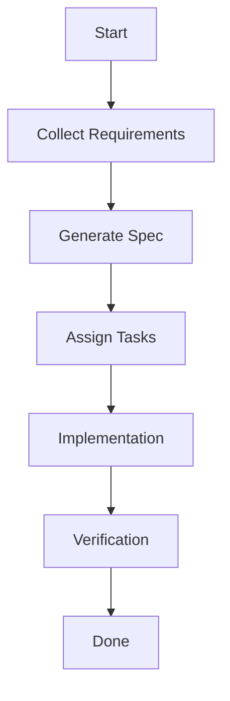

# Agent OS Complete Methodology & File Workflow Mapping: Master Prompt Blueprint

## Core Build Deliverable: Agentic Meta-Agent Markdown File

### What You Must Build

You are required to produce, as your **primary output**, a **single, standalone, standards-compliant Markdown file** that constitutes the actual agentic meta-agent subagent for Agent OS.

#### This file is the agent itself:

- **Format:**  
  - The deliverable is a `.md` (Markdown) file, fully self-contained, and ready to be used as a Claude/LLM system prompt or as a blueprint for deploying the Agent OS meta-agent/subagent.
- **Content:**  
  - Integrate—within the file itself—all required process mappings, checklists, canonical examples, diagrams (using in-line Mermaid or Markdown), error/validation protocols, output requirements, and references described in this blueprint.
  - Embed all supporting artifacts as sections within the file:  
    - Source manifest  
    - Methodology analysis & simulation  
    - Standards mapping & simulation  
    - Engine/protocol inventory & orchestration docs  
    - File/artifact structure mapping  
    - Process mapping table & diagrams  
    - All phase/role/engine checklists  
    - Canonical examples for every artifact  
    - Domain/profile coverage summary table  
    - Output requirements documentation  
    - AI synthesis & validation protocols  
    - Appendix: URL/file/artifact/diagram references  
    - All inline and appendix examples, with explicit cross-references
- **Usage:**  
  - The file must be deployable *as is*; no further assembly, referencing, or manual integration is required.
  - The file must serve as a “drop-in” meta-agent: both blueprint and operational prompt.
  - Anyone with this file must be able to instantiate, validate, audit, and extend the meta-agentic orchestration system without any external context or dependencies.
- **Alignment:**  
  - Every section and artifact must be strictly compliant with the technical standards, file structures, process mappings, and methodological principles outlined throughout this blueprint.

---

### Natural Language Instruction

> **You are not simply producing documentation or a mapping—you are building and delivering the meta-agentic subagent itself.  
> Your output must be a single, unified Markdown file that is both the operational prompt and the full standards/methodology-compliant blueprint for the Agent OS meta-agent.  
> The deliverable must be fully executable, auditable, and extensible, with every section, example, checklist, and protocol embedded and cross-referenced.  
> No output is valid unless it is this complete, ready-to-operate agentic meta-agent Markdown file.**

---

### Master Deliverables Checklist

Your final output must be a single, fully self-contained markdown file (the "Agentic Meta-Agent Markdown File") that includes **all** of the following, fully embedded and cross-referenced as sections:

| Output / Section / Artifact                        | Description / Notes                                               |
|----------------------------------------------------|-------------------------------------------------------------------|
| **Agentic Meta-Agent Markdown File (core build)**  | The complete, executable markdown prompt/file for the meta-agent. **All items below must be included as sections or content within this file.** |
| Source Manifest                                    | Full list of all sources, files, docs, with context of use        |
| Methodology Analysis & Simulation                  | 3-layer context mapping, workflow scenarios, profile inheritance demos |
| Standards Mapping & Simulation                     | Enumerated standards, enforcement, profile overrides, validation cases |
| Engine/Protocol Inventory & Orchestration Docs     | Engine contracts, orchestration diagrams, simulations, enhancement plans |
| File/Artifact Structure Mapping                    | Directory tree, naming conventions, file templates, validation rules    |
| Process Mapping Table & Diagrams                   | Canonical atomic process table, Mermaid diagrams                  |
| All Phase/Role/Engine Checklists                   | Dynamic, role-aware checklists, meta-checklist, management protocol   |
| Canonical Examples for Every Artifact              | requirements.md, spec.md, tasks.md, assignments, reports, logs, etc.  |
| Domain/Profile Coverage Summary Table              | Cross-reference all domains/profiles to artifact examples         |
| Output Requirements Documentation                  | Formatting, validation, error output requirements                 |
| AI Synthesis & Validation Protocols                | Instructions for AI, ambiguity handling, self-validation          |
| Appendix: URL/File/Artifact/Diagram References     | All referenced URLs, files, diagrams, plus canonical/inline examples  |
| All Inline and Appendix Examples                   | With explicit cross-references                                   |

---

**Instruction:**  
All items in this checklist must be present as integral, cross-referenced sections or artifacts within the single markdown file you output.  
No output is considered valid unless every checklist item is included, and the markdown file is directly usable as the agentic meta-agent prompt/blueprint for Agent OS.

---

## 1. Introduction

### Goal

The goal of this project is to generate a comprehensive, granular, and fully up-to-date mapping of the Agent OS methodology, process workflow, agent/subagent roles, file-level artifacts, standards, and context dependencies.  
**In addition, the project must result in the design and (if feasible) generation of a “meta-agent”: an agent that can orchestrate, validate, and augment subagents or user workflows for Agent OS, ensuring all interactions, handoffs, and outputs are fully compatible with Agent OS’s requirements and best practices.**

### Scope

- Analyze and document every phase of the Agent OS process, from product context planning to feature spec lifecycle, through task assignment, implementation, verification, and product-level aggregation.
- Map all standards, profiles, agent roles, file formats, and context flows across all layers (global/product, spec/feature, implementation/task).
- Produce canonical tables, flowcharts/diagrams, phase-by-phase checklists, and example artifacts for each output file and handoff.
- Identify and document error cases, ambiguities, and required validation steps.
- **Design and specify the meta-agent:** a supervisory or orchestration agent that can guide, validate, and/or automate the correct preparation and handoff of all necessary Agent OS artifacts, using the mapping and standards produced in this project.
- Reference and use all current, authoritative documentation and source files—no reliance on LLM prior knowledge or summaries.

### What is a “meta-agent”?

In this context, a “meta-agent” is:
- An agent (AI or automation) whose role is to supervise, orchestrate, and/or validate all Agent OS-related workflows.
- It is responsible for ensuring that subagents, users, or other AIs consistently prepare and deliver inputs, outputs, and handoffs in the precise formats, structures, and standards required by Agent OS.
- The meta-agent may prompt for missing information, correct errors, enforce standards, and automate or coordinate multi-phase or multi-feature workflows.
- The meta-agent may also serve as a “bridge” between less-technical users and Agent OS, abstracting away complexity and ensuring smooth, standards-compliant operation.

### Reference to Existing Subagent

- You will be provided with an existing subagent implementation, which serves as a partial foundation or inspiration for the meta-agent.
- Study the subagent’s approach, strengths, and limitations.
- Use it as a reference point, but extend, generalize, and improve upon it as required to fulfill the goals and requirements of this project.

### AI Requirements

- Must be an AI model or agent with a context window large enough to process all referenced documentation, source files, standards, and example artifacts simultaneously (e.g., 1M+ tokens).
- Must be capable of:
  - Parsing and analyzing Markdown, YAML, code, and structured documentation.
  - Synthesizing cross-referenced tables, diagrams, and examples as output.
  - **Designing, specifying, and (if feasible) generating the meta-agent described above, using all mapped requirements, standards, and examples.**
  - Following explicit, multi-step instructions for data gathering, analysis, validation, and synthesis.

### Constraints

- **Freshness:** All analysis, mapping, and example generation must be performed from scratch, using the latest available documentation and source files. The AI must not rely on its internal LLM knowledge or outdated summaries.
- **Completeness:** The entire project must be executed in a single, uninterrupted processing run—no incremental, piecemeal, or conversational approaches. The response must be fully comprehensive and self-contained.
- **Exactness:** All outputs must strictly follow the structures, formats, and standards referenced in source documentation—no omissions, paraphrasing, or unverified assumptions.
- **Validation:** The output must include explicit validation steps and checks for each phase, file, and handoff to ensure agent-os compatibility.
- **Reference Integrity:** Every claim, rule, or format in the output must be traceable to a specific document, file, or authoritative instruction, with references or links where possible.

---

## 2. Source Material

This section specifies all source materials and references the AI must use to complete the project. The instructions below enforce total completeness and freshness—**no reliance on prior knowledge or summaries is permitted**.

### 2.1. Documentation and Knowledge Sources

The AI must use, in its entirety, ALL of the following (and may not skip or partially process any):

1. **Official Anthropic/Claude Documentation**  
   - https://docs.claude.com/en/home  
   - All subpages and linked documentation relevant to agent, prompt, and context window capabilities.

2. **GitHub Project Repository: Agent OS**  
   - https://github.com/buildermethods/agent-os  
   - *Every* file, directory, and subdirectory in this repository must be inspected and analyzed.  
   - *No file, script, workflow, standard, or template may be omitted, regardless of perceived importance or naming.*  
   - Includes, but is not limited to:  
     - `/profiles`
     - `/standards`
     - `/product`
     - `/specs`
     - `/commands`
     - `/workflows`
     - `/agents`
     - `/scripts`
     - All Markdown, YAML, shell, and code files

3. **Agent OS Official Website and Documentation**  
   - https://buildermethods.com/agent-os  
   - *Every* page, subpage, tutorial, example, and linked document.
   - *No omission permitted due to perceived redundancy with repo files.*

4. **Example Artifacts**  
   - The AI must gather and review canonical or example artifacts for every output file and handoff, including (but not limited to):  
     - `requirements.md`
     - `spec.md`
     - `tasks.md`
     - `task-assignments.yml`
     - `implementation/*.md`
     - `verification/*.md`
   - If such artifacts exist in the repo, the website, or documentation, the AI must extract and use them.
   - If they do not exist, the AI must synthesize them in perfect accordance with referenced standards.

5. **Potentially Applicable Research Papers**  
   - https://www.anthropic.com/engineering/multi-agent-research-system
   - https://www.anthropic.com/engineering/building-effective-agents

### 2.2. Instructions for Source Handling

- The AI must not rely on, reference, or summarize any prior training, internal LLM knowledge, or cached content.  
- Each and every file, document, and web page referenced above must be **freshly accessed, fetched, and inspected in full** as part of this project.  
- *No* directory, file, standard, template, or artifact may be omitted, skipped, or summarized based on its name, past experience, or any other heuristic.
- If new files, pages, or artifacts are discovered during processing (e.g., via links or cross-references), the AI must recursively fetch and analyze them as well.
- If the user supplies additional links or research papers, the AI must integrate them into its process just as rigorously as the above.

### 2.3. Order of Processing

- The AI may process these sources in any order that enables maximum completeness, cross-linking, and validation.
- However, if dependencies or cross-references exist (e.g., standards referenced in templates), the AI must ensure that dependencies are resolved and all references are validated.
- If any ambiguity in source coverage arises, the AI must default to **full inclusion**.

### 2.4. Source Manifest Requirement

- **As it processes each source, the AI must maintain a complete and up-to-date “source manifest.”**
  - The manifest must include:
    - The full canonical path or URL of every file, web page, or document processed.
    - The version, hash, or retrieval timestamp (where possible/applicable).
    - The context in which the source was used (e.g., for table mapping, example artifact, standards reference).
  - The manifest must be included as a dedicated section in the final output.
  - If any source could not be processed (e.g., binary, non-English, error), the manifest must log the reason and context.
  - This manifest serves as the authoritative record for what was analyzed and mapped.

---

**Do not proceed to analysis, mapping, or meta-agent generation until every required source has been fully loaded, parsed, and logged in the manifest.**

---

## 3. Methodology Analysis

This section instructs the AI to deeply analyze, internalize, and simulate the Agent OS methodology. The AI must go beyond surface-level summary and demonstrate true comprehension and reasoning. All findings must be evidenced by scenario-based examples, counter-examples, and self-tests.

### 3.1. 3-Layer Context Model

- **Task:** Analyze, map, and demonstrate the Agent OS three-layer context model:
  - **Global context:** Product standards, mission, roadmap, tech stack, persistent rules.
  - **Spec/feature context:** Current feature’s requirements, visual assets, Q&A, scope, constraints.
  - **Implementation/task context:** Current task or subtask, assigned agent, immediate standards, and scope.
- **Requirements:**
  - For each layer, clearly define its contents, scope, and how it is accessed and used by agents/subagents.
  - Diagram the flow of context from one layer to another and how agents must reference each layer for every major workflow phase.
  - **Demonstrate understanding by producing scenario-based examples:** For at least three different agent roles (e.g., implementer, verifier, researcher), simulate how they would use all three context layers to process a specific task.
  - Identify and explain any potential ambiguities, overlaps, or risks in context handoff or inheritance.

### 3.2. Workflow Phases

- **Task:** Map the complete lifecycle of a feature in Agent OS, including all workflow phases:
  1. **plan-product**
  2. **new-spec** (research and requirements gathering)
  3. **create-spec** (formal spec creation)
  4. **task breakdown** (task list, assignments)
  5. **implement** (implementation, documentation)
  6. **verify** (feature verification and compliance)
  7. **update-roadmap** (aggregate and update product context)
- **Requirements:**
  - For each phase, detail:
    - Inputs and outputs (including files, context, and standards)
    - Agent/subagent roles involved
    - Required standards and validation steps
    - How context flows into and out of the phase
  - **Simulation:** For each phase, produce a step-by-step simulation for a representative feature (e.g., “User Login Feature”), showing context handoff, agent actions, and file outputs at each step.
  - Identify phase transitions, decision points, and feedback/iteration loops.
  - Explicitly map dependencies between phases and possible failure/recovery scenarios.

### 3.3. Profile Selection and Inheritance

- **Task:** Analyze the concept of “profiles” in Agent OS and their impact on standards, agent templates, and workflows.
- **Requirements:**
  - Define what a profile is, how it is created, selected, and inherited.
  - Detail which elements (standards, agent templates, workflows) are profile-dependent, and how overrides/inheritance works.
  - **Scenario analysis:** Demonstrate how two different profiles (e.g., “default” vs. “custom-enterprise”) would affect the standards, available agents, or file outputs for a given feature spec.
  - Map and explain how profile selection is validated and enforced throughout the workflow.
  - Identify any ambiguity or risk in profile handling and propose validation steps to ensure correctness.

### 3.4. Methodology Verification and Self-Test

- **Task:** After mapping and simulating the above, the AI must **verify its own understanding** of the methodology.
- **Requirements:**
  - For each major process and context flow, pose and answer “What if?” scenarios (e.g., “What if the wrong profile is selected?” “What if a standards file is missing?” “What if a task is implemented with outdated product context?”).
  - Identify ambiguity, edge cases, or conflicting rules, and suggest how the meta-agent should handle or flag them.
  - **Deliver a set of self-test cases** (with expected outcomes) that can be used to validate that future agents or users are properly following the methodology.

---

**Do not proceed to standards mapping or agent role mapping until the methodology has been fully mapped, simulated, and verified as above.**

## 4. Standards and Profiles

This section instructs the AI to rigorously analyze, map, simulate, and validate the standards and profiles system in Agent OS.  
The resulting outputs must enable the meta-agent to enforce, validate, and, where allowed, adapt standards and profiles in any context or workflow.

---

### 4.1. Standards

#### 4.1.1. Definition and Structure
- Fully enumerate and define every standards file, rule, and best practice referenced or enforced by Agent OS.
  - Include, but do not limit to: coding standards, naming conventions, file structure, test-writing rules, API/architecture guidelines, accessibility, security, and technological stack requirements.
  - For each standard, specify:
    - File path and canonical location (e.g., `standards/global/coding-style.md`)
    - Scope of enforcement (global, feature, implementation, agent-specific)
    - Format (Markdown, YAML, other)
    - Inheritance/overrides (can this standard be superseded by profile/project standards?)

#### 4.1.2. Enforcement and Validation
- **Map**: For every workflow phase and file/artifact, specify which standards are required, how compliance is checked, and what happens when a violation is detected.
- **Simulate**: For at least three scenarios (e.g., code style violation, missing security standard, conflicting standards across profiles), walk through how detection, error reporting, and remediation would occur.
- **Best Practices**: Synthesize not only formal rules but the meta-principles (e.g., "do not paraphrase user requirements," "must document standards compliance in every implementation/verification report").
- **External Standards**: If Agent OS references external standards (e.g., language/framework best practices), include these and specify how the meta-agent must fetch, validate, or update them.

#### 4.1.3. Gaps and Ambiguity
- **Analyze**: Identify any areas where standards are ambiguous, missing, or potentially conflicting.
  - For each, propose a validation or conflict-resolution approach for the meta-agent.

---

### 4.2. Profiles

#### 4.2.1. Configuration and Structure
- **Fully define**: What is a profile in Agent OS? How is it created, structured, and selected?
  - List and describe all configurable elements (standards, agent templates, workflows, roles, etc.).
  - Specify canonical file formats/locations (e.g., `profile-config.yml`).

#### 4.2.2. Inheritance and Overrides
- **Map**: How does profile inheritance work?
  - Describe the rules for inheriting standards and behaviors from parent/default profiles.
  - For each element, specify how and where it can be overridden (file-level, directory-level, agent-level, project-level).
  - Simulate: Provide at least two scenarios (e.g., a “default” profile inherited by a “custom-enterprise” profile with specific overrides).
  - Include edge cases (e.g., missing, malformed, or conflicting overrides).

#### 4.2.3. Enforcement and Validation
- **Describe**: How is the active profile determined and enforced at runtime (both by humans and by agents)?
- **Validation**: What checks must the meta-agent perform to ensure standards and configuration are consistent, complete, and non-conflicting for a given profile?
- **Simulation**: For at least one scenario, walk through profile selection, inheritance, override, and enforcement for a new feature spec.

#### 4.2.4. Profile-Driven Agent Behavior
- **Map**: For every major agent/subagent, specify how profiles and standards affect:
  - Prompting
  - Validation
  - Output formatting
  - Error handling
- **Best Practices**: Summarize how meta-agents should reason about, enforce, or surface profile-driven differences to users and subagents.

---

**Do not proceed to agent/role mapping until all standards, profiles, inheritance, and enforcement logic have been fully mapped, simulated, and validated.**

## 5. Agentic Engines, Protocols, and Meta-Agentic Workflow Mapping

This section instructs the AI to produce a full inventory and simulation of all agentic engines, protocols, and orchestration patterns required for robust, adaptive, and extensible AI workflow management—drawing on both the provided subagent and best practices from AI Workflow Design.

---

### 5.1. Definitions and Knowledge Domains

- **Agentic Workflow Management and Design:**  
  The domain concerned with the design, implementation, and evolution of interconnected AI engines, protocols, and dynamic workflows that reason about, validate, and adapt complex projects and user needs.
- **Engine:**  
  A persistent, modular subsystem with its own state, schema, and contract. Engines may include: Knowledge Core, Adaptive Workflow Manager, Multi-Role Analysis, Memory Graph, User Profile Manager, etc.
- **Protocol:**  
  A dynamic and formalized set of rules for engine interaction, context handoff, error recovery, escalation, and adaptation.
- **Meta-Agent:**  
  The orchestrator of engines and protocols—deciding, at runtime, which engine(s) to invoke, how to route context, and how to validate and adapt outcomes for user and project needs.

---

### 5.2. Engine/Protocol Inventory and Contracts

- **Document every engine’s contract:**
  - State/data maintained (with full schema)
  - Inputs/outputs
  - Protocols participated in
  - Initialization, update, error handling, and logging requirements
- **Document every protocol:**
  - Trigger conditions, steps, validation gates, and expected outputs
  - Escalation/feedback/error branches
  - How protocols are selected, adapted, or composed at runtime
- **Diagram orchestration:**  
  - Show how the meta-agent routes user intent, project state, and spec requirements across engines and protocols

---

### 5.3. Dynamic Workflow/Engine/Protocol Assignment

- **Map the dynamic assignment logic:**  
  - How does the meta-agent (main.py) decide what to do when a user input arrives, a spec is incomplete, or a new requirement is surfaced?
  - How does it adapt workflow phases, validation, and analysis as project state and user profile evolve?
  - How does it query the Knowledge Core to dynamically update required sections, protocols, and roles?

---

### 5.4. Memory, History, and Cross-Spec Reasoning

- **Document how the Memory Graph engine maintains cross-spec, cross-phase, and cross-role relationships:**
  - Node and edge types
  - How memory informs engine/protocol choice and adaptation
  - How memory enables multi-spec, multi-phase project management

---

### 5.5. Simulation, Enhancement, and Self-Test

- **Simulate at least three realistic, multi-engine/project scenarios:**  
  (e.g., adding a new spec type, resolving a missing section, adapting workflow to user feedback)
- **Propose enhancements:**  
  - How could new engines, protocols, or orchestration patterns improve resilience, extensibility, or user partnership?
- **Self-Test:**  
  - Define test cases and expected outcomes for the meta-agentic system—validating not just output, but engine/protocol routing, error recovery, and cross-phase coherence

---

**Do not proceed to file/artifact structure mapping until all engines, protocols, orchestration patterns, and meta-agentic flows have been fully mapped, simulated, and validated.**

**Central Mission Reinforcement:**  
In particular, you must design, specify, and, if feasible, implement the **missing “meta-methodology engine”**—an engine capable of understanding, synthesizing, and operationalizing not just code, structure, and workflow, but also the methodology itself and the preparation required for it.  
This engine must be able to:
- Reason about methodology and process at a meta-level,
- Prepare, adapt, and validate agents, workflows, and artifacts for full methodology compliance,
- Bridge the gap between technical orchestration and methodological rigor,
- Enable other engines, agents, and human partners to operate with complete methodological awareness and precision.

**This is not optional—this engine is key to the success of the entire agentic/agent-os meta-agent project.**  
You must not consider your mapping, simulation, or orchestration complete until this engine is fully conceptualized, specified, and (if possible) prototyped.

## 6. File and Artifact Structure

This section instructs the AI to produce a complete and canonical mapping of all file and artifact structures required by Agent OS and your agentic meta-agent design.

---

### 6.1. Directory and Project Tree

- **Map the full directory tree** for a complete, multi-feature, multi-phase Agent OS (and/or Spec Kit) project.
- For each directory, specify:
  - Its purpose (context, specs, logs, diagrams, etc.)
  - Which engine(s) or protocol(s) own, read, or write to it
  - Whether it is required, optional, or dynamically created
- **Render the tree** in both tree-diagram and human-readable list format.
- **If multiple project layouts are supported or allowed (e.g., for different profiles), enumerate each variant and flag which profile(s) or context(s) apply.**

---

### 6.2. File Naming Conventions

- **Enumerate all file naming conventions** (including extensions, dynamic naming patterns, and allowed/forbidden characters).
- For each file type:
  - Show canonical name (e.g., requirements.md, task-assignments.yml), variants (e.g., feature-xyz.md), and any template or auto-generated names
  - Specify rules for dynamic naming (e.g., timestamped, spec-type-prefixed, role-labeled)
  - Flag profile- or engine-specific naming differences
- **Provide regex or glob patterns** for each file type, where feasible, to enable automated validation.
- **Document any reserved names or paths** that must not be used for non-standard files.

---

### 6.3. File Format and Content Requirements

- **For every file/artifact type:**
  - Specify required **format** (Markdown, YAML, JSON, code, binary, etc.)
  - Document required headers, sections, metadata, and internal structure (e.g., top-level headings, YAML front-matter, JSON schema)
  - For Markdown files, specify section order, required headings, and formatting rules (e.g., numbered Q&A, checklist syntax, image references)
  - For YAML/JSON, provide canonical schema and validation rules
- **Produce canonical file templates/examples** for each artifact type (requirements.md, spec.md, tasks.md, implementation/*.md, etc.)—using content and structure that is fully standards-compliant.
- **Flag any profile/engine/context-dependent format variations.**

---

### 6.4. Validation and Enforcement

- **Map out how the meta-agent (and engines/protocols) must validate:**
  - Directory existence and permissions
  - File naming and placement
  - Content completeness and standards compliance (e.g., no missing required sections, correct format on all fields)
- **Describe error handling** for:
  - Missing or malformed files
  - Conflicting files (duplicates, naming collisions)
  - Outdated or version-mismatched artifacts
- **Propose rules or scripts for automated enforcement** (e.g., pre-commit hooks, CI validation, agentic self-checks)

---

### 6.5. Extensibility

- **Document how new file/artifact types can be added:**
  - Where to define schema/templates
  - How engines/protocols must be updated to recognize and handle new types

---

### 6.6. Active Content and Executable Artifacts

- **Inventory all “active content” files:**
  - Shell scripts (`*.sh`), Python/Ruby scripts, Makefiles, workflow automation YAMLs (e.g., GitHub Actions), and any other executable or automation files present in the project.
- **For each active content artifact:**
  - Specify its canonical location, naming convention, and invocation context.
  - Document what workflow(s), engine(s), or protocols it participates in or triggers.
  - Indicate required permissions, dependencies, and expected side effects (e.g., generates files, modifies state, triggers notifications).
  - Provide canonical examples or templates where possible.
- **Integration with agentic workflow:**
  - Map how the meta-agent (and underlying engines/protocols) must:
    - Recognize and validate the presence and correctness of active content.
    - Track dependencies and execution order.
    - Detect and recover from errors or unexpected outputs in active content execution.
    - Log, surface, and handle side effects (file creation, state mutation, logs).
  - Describe how active content artifacts are versioned, validated, and tested—both by human and agentic processes.
- **Security and compliance:**
  - Specify how executable content is checked for security, compliance, and best-practice adherence (e.g., linting, static analysis, permissions validation).
  - Document required safeguards for agentic execution or invocation of active content (e.g., sandboxing, dry-run, audit logging).

---

**Do not consider file/artifact structure mapping complete until all active content files, their workflows, dependencies, and side effects have been fully inventoried, mapped, and integrated into the agentic orchestration and validation logic.**

## 7. Process Mapping

This section instructs the AI to produce a **granular, standards-compliant process map** for the entire Agent OS/agentic meta-agent workflow.

---

### 7.1. Fully Atomic Granular Process Mapping Table

- **Produce a canonical, atomic process table** for every workflow phase and operation.
- **Atomicity requirements:**
  - Each row represents a single, indivisible step or check in the process—**no aggregation or summarization** (e.g., “Parse requirements.md” and “Validate Q&A section in requirements.md” are separate rows).
  - For each atomic step, specify:
    - **Phase**
    - **Atomic Step/Action**
    - **Triggering event** (e.g., user input, file change, engine output)
    - **Preconditions** (files, context, standards, state required)
    - **Input(s)** (files, data, prior outputs, external signals)
    - **Responsible agent/engine/protocol** (who/what executes the step)
    - **Active content invoked** (scripts, workflows, automation, if any)
    - **Exact output(s)/artifact(s)** (file write, log entry, state update, notification, etc.)
    - **Validation/checks** (schema, standards, cross-file, cross-phase)
    - **Error/exception handling** (what if input missing, file malformed, permission denied)
    - **Escalation/recovery paths** (who/what handles error, next escalation)
    - **Next step(s)/phase(s)**
    - **Cross-references** (standards, protocols, diagrams, or previous steps)
    - **Profile/context variation** (if the step varies by project profile, context, or dynamic assignment, explicitly note this; include conditional or alternate rows if needed)
- **For any step involving active content (e.g., workflow scripts, shell scripts), specify:**
    - Invocation order and dependencies
    - Expected side effects (file creation, state mutation, logs)
    - Security/compliance checks required
- **Every process variation due to profile, context, or dynamic adaptation is reflected as a distinct conditional or alternate row.**

---

### 7.2. Visualization Standards and Diagramming

- **All process diagrams/flowcharts must be provided in [Mermaid](https://mermaid-js.github.io/) syntax** (current stable version: v10.x), unless otherwise specified.
- **Diagram types required:**
  - Flowcharts (high-level and phase-specific)
  - Sequence diagrams (for agent/engine/protocol interactions)
  - State diagrams (for workflow/phase transitions)
- **Formatting and best practices:**
  - Code block must be:  
    ````markdown  
    ```mermaid  
    ...  
    ```  
    ````
  - All nodes, edges, and phases must be labeled for clarity.
  - Use explicit, stable IDs for phases and roles—avoid ambiguous or context-dependent naming.
  - Provide a diagram title as a Markdown heading before each diagram.
  - Diagrams must **render without error** in [target environment] (e.g., GitHub Markdown, VS Code, MkDocs, or the designated documentation renderer).
- **Linting and validation:**
  - All Mermaid diagrams must be validated using [Mermaid Live Editor](https://mermaid.live/) or equivalent prior to inclusion.
  - If any diagram cannot be rendered due to syntax limitations, provide a fallback in ASCII, PlantUML, or a descriptive table.
- **Extensibility:**
  - Document how new phases, engines, or protocols should be visualized and integrated into the process mapping in a standards-compliant way.

---

**The process mapping table must be as atomic as possible—every actionable or checkable step, including content parsing, standards validation, active content invocation, error handling, and artifact creation, must be mapped as its own row.**

**Do not proceed to checklists or canonical examples until process mapping tables and diagrams have been fully generated, validated, and cross-referenced with previous sections.**

## 8. Agentic and Methodological Checklists

This section instructs the AI to produce **dynamic, role- and context-aware checklists** for every phase, engine, protocol, and agentic workflow—ensuring that every actor (human, subagent, engine, protocol, or orchestrator) is operating with full methodological and contextual compliance, not just technical correctness.

---

### 8.1. Phase- and Role-Based Checklist Generation

- **For every workflow phase and atomic process step:**
  - Produce a checklist that covers all required actions, data/context loading, validations, outputs, error checks, and handoffs.
- **Checklists must be role- and engine-aware:**
  - There must be a checklist for each relevant role (subagent, orchestrator, engine, protocol delegate, human-in-the-loop).
  - Each checklist must adapt to profile, project type, context, and dynamic assignment (e.g., fallback or escalation steps if a role or engine is unavailable).
- **Checklist items must be atomic, actionable, and methodologically grounded:**
  - Each item is a single, verifiable action or check (e.g., “Load workflow_state.json and validate phase,” “Invoke Spec-Kit Knowledge Core for required sections,” “Log error and escalate to orchestrator if schema validation fails”).
  - **Every checklist must explicitly include steps for:**
    - **Loading and validating the current methodology** (e.g., product context, process protocols, standards, agentic workflow rules).
    - **Assessing and documenting methodology compliance:** Each action must be checked not only for technical correctness, but also for alignment with the underlying methodology (e.g., “Does this output reflect the principles and protocols of Agent OS/Spec Kit/agentic workflow?”).
    - **Surfacing and resolving ambiguity or conflict:** If there is any uncertainty, conflict, or gap in methodology or its application, the checklist must require the agent/engine to document it and either prompt the user or escalate to the appropriate engine/protocol for resolution.
    - **Providing rationale:** Where possible, checklist steps should briefly note the methodological reason for the step (“This Q&A is required to ensure the spec is grounded in user context per Spec-Driven Development.”).
- **Checklist items must include:**
  - Context and standards loading
  - Profile/engine/protocol initialization
  - Artifact and input validation
  - Action execution and output generation
  - Validation of outputs and compliance with standards and methodology
  - Error detection and handling
  - Handoff and logging
  - Escalation, fallback, or recovery (where applicable)

---

### 8.2. Meta-Checklist and Protocol for Checklist Management

- **Produce a meta-checklist (protocol) for checklist generation, validation, and adaptation:**
  - Must include steps for:
    - Generating new checklists when new phases/roles/engines are added
    - Validating completeness, correctness, and methodological alignment of checklists against process mapping and standards
    - Adapting checklists to context/profile/project/methodology changes
    - Logging and versioning checklist updates
    - **Periodic review and validation** that all checklists remain aligned with both current technical and methodological requirements—not just technical standards.
  - Specify how the meta-agent (or checklist engine) ensures that checklists remain current and contextually/methodologically accurate as the project and workflow evolve.

---

### 8.3. Extensibility and Validation

- **Document how checklists are extended when new engines, roles, protocols, phases, or methodological changes are introduced.**
- **Specify validation rules or scripts for automated checklist completeness, compliance, and methodology alignment checking.**
- **Optionally, include a “methodology compliance” column or annotation for each checklist step.**

---

**Do not proceed to canonical examples or artifact generation until dynamic, atomic, context- and role-aware, and methodologically grounded checklists have been fully generated, validated, and protocolized.**

## 9. Canonical Examples

This section instructs the AI to generate **fully standards- and methodology-compliant canonical examples** for every key artifact, data file, script, log, and diagram that may be created, read, or validated by any engine, protocol, or workflow in the Agent OS/meta-agent system.

---

### 9.1. General Requirements for Canonical Examples

- **Every example must:**
  - Be complete, not partial or elided—show all required fields/sections as per standards, process mapping, and checklists.
  - Be annotated (inline or as side notes) to highlight:
    - Where methodology/standards are enforced.
    - Common pitfalls or best practices.
    - Profile/context-driven variations, if applicable.
  - Be derived directly from the latest standards, file schemas, and checklist/process mapping.
  - Include rationale for non-obvious structure/content choices.
  - Be suitable as a starting template for new artifacts.
- **If a phase/artifact varies by profile, context, or workflow, provide at least one example for each major variant, and annotate the difference.**

---

### 9.2. Required Canonical Examples

#### a. Requirements, Specs, Tasks

- `requirements.md` — Interactive Q&A, standards-compliant, annotated.
- `spec.md` — Formal sections, fully annotated.
- `tasks.md` — Grouped, assigned, checklist-ready.
- `task-assignments.yml` — Canonical assignment schema and content.

#### b. Reports and Validation Artifacts

- Implementation report (e.g., `implementation-report.md` or `.yml`)
- Verification report (e.g., `verification-report.md` or `.yml`)
- Test plan and test case files (e.g., `test-plan.md`, `tests/`)

#### c. Profile, Standards, and Configuration Files

- `profile.yml`, `profile-config.yml`
- Standards files (e.g., `standards/global/coding-style.md`, `standards/security.md`)
- Product context and roadmap files (e.g., `product-context.md`, `roadmap.md`)

#### d. Engine, Data, and Memory Artifacts

- `spec-manifest.json`
- `spec-kit-knowledge.json`
- `workflow_state.json`
- `memory-graph.json`
- `user_profile.json`
- `multi-role-analysis.json`
- Logs (`conversation.log`, `internal_monologue.log`)

#### e. Diagrams and Visualization Artifacts

- Embedded Mermaid diagrams (e.g., `diagram.mmd`), with rendered Markdown examples.
- State, flow, and sequence diagrams for key workflows, phases, or agent interactions.

#### f. Scripts, Automation, and Active Content

- Shell scripts (`*.sh`)
- Automation/workflow files (`Makefile`, GitHub Actions YAML, etc.)
- Examples of generated/active content (e.g., migration scripts, auto-generated code)

#### g. Error, Validation, and Template Artifacts

- Error logs and validation outputs (e.g., artifact validation errors, failed checklist runs)
- Canonical file templates for all major artifact types, including new/extensible types introduced by engines/protocols.

---

### 9.3. Validation and Usage

- Each example must be cross-validated against:
  - The atomic process mapping (Section 7)
  - Checklists (Section 8)
  - File/artifact structure (Section 6)
  - Standards and profiles (Sections 4 and 5)
- Examples must be suitable for direct use as test vectors in meta-agent validation, onboarding, and documentation.

---

**Canonical examples are not “nice to have”—they are required foundation artifacts for all process, agent, and protocol validation. Do not proceed to error/edge case documentation until every canonical example is complete, validated, and annotated for both technical and methodological compliance.**

## 9. Canonical Examples

This section instructs the AI to generate **fully standards- and methodology-compliant canonical examples** for every key artifact, data file, script, log, diagram, and documentation that may be created, read, or validated by any engine, protocol, or workflow in the Agent OS/meta-agent system.

---

### 9.1. General Requirements for Canonical Examples

- **Every example must:**
  - Be complete, not partial or elided—show all required fields/sections as per standards, process mapping, and checklists.
  - Be annotated (inline or as side notes) to highlight:
    - Where methodology/standards are enforced.
    - Common pitfalls or best practices.
    - Profile/context-driven variations, if applicable.
  - Be derived directly from the latest standards, file schemas, and checklist/process mapping.
  - Include rationale for non-obvious structure/content choices.
  - Be suitable as a starting template for new artifacts.
- **If a phase/artifact varies by profile, context, or workflow, provide at least one example for each major variant, and annotate the difference.**

---

### 9.2. Required Canonical Examples

#### a. Requirements, Specs, Tasks

- `requirements.md` — Interactive Q&A, standards-compliant, annotated.
- `spec.md` — Formal sections, fully annotated.
- `tasks.md` — Grouped, assigned, checklist-ready.
- `task-assignments.yml` — Canonical assignment schema and content.

#### b. Reports and Validation Artifacts

- Implementation report (e.g., `implementation-report.md` or `.yml`)
- Verification report (e.g., `verification-report.md` or `.yml`)
- Test plan and test case files (e.g., `test-plan.md`, `tests/`)

#### c. Profile, Standards, and Configuration Files

- `profile.yml`, `profile-config.yml`
- Standards files (e.g., `standards/global/coding-style.md`, `standards/security.md`)
- Product context and roadmap files (e.g., `product-context.md`, `roadmap.md`)

#### d. Engine, Data, and Memory Artifacts

- `spec-manifest.json`
- `spec-kit-knowledge.json`
- `workflow_state.json`
- `memory-graph.json`
- `user_profile.json`
- `multi-role-analysis.json`
- Logs (`conversation.log`, `internal_monologue.log`)

#### e. Diagrams and Visualization Artifacts

- Embedded Mermaid diagrams (e.g., `diagram.mmd`), with rendered Markdown examples.
- State, flow, and sequence diagrams for key workflows, phases, or agent interactions.

#### f. Scripts, Automation, and Active Content

- Shell scripts (`*.sh`)
- Automation/workflow files (`Makefile`, GitHub Actions YAML, etc.)
- Examples of generated/active content (e.g., migration scripts, auto-generated code)

#### g. Error, Validation, and Template Artifacts

- Error logs and validation outputs (e.g., artifact validation errors, failed checklist runs)
- Canonical file templates for all major artifact types, including new/extensible types introduced by engines/protocols.

#### h. Release Notes and Changelogs

- Canonical examples for:
  - Release notes (`CHANGELOG.md`)
  - Version history files, if relevant

#### i. API Documentation Artifacts

- Canonical examples for:
  - API documentation files (`api.md`)
  - OpenAPI/Swagger files (`openapi.yml`)
  - Any schema, endpoint, or integration documentation required by standards or workflows

---

### 9.3. Validation and Usage

- Each example must be cross-validated against:
  - The atomic process mapping (Section 7)
  - Checklists (Section 8)
  - File/artifact structure (Section 6)
  - Standards and profiles (Sections 4 and 5)
- Examples must be suitable for direct use as test vectors in meta-agent validation, onboarding, and documentation.

---

**Canonical examples are not “nice to have”—they are required foundation artifacts for all process, agent, and protocol validation. Do not proceed to error/edge case documentation until every canonical example is complete, validated, and annotated for both technical and methodological compliance.**

## 9. Canonical Examples

This section instructs the AI to generate **fully standards- and methodology-compliant canonical examples** for every key artifact, data file, script, log, diagram, and documentation that may be created, read, or validated by any engine, protocol, or workflow in the Agent OS/meta-agent system.

---

### 9.1. General Requirements for Canonical Examples

- **Every example must:**
  - Be complete, not partial or elided—show all required fields/sections as per standards, process mapping, and checklists.
  - Be annotated (inline or as side notes) to highlight:
    - Where methodology/standards are enforced.
    - Common pitfalls or best practices.
    - Profile/context-driven variations, if applicable.
  - Be derived directly from the latest standards, file schemas, and checklist/process mapping.
  - Include rationale for non-obvious structure/content choices.
  - Be suitable as a starting template for new artifacts.
- **If a phase/artifact varies by profile, context, or workflow, provide at least one example for each major variant, and annotate the difference.**

---

### 9.2. Required Canonical Examples

#### a. Requirements, Specs, Tasks

- `requirements.md` — Interactive Q&A, standards-compliant, annotated.
- `spec.md` — Formal sections, fully annotated.
- `tasks.md` — Grouped, assigned, checklist-ready.
- `task-assignments.yml` — Canonical assignment schema and content.

#### b. Reports and Validation Artifacts

- Implementation report (e.g., `implementation-report.md` or `.yml`)
- Verification report (e.g., `verification-report.md` or `.yml`)
- Test plan and test case files (e.g., `test-plan.md`, `tests/`)

#### c. Profile, Standards, and Configuration Files

- `profile.yml`, `profile-config.yml`
- Standards files (e.g., `standards/global/coding-style.md`, `standards/security.md`)
- Product context and roadmap files (e.g., `product-context.md`, `roadmap.md`)

#### d. Engine, Data, and Memory Artifacts

- `spec-manifest.json`
- `spec-kit-knowledge.json`
- `workflow_state.json`
- `memory-graph.json`
- `user_profile.json`
- `multi-role-analysis.json`
- Logs (`conversation.log`, `internal_monologue.log`)

#### e. Diagrams and Visualization Artifacts

- Embedded Mermaid diagrams (e.g., `diagram.mmd`), with rendered Markdown examples.
- State, flow, and sequence diagrams for key workflows, phases, or agent interactions.

#### f. Scripts, Automation, and Active Content

- Shell scripts (`*.sh`)
- Automation/workflow files (`Makefile`, GitHub Actions YAML, etc.)
- Examples of generated/active content (e.g., migration scripts, auto-generated code)

#### g. Error, Validation, and Template Artifacts

- Error logs and validation outputs (e.g., artifact validation errors, failed checklist runs)
- Canonical file templates for all major artifact types, including new/extensible types introduced by engines/protocols.

#### h. Release Notes and Changelogs

- Canonical examples for:
  - Release notes (`CHANGELOG.md`)
  - Version history files, if relevant

#### i. API Documentation Artifacts

- Canonical examples for:
  - API documentation files (`api.md`)
  - OpenAPI/Swagger files (`openapi.yml`)
  - Any schema, endpoint, or integration documentation required by standards or workflows

---

### 9.3. Validation and Usage

- Each example must be cross-validated against:
  - The atomic process mapping (Section 7)
  - Checklists (Section 8)
  - File/artifact structure (Section 6)
  - Standards and profiles (Sections 4 and 5)
- Examples must be suitable for direct use as test vectors in meta-agent validation, onboarding, and documentation.

---

### 9.4. Domain and Profile Coverage Summary Table

This table maps each referenced or required domain/profile to the corresponding canonical example(s) and artifact(s) provided in Section 9. It serves as a cross-reference and audit checkpoint for completeness.

| Domain/Profile                        | Example Artifact(s) / Section(s)                 | Notes / Annotations                   |
|---------------------------------------|--------------------------------------------------|---------------------------------------|
| Profile/configuration                 | profile.yml, profile-config.yml (9.2.c)          |                                       |
| Standards                             | standards/global/coding-style.md (9.2.c)         |                                       |
| Product context/roadmap               | product-context.md, roadmap.md (9.2.c)           |                                       |
| Spec-manifest                         | spec-manifest.json (9.2.d)                       |                                       |
| Knowledge Core                        | spec-kit-knowledge.json (9.2.d)                  |                                       |
| Workflow state                        | workflow_state.json (9.2.d)                      |                                       |
| Memory graph                          | memory-graph.json (9.2.d)                        |                                       |
| User profile/relationship             | user_profile.json (9.2.d)                        |                                       |
| Multi-role analysis                   | multi-role-analysis.json (9.2.d)                 |                                       |
| Logs                                  | conversation.log, internal_monologue.log (9.2.d) |                                       |
| Diagrams/visualization                | diagram.mmd, embedded Mermaid (9.2.e)            |                                       |
| Scripts/automation                    | *.sh, Makefile, workflow YAML (9.2.f)            |                                       |
| Active content outputs                | migration scripts, auto-generated code (9.2.f)   |                                       |
| Error/case records                    | error logs, validation outputs (9.2.g)           |                                       |
| Canonical templates                   | all file types (9.2.g)                           |                                       |
| Test plans/case files                 | test-plan.md, tests/ (9.2.b)                     |                                       |
| Release notes/changelogs              | CHANGELOG.md (9.2.h)                             |                                       |
| API docs                              | api.md, openapi.yml (9.2.i)                      |                                       |

---

**Verification Protocol:**
- This table must be reviewed and updated whenever new domains or profiles are identified through inspection, examination, or system evolution.
- If any artifact, domain, or profile is missing from this table, it must be immediately added to Section 9’s canonical examples and mapped here.
- The meta-agent and human maintainers are both responsible for ensuring this table remains current and complete throughout the project lifecycle.

---

**Instruction:**  
Whenever a new domain or profile is referenced, signaled by analysis, or added to the system, update this table and Section 9 accordingly to ensure comprehensive, gap-free coverage of all required artifacts.

---

> **Reference:**  
> This table and its verification protocol must appear both as an appendix and at the end of Section 9 (Canonical Examples) to maximize discoverability, auditability, and compliance.

---

**Canonical examples are not “nice to have”—they are required foundation artifacts for all process, agent, and protocol validation. Do not proceed to error/edge case documentation until every canonical example is complete, validated, and annotated for both technical and methodological compliance.**

## 12. Instructions for the AI

This section provides step-by-step, methodology- and agentic-aware instructions for processing, synthesizing, and outputting all requirements from Sections 1–11. These instructions apply to the meta-agent, all engines, subagents, and protocols derived from this blueprint.

---

### 12.0. Zero-Assumption, Fresh-Context Mandate

- **Do not use any prior, assumed, or model-internal knowledge about agent-os, its methodology, or any related domains.**
- **Only operate on the latest, explicitly provided context, standards, checklists, and artifacts as specified in this blueprint and the current project state.**
- **Never “fill in gaps” with model memory or generic knowledge—if the required information is not present, flag it as missing and escalate per ambiguity protocol (12.3).**
- **This applies to:**
  - Artifact structure, process mapping, and standards
  - Methodology, protocols, and orchestration
  - Diagrams, code, technical content, and examples
- **Treat any prior knowledge, cached assumptions, or external data as invalid unless explicitly confirmed by current project context.**

---

### 12.1. Synthesis and Processing Instructions

- **Ingest all prior sections** (1–11) as the complete, authoritative context for analysis and output generation.
- **Cross-reference** all requirements, standards, artifact types, process mappings, checklists, and canonical examples.
- **Do not process sections in isolation**—always take into account dependencies, cross-links, and referenced standards between sections.
- **For each required output (table, file, checklist, diagram, template, etc.):**
  - Validate that all referenced sections and requirements are satisfied and up-to-date.
  - Synthesize outputs that are both technically and methodologically compliant and context-appropriate for the current domain/profile/project.
  - Explicitly flag or annotate any assumptions or interpretations made during synthesis.

---

### 12.2. Output Formatting and Standards

- **Format all outputs** (files, tables, diagrams, error cases, etc.) according to the requirements specified in Section 11.
- **Use code blocks, explicit titles, headers, and annotations** as required for clarity and auditability.
- **For artifacts that admit multiple formats (e.g., YAML or Markdown),** select the one specified in Section 6 and reference the canonical examples in Section 9.
- **Include version, context, and profile metadata** in all outputs where applicable.
- **Annotate outputs** with rationale, methodology reference, and cross-references to relevant requirements or standards.

---

### 12.3. Handling Ambiguity, Missing Data, or Uncertainty

- **Detect and surface ambiguity, missing data, or unclear requirements** at every synthesis step.
- **Never “fill in” missing data with plausible guesses, model memory, or generic knowledge.**
- **If ambiguity or missing data is encountered:**
  - **Annotate the output** (e.g., “TODO”, “Needs clarification from user/maintainer”, “Ambiguity in Section X: …”)
  - **Escalate** according to the error and ambiguity handling protocols in Sections 6, 8, and 11 (e.g., log the gap, flag for user/maintainer attention, propose recovery paths).
  - **If recovery is possible** (e.g., by using defaults or referencing standards), clearly document the method and rationale.
- **If the methodology itself is unclear or missing:**  
  - Flag the gap explicitly, stop further synthesis for the affected output, and escalate as a critical error.
  - Propose a methodology research or update step in the output.

---

### 12.4. Self-Validation and Reflection

- **After synthesizing any output,** validate it against:
  - The checklists (Section 8)
  - Process mapping (Section 7)
  - Output requirements (Section 11)
  - Canonical examples and summary table (Section 9.4)
- **If the output does not fully comply,** annotate deficiencies, propose or enact corrections, or escalate for review.
- **Log all self-detected gaps, errors, or uncertainties** in the designated error/case record artifacts.

---

### 12.5. Extensibility and Continuous Improvement

- **Whenever new domains, profiles, standards, or artifact types are introduced:**
  - Update all relevant sections (6, 7, 8, 9, 11, and the coverage summary table).
  - Generate or request new canonical examples, checklists, and process mappings as required.
  - Document rationale and methodology for every update or extension.

---

### 12.6. Instruction Recursion and Update Protocol

- **Treat these instructions as a living, recursive contract.**  
  Whenever instructions are ambiguous, insufficient, or superseded by new standards/methodologies:
  - Annotate and escalate the gap.
  - Propose updated synthesis and output protocols.
  - Log meta-instructions for future agentic or human review.

---

**Do not consider any synthesis or output complete until:**
- All cross-referenced requirements have been satisfied,
- All ambiguities or missing data are flagged and protocolized,
- Outputs are fully standards- and methodology-compliant,
- And the process is fully logged for future review and improvement.

## Appendix

This appendix provides **complete, up-to-date references** to all URLs, repositories, files, standards documents, diagrams, and canonical examples cited in this blueprint. It also enforces best practices for example usage and cross-referencing, supporting both AI and human users in producing consistent, standards-compliant outputs.

---

### A.1. Example Policy

> **Example Policy:**  
> For every artifact, output type, or instruction, provide a **concrete, annotated example** at the point of introduction if there is any risk of ambiguity, formatting error, or misinterpretation—especially for complex or non-obvious requirements.
>
> Additionally, maintain a **centralized, canonical set of examples** (see Appendix), with explicit cross-references from each section.
>
> If a format or requirement changes, update both the inline and appendix examples to ensure consistency and clarity for both AI and human agents.
>
> All inline examples should reference their corresponding canonical example(s) in this Appendix, and vice versa.

---

### A.2. URL References

- List every external or internal URL cited in any section, including:
  - Repositories (e.g., GitHub repo links)
  - Standards/specification documents
  - Diagram/model source URLs
  - Tooling, documentation, or reference resources

**Example:**
```
[Agent OS GitHub Repository](https://github.com/agent-os/agent-os)
Section(s): 2.1, 6.2, 9.2.a
Notes: Main development repository, always reference the latest branch for standards and structure.
```

---

### A.3. File and Artifact References

- List every file/artifact type referenced in any section, including canonical examples, templates, automation scripts, logs, etc.
- For each, include:
  - File name (with relative or absolute path as applicable)
  - Section(s) where it is discussed or exemplified
  - Brief description of its purpose/role
  - If applicable, a permalink or example file URL

**Example:**
```
File: requirements.md  
Section(s): 6.6, 9.2.a, 9.4  
Description: Canonical requirements-gathering document using interactive Q&A, annotated inline and cross-referenced to Appendix A.4 Example 1.  
Permalink: https://github.com/agent-os/agent-os/blob/main/examples/requirements.md  
```

---

### A.4. Canonical Example Cross-Reference

- Provide a table mapping each canonical example (from Section 9.2 and inline in each section) to:
  - File/artifact name
  - Section(s) where introduced or referenced inline
  - Link to canonical example in this Appendix

**Example Table:**

| Example Name           | File/Artifact         | Inline Section(s) | Appendix Example Ref      |
|-----------------------|----------------------|-------------------|--------------------------|
| Requirements (Q&A)    | requirements.md      | 6.6, 9.2.a        | Appendix A.4 Example 1   |
| Spec (Formal)         | spec.md              | 6.7, 9.2.a        | Appendix A.4 Example 2   |
| Task Assignments      | task-assignments.yml | 6.9, 9.2.a        | Appendix A.4 Example 3   |

---

#### Canonical Example 1: requirements.md

```markdown
# Requirements

## Context
Describe the product, users, and core goals.

## Q&A
- **Q:** What problem are we solving?  
  **A:** Streamline onboarding for remote teams.

- **Q:** Who are the primary users?  
  **A:** HR managers, new hires.

<!-- Annotation: This Q&A format is required as per Section 6.6 and Section 9.2.a. See Appendix Example 1 for canonical format. -->
```

---

#### Canonical Example 2: spec.md

```markdown
# Feature Specification

## Problem Statement
New hires face friction setting up accounts and accessing onboarding materials.

## Goals
- Reduce onboarding time to <24 hours
- Automate account provisioning

## User Stories
- As a new hire, I want a single onboarding link
- As HR, I want onboarding progress tracking

<!-- Annotation: Each section is required per Section 6.7 and mapped in Section 9.2.a. -->
```

---

*Continue with canonical examples for all referenced artifacts, files, and outputs as per Section 9.*

---

### A.5. Diagram and Visualization References

- List all diagrams (Mermaid, PlantUML, etc.) referenced, with:
  - Section(s) where they appear (and inline example cross-reference)
  - Diagram type (flowchart, sequence, etc.)
  - File or code block location (if saved separately)
  - Notes on rendering or usage

**Example:**
```
Diagram: Onboarding Flow (Mermaid)
Section(s): 7.2, 9.2.e, Appendix Example D1
File/block: diagram.mmd
Notes: Renderable in GitHub markdown and Mermaid Live Editor; canonical example provided in Appendix A.5 Example D1.
```

---

#### Example D1: Onboarding Flow (Mermaid)



---

### A.6. Update and Review Protocol

- This appendix **must be reviewed and updated with every blueprint revision**.
- Any new or deprecated URL, file, artifact, diagram, or canonical example must be reflected here and referenced from inline instructions/examples.
- Inline examples must reference their canonical version here, and vice versa, for consistency and auditability.
- The meta-agent and human maintainers are responsible for maintaining the appendix as a living reference.

---

**The Appendix is a required reference for all audits, onboarding, and compliance checks. No blueprint update is complete until the Appendix is current, and all inline examples are correctly cross-referenced here.**
